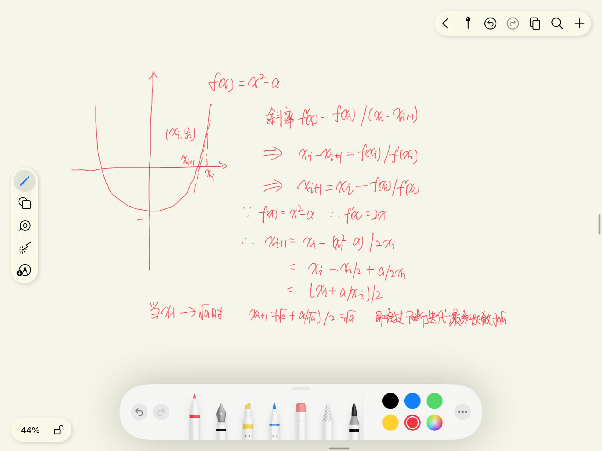
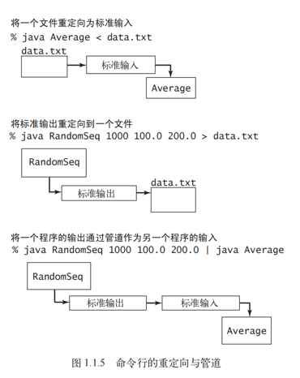

# 基础

## 为什么要学习
当用计算机解决一个问题时，一般都存在多种不同的方法。对于小型问题，只要管用，方法的不同并没有什么关系。但是对于大型问题（或者是需要解决大量小型问题的应用），我们就需要设计能够有效利用时间和空间的方法了。

学习算法的主要原因是它们能节约非常多的资源，甚至能够让我们完成一些本不可能完成的任务。在某些需要处理上百万个对象的应用程序中，设计优良的算法甚至可以将程序运行的速度提高数百万倍。在本书中我们将在多个场景中看到这样的例子。与此相反，花费金钱和时间去购置新的硬件可能只能将速度提高十倍或是百倍。无论在任何应用领域，精心设计的算法都是解决大型问题最有效的方法。

### 牛顿迭代法求平方根

```java
public static double sqrt(int n) {
    int ub = 20; //  20 次左右的迭代可以解决 32 位有符号整数的平方根
    double y = 0.5 * n; // 初始值默认为 0.5 倍的 n，如果能够取得更好的初始值，算法性能会有进一步的提升
    double rootx = Math.sqrt(n); // 实际平方根，用于比较
    for (int i = 0; i < ub; ++i) {
        System.out.printf("%05d: %25.16f %25.16f\n", i, y, Math.abs(y - rootx) / rootx);
        double newy = 0.5*(y + (double) n / y); // 迭代
        if (newy == y) {
            System.out.println("Converged");
            break;
        }
        y = newy;
    }

    return y;
}
```



**思想：**

牛顿迭代法的思想就是在一条曲线上从某一点的切线开始，首先求其与横轴的交点 $x^2$ ，之后再确定曲线上和该交点横坐标相同的点，并重复求该点的切线与横坐标的交点的方式，不断逼近真实解的过程。

时间复杂度：可以看到，如果有一个合适的初始值，牛顿迭代法可以是一个常数时间内的操作，即 𝑂(1)

空间复杂度：只需要少量的几个中间变量，因此空间复杂度为 𝑂(1)

```java
// 算法4中求平方根代码 
public static double sqrt(double c) {
    if (c < 0) {
        return Double.NaN;
    }
    double err = 1e-15;
    double t = c;
    while (Math.abs(t - c / t) > err * t) {
        t = (c / t + t) / 2.0;
    }
    return t;
}
```

《算法4》平方根算法值得思考的点：**一个是输入为0的情况，二是判断迭代结束（收敛）的条件**。

1. 输入为0时，c / t 为Double.*NaN*，与任何数进行计算，符号比较(==, >, <等) 均为false，故不会进入循环，返回0.0。

2. 判断迭代结束的**收敛条件**：

   > Math.*abs*(t - c / t) > err * t

   误差的判断条件我们有以下几个选择：

   1. Math.abs(t * t - c) > err : 最为直观的误差形式，直接带入方程得到与所求函数值的差值，我姑且在这里称其为“绝对误差”，我在一些网上的博文中看到了使用这个误差的代码；

   2. Math.abs(t - c / t) > err ：我又根据数学中对牛顿迭代误差的分析，通过微分中值定理得到形式类似的误差形式，我在这里姑且称之为“中值误差”，这种误差我在stackOverflow上看到了类似代码；

   3. Math.abs(t - c / t) > err * t ：最后就是《算法》这本书中源代码中使用的误差表达形式，这里姑且称之为“算法误差”，如果我没有看过源代码，我自己是不能直接写出这种形式的，那么使用这种形式的误差的理由是什么呢？
   
      

**验证**：

这里我们使用这三种误差来计算1e-100的平方根，代码中的err=1e-15。

首先是使用**绝对误差**,结果：1.0E-100

显然这是个错误答案，因为用IEEE 754标准表示的Double类型其范围为+/-1.7976931348623157E+308，绝对误差一是超出了double的精度范围，二是直接小于我们设定的收敛条件得到了错误答案。

其次使用“中值误差”，得到结果如下：8.881784197001252E-16

可以看到中值误差也过早地进入到了我们的收敛条件中，得到了错误的结果，那如果我们给err进行一个适应性的缩放会不会得到正确的结果呢？

最后我们使用《算法》中的源代码进行计算，可以得到：1.0E-50

通过这个测试我们知道了几点：一是《算法》源代码中的误差形式可以从微分中值定理推导得到，二是为了使算法对于任意的double类型变量都能够得到正确的结果，要对收敛条件进行一个适当的缩放，这样可以避免收敛条件过大导致对于较小的数值得到错误的结果，或对于过大的数值导致收敛过慢或不收敛。

### 递归

递归三要素：

* 递归总有一个最简单的情况，即base case，方法的第一条语句总是一个包含 return 的条件语句。
* 递归调用总是去尝试解决一个规模更小的子问题，这样递归才能收敛到最简单的情况。
* 递归调用的父问题和尝试解决的**子问题之间不应该有交集**。

违背其中任意一条都可能得到错误的结果或是低效的代码，而 坚持这些原则能写出清晰、正确且容易评估性能的程序。


### 输入输出、重定向、管道

```java
public class RandomSeq {
     public static void main(String[] args) { // 打印N个(lo, hi)之间的随机值
         int N = Integer.parseInt(args[0]);
         double lo = Double.parseDouble(args[1]);
         double hi = Double.parseDouble(args[2]);
         for (int i = 0; i < N; i++) {
             double x = StdRandom.uniform(lo, hi);
             StdOut.printf("%.2f\n", x);
         }
     }
}

public class Average {
   public static void main(String[] args) { // 取StdIn中所有数的平均值
      double sum = 0.0;
      int cnt = 0;
      while (!StdIn.isEmpty()) { // 读取一个数并计算累计之和
         sum += StdIn.readDouble();
         cnt++;
      }
      double avg = sum / cnt;
      StdOut.printf("Average is %.5f\n", avg);
   }
}
```

> % java RandomSeq 1000 100.0 200.0 > data.txt

这条命令指明标准输出流不是被打印至终端窗口，而是被写入一个叫做 data.txt 的文件。每次 调用 StdOut.print() 或是 StdOut.println() 都会向该文件追加一段文本。

> % java Average < data.txt

这条命令会从文件 data.txt 中读取一系列数值并计算它们的平均值。

> % java RandomSeq 1000 100.0 200.0 | java Average

这条命令将 RandomSeq 的标准输出和 Average 的标准输入指定为同一个流。它的效果是好像在 Average 运行时 RandomSeq 将它生成的数字输入了终端窗口。




**问：** Java 表达式 1/0 和 1.0/0.0 的值是什么？
**答：** 第一个表达式会产生一个运行时除以零异常（它会终止程序，因为这个值是未定义的）；第二个表达式的值是 Infinity（无穷大）。

**问：** 负数的除法和余数的结果是什么？
**答：** 表达式 a/b 的商会向 0 取整；a % b 的余数的定义是 (a/b)*b + a % b 恒等于 a。例如 -14/3 和14/-3 的商都是 -4，但 -14 % 3 是 -2，而 14 % -3 是 2。

### 算术表达式求值

E.W.Dijkstra 在 20 世纪 60 年代发明了一个非常简单的算法，用**两个栈**（一个用于保存运算符，一个用于保存操作数）完成了这个任务

表达式由括号、运算符和操作数（数字）组成。我们根据以下 4 种情况从左到右逐个将这些实体送入栈处理：
* 将操作数压入操作数栈；
* 将运算符压入运算符栈；
* 忽略左括号；
* 在遇到右括号时，弹出一个运算符，弹出所需数量的操作数，并将运算符和操作数的运算结果压入操作数栈。

在处理完最后一个右括号之后，操作数栈上只会有一个值，它就是表达式的值。


