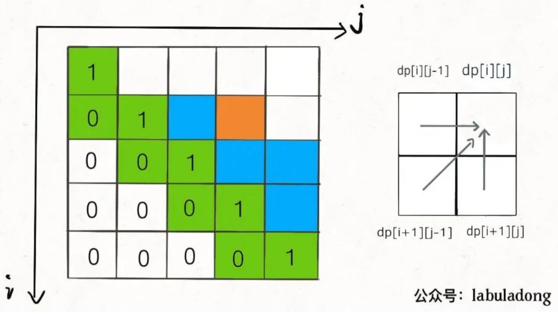
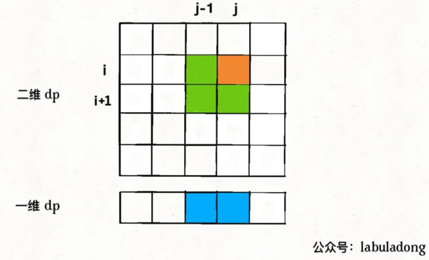
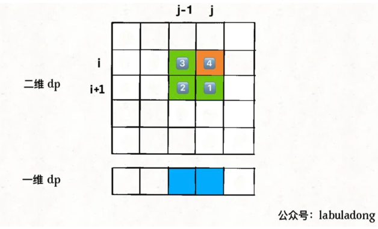
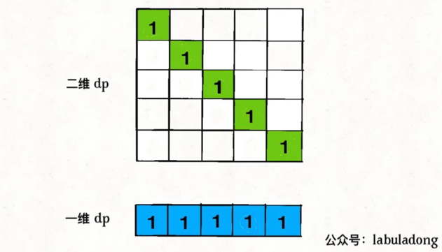

# 动态规划系列

## 动态规划答疑篇

这篇文章就给你讲明白以下几个问题：

1、到底什么才叫「最优子结构」，和动态规划什么关系。

2、如何判断一个问题是动态规划问题，即如何看出是否存在重叠子问题。

3、为什么经常看到将dp数组的大小设置为n + 1而不是n。

4、为什么动态规划遍历dp数组的方式五花八门，有的正着遍历，有的倒着遍历，有的斜着遍历。

**动态规划：递归-->自顶向下递归（备忘录）-->自底向上DP数组（迭代）**

### 一、最优子结构详解

「最优子结构」是某些问题的一种特定性质，并不是动态规划问题专有的。也就是说，很多问题其实都具有最优子结构，只是其中大部分不具有重叠子问题，所以我们不把它们归为动态规划系列问题而已。

我先举个很容易理解的例子：假设你们学校有 10 个班，你已经计算出了每个班的最高考试成绩。那么现在我要求你计算全校最高的成绩，你会不会算？当然会，而且你不用重新遍历全校学生的分数进行比较，而是只要在这 10 个最高成绩中取最大的就是全校的最高成绩。

我给你提出的这个问题就**符合最优子结构**：可以从子问题的最优结果推出更大规模问题的最优结果。让你算每个班的最优成绩就是子问题，你知道所有子问题的答案后，就可以借此推出全校学生的最优成绩这个规模更大的问题的答案。

你看，这么简单的问题都有最优子结构性质，只是因为显然**没有重叠子问题，所以我们简单地求最值肯定用不出动态规划**。

再举个例子：假设你们学校有 10 个班，你已知每个班的最大分数差（最高分和最低分的差值）。那么现在我让你计算全校学生中的最大分数差，你会不会算？可以想办法算，但是肯定不能通过已知的这 10 个班的最大分数差推到出来。因为这 10 个班的最大分数差不一定就包含全校学生的最大分数差，比如全校的最大分数差可能是 3 班的最高分和 6 班的最低分之差。

这次我给你提出的问题就**不符合最优子结构**，因为你没办通过每个班的最优值推出全校的最优值，没办法通过子问题的最优值推出规模更大的问题的最优值。前文 动态规划详解 说过，想满足最优子结，子问题之间必须互相独立。全校的最大分数差可能出现在两个班之间，显然子问题不独立，所以这个问题本身不符合最优子结构。

最优子结构并不是动态规划独有的一种性质，能求最值的问题大部分都具有这个性质；但反过来，**最优子结构性质作为动态规划问题的必要条件，一定是让你求最值的**

### 二、如何一眼看出重叠子问题

略

### 三、dp数组的大小设置

理论上，你怎么定义都可以，只要根据定义处理好 base case 就可以。避免索引出现 -1 的情况即可。

### 四、dp 数组的遍历方向（动态规划的迷惑行为）

我相信读者做动态规划问题时，肯定会对dp数组的遍历顺序有些头疼。我们拿二维dp数组来举例，有时候我们是正向遍历：

```java
int[][] dp = new int[m][n];
for (int i = 0; i < m; i++)
    for (int j = 0; j < n; j++)
        // 计算 dp[i][j]
```

有时候我们反向遍历：

```java
for (int i = m - 1; i >= 0; i--)
    for (int j = n - 1; j >= 0; j--)
        // 计算 dp[i][j]
```

有时候可能会斜向遍历：

```java
// 斜着遍历数组
for (int l = 2; l <= n; l++) {
    for (int i = 0; i <= n - l; i++) {
        int j = l + i - 1;
        // 计算 dp[i][j]
    }
}
```

甚至更让人迷惑的是，有时候发现正向反向遍历都可以得到正确答案，比如我们在 团灭 LeetCode 股票买卖问题 中有的地方就正反皆可。

那么，如果仔细观察的话可以发现其中的原因的。你只要把住两点就行了：

* 1、遍历的过程中，所需的状态必须是已经计算出来的。

* 2、遍历的终点必须是存储结果的那个位置。


## 状态压缩技巧：动态规划的降维打击

动态规划技巧对于算法效率的提升非常可观，一般来说都能把指数级和阶乘级时间复杂度的算法优化成 O(N^2)，堪称算法界的二向箔，把各路魑魅魍魉统统打成二次元。

动态规划本身也是可以进行阶段性优化的，比如说我们常听说的「状态压缩」技巧，就能够把很多动态规划解法的**空间复杂度进一步降低，由 O(N^2) 降低到 O(N)**。

能够使用状态压缩技巧的动态规划都是二维dp问题，你看它的状态转移方程，**如果计算状态dp[i][j]需要的都是dp[i][j]相邻的状态，那么就可以使用状态压缩技巧**，将二维的dp数组转化成一维，将空间复杂度从 O(N^2) 降低到 O(N)。

什么叫「和dp[i][j]相邻的状态」呢，比如前文 最长回文子序列 中，我们对dp[i][j]的更新，其实只依赖于dp[i+1][j-1], dp[i][j-1], dp[i+1][j]这三个状态：

```c++
// 状态转移方程
for (int i = n - 2; i >= 0; i--) {
    for (int j = i + 1; j < n; j++) {
        // 状态转移方程
        if (s[i] == s[j])
            dp[i][j] = dp[i + 1][j - 1] + 2;
        else
            dp[i][j] = max(dp[i + 1][j], dp[i][j - 1]);
    }
}
```



这就叫和dp[i][j]相邻，反正你计算dp[i][j]只需要这三个相邻状态，其实根本不需要那么大一个二维的 dp table 对不对？

**状态压缩的核心思路就是，将二维数组「投影」到一维数组**：



思路很直观，但是也有一个明显的问题，图中dp[i][j-1]和dp[i+1][j-1]这两个状态处在同一列，而一维数组中只能容下一个，那么当我计算dp[i][j]时，他俩必然有一个会被另一个覆盖掉，怎么办？

这就是状态压缩的难点，下面就来分析解决这个问题

想把二维dp数组压缩成一维，**一般来说是把第一个维度，也就是i这个维度去掉，只剩下j这个维度。压缩后的一维dp数组就是之前二维dp数组的dp[i][..]那一行**。

我们先将上述代码进行改造，直接无脑去掉i这个维度，把dp数组变成一维：

```c++
for (int i = n - 2; i >= 0; i--) {
    for (int j = i + 1; j < n; j++) {
        // 在这里，一维 dp 数组中的数是什么？
        if (s[i] == s[j])
            dp[j] = dp[j - 1] + 2;
        else
            dp[j] = max(dp[j], dp[j - 1]);
    }
}
```
上述代码的一维dp数组只能表示二维dp数组的一行dp[i][..]，那我怎么才能得到dp[i+1][j-1], dp[i][j-1], dp[i+1][j]这几个必要的的值，进行状态转移呢？

在代码中注释的位置，将要进行状态转移，更新dp[j]，那么我们要来思考两个问题：

* 1、在对dp[j]赋新值之前，dp[j]对应着二维dp数组中的什么位置？

* 2、dp[j-1]对应着二维dp数组中的什么位置？

**对于问题 1，在对dp[j]赋新值之前，dp[j]的值就是外层 for 循环上一次迭代算出来的值，也就是对应二维dp数组中dp[i+1][j]的位置**。

**对于问题 2，dp[j-1]的值就是内层 for 循环上一次迭代算出来的值，也就是对应二维dp数组中dp[i][j-1]的位置**。

那么问题已经解决了一大半了，只剩下二维dp数组中的dp[i+1][j-1]这个状态我们不能直接从一维dp数组中得到：

```c++
for (int i = n - 2; i >= 0; i--) {
    for (int j = i + 1; j < n; j++) {
        if (s[i] == s[j])
            // dp[i][j] = dp[i+1][j-1] + 2;
            dp[j] = ?? + 2;
        else
            // dp[i][j] = max(dp[i+1][j], dp[i][j-1]);
            dp[j] = max(dp[j], dp[j - 1]);
    }
}
```

因为 for 循环遍历i和j的顺序为从左向右，从下向上，所以可以发现，在更新一维dp数组的时候，dp[i+1][j-1]会被dp[i][j-1]覆盖掉，图中标出了这四个位置被遍历到的次序：



那么如果我们想得到dp[i+1][j-1]，就必须在它被覆盖之前用一个临时变量temp把它存起来，并把这个变量的值保留到计算dp[i][j]的时候。为了达到这个目的，结合上图，我们可以这样写代码：

```c++
for (int i = n - 2; i >= 0; i--) {
    // 存储 dp[i+1][j-1] 的变量
    int pre = 0;
    for (int j = i + 1; j < n; j++) {
        int temp = dp[j];
        if (s[i] == s[j])
            // dp[i][j] = dp[i+1][j-1] + 2;
            dp[j] = pre + 2;
        else
            dp[j] = max(dp[j], dp[j - 1]);
        // 到下一轮循环，pre 就是 dp[i+1][j-1] 了
        pre = temp;
    }
}
```

别小看这段代码，这是一维dp最精妙的地方，会者不难，难者不会。为了清晰起见，我用具体的数值来拆解这个逻辑：

假设现在i = 5, j = 7且s[5] == s[7]，那么现在会进入下面这个逻辑对吧：

```c++
if (s[5] == s[7])
    // dp[5][7] = dp[i+1][j-1] + 2;
    dp[7] = pre + 2;
```

我问你这个pre变量是什么？是内层 for 循环上一次迭代的temp值。

那我再问你内层 for 循环上一次迭代的temp值是什么？是dp[j-1]也就是dp[6]，但这是外层 for 循环上一次迭代对应的dp[6]，也就是二维dp数组中的dp[i+1][6] = dp[6][6]。

也就是说，pre变量就是dp[i+1][j-1] = dp[6][6]，也就是我们想要的结果。

那么现在我们成功对状态转移方程进行了降维打击，算是最硬的的骨头啃掉了，但注意到我们还有 base case 要处理呀：

如何把 base case 也打成一维呢？很简单，记住，**状态压缩就是投影**，我们把 base case 投影到一维看看：



二维dp数组中的 base case 全都落入了一维dp数组，不存在冲突和覆盖，所以说我们直接把一维 dp 数组全部初始化为 1即可

至此，我们把 base case 和状态转移方程都进行了降维，实际上已经写出完整代码了：

```c++
int longestPalindromeSubseq(string s) {
    int n = s.size();
    // base case：一维 dp 数组全部初始化为 1
    vector<int> dp(n, 1);

    for (int i = n - 2; i >= 0; i--) {
        int pre = 0;
        for (int j = i + 1; j < n; j++) {
            int temp = dp[j];
            // 状态转移方程
            if (s[i] == s[j])
                dp[j] = pre + 2;
            else
                dp[j] = max(dp[j], dp[j - 1]);
            pre = temp;
        }
    }
    return dp[n - 1];
}
```

## 动态规划和回溯算法到底谁是谁爹？

todo zl

## 动态规划设计：最⻓递增⼦序列

todo zl

## 经典动态规划：0-1 背包问题

简单描述：给你一个可装载重量为W的背包和N个物品，每个物品有重量和价值两个属性。其中第i个物品的重量为wt[i]，价值为val[i]，现在让你用这个背包装物品，最多能装的价值是多少？

题目就是这么简单，一个典型的动态规划问题。**这个题目中的物品不可以分割，要么装进包里，要么不装，不能说切成两块装一半**。这也许就是 0-1 背包这个名词的来历。

### 动规标准套路

* 第一步要明确两点，「状态」和「选择」:如何才能描述一个问题局面？只要给定几个可选物品和一个背包的容量限制，就形成了一个背包问题，对不对？所以状态有两个，就是「背包的容量」和「可选择的物品」;再说选择，也很容易想到啊，对于每件物品，你能选择什么？选择就是「装进背包」或者「不装进背包」嘛。

    明白了状态和选择，动态规划问题基本上就解决了，只要往这个框架套就完事儿了：
    ```java
    for 状态1 in 状态1的所有取值：
        for 状态2 in 状态2的所有取值：
            for ...
                dp[状态1][状态2][...] = 择优(选择1，选择2...)
    ```
* 第二步要明确dp数组的定义：dp数组是什么？其实就是描述问题局面的一个数组。换句话说，我们刚才明确问题有什么「状态」，现在需要用dp数组把状态表示出来。

  刚才找到的「状态」，有两个，也就是说我们需要一个二维dp数组，一维表示可选择的物品，一维表示背包的容量。

  dp[i][w]的定义如下：对于前i个物品，当前背包的容量为w，这种情况下可以装的最大价值是dp[i][w]。

  比如说，如果 dp[3][5] = 6，其含义为：对于给定的一系列物品中，若只对前 3 个物品进行选择，当背包容量为 5 时，最多可以装下的价值为 6。

  根据这个定义，我们想求的最终答案就是dp[N][W]。base case 就是dp[0][..] = dp[..][0] = 0，因为没有物品或者背包没有空间的时候，能装的最大价值就是 0。

  细化上面的框架：
  ```java
  int dp[N+1][W+1]
  dp[0][..] = 0
  dp[..][0] = 0
  
  for i in [1..N]:
      for w in [1..W]:
          dp[i][w] = max(
              把物品 i 装进背包,
              不把物品 i 装进背包
          )
  return dp[N][W]
  ```
* 第三步，根据「选择」，思考状态转移的逻辑。

  dp[i][w]表示：对于前i个物品，当前背包的容量为w时，这种情况下可以装下的最大价值是dp[i][w]。

  如果你没有把这第i个物品装入背包，那么很显然，最大价值dp[i][w]应该等于dp[i-1][w]。

  如果你把这第i个物品装入了背包，那么dp[i][w]应该等于dp[i-1][w-wt[i-1]] + val[i-1]。

  首先，由于i是从 1 开始的，所以对val和wt的取值是i-1。

  而dp[i-1][w-wt[i-1]]也很好理解：你如果想装第i个物品，你怎么计算这时候的最大价值？换句话说，在装第i个物品的前提下，背包能装的最大价值是多少？

  ```java
  for i in [1..N]:
      for w in [1..W]:
          dp[i][w] = max(
              dp[i-1][w],
              dp[i-1][w - wt[i-1]] + val[i-1]
          )
  return dp[N][W]
  ```
* 最后一步，把伪码翻译成代码，**处理一些边界情况**。

  如上伪代码，需要处理w - wt[i-1]可能小于 0 导致数组索引越界的问题；最终成解。

  ```java
   public static int knapsackDP(int W, int[] wt, int[] val){
      int N = wt.length;
      int[][] dp = new int[N + 1][W + 1];
      for (int i = 1; i <= N; i++){
          for (int w = 0; w <= W; w++){
              if (w - wt[i - 1] < 0){
                  dp[i][w] = dp[i - 1][w];
              } else {
                  dp[i][w] = Math.max(dp[i-1][w], dp[i-1][w - wt[i-1]] + val[i-1]);
              }
  
          }
      }
      return dp[N][W];
  }
  ```


