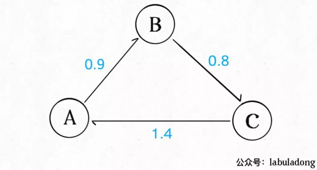
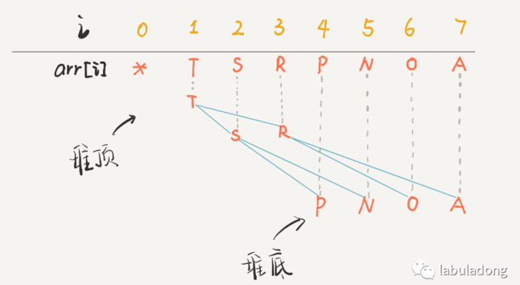
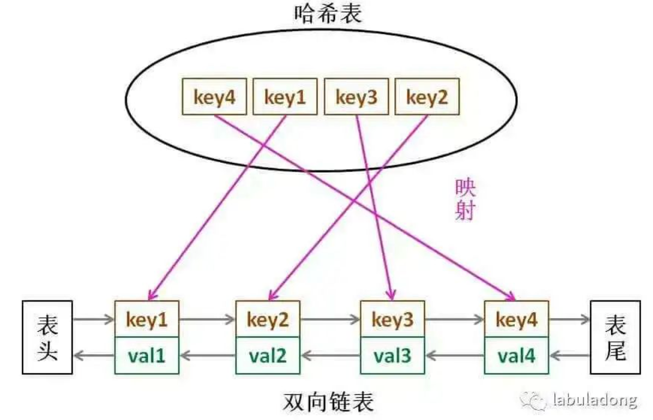
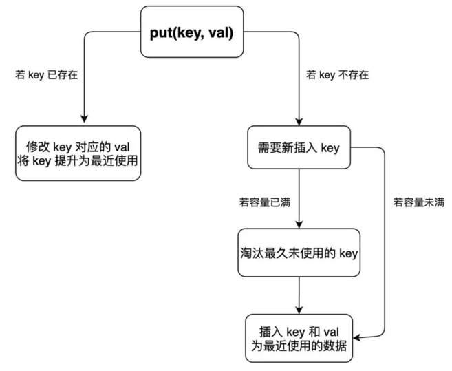

# 数据结构系列

## 为什么我推荐《算法4》

### 一、二分图的应用

二分图就是一幅拥有特殊性质的图：能够用两种颜色为所有顶点着色，使得任何一条边的两个顶点颜色不同。

能解决什么实际问题呢？

算法方面，常见的操作是如何判定一幅图是不是二分图。电影和演员的关系是具有二分图性质的，利用二分图可以避免建立两个hash表互为反向索引。

其他有趣的玩法，比如说社交网络中「间隔度数」的计算（六度空间理论应该听说过）等等，其实就是一个 BFS 广度优先搜索寻找最短路径的问题。


### 二、套汇的算法

如果我们说货币 A 到货币 B 的汇率是 10，意思就是 1 单位的货币 A 可以换 10 单位货币 B。如果我们把每种货币视为一幅图的顶点，货币之间的汇率视为加权有向边，那么整个汇率市场就是一幅「完全加权有向图」。

一旦把现实生活中的情景抽象成图，就有可能运用算法解决一些问题。比如说图中可能存在下面的情况：



图中的加权有向边代表汇率，我们可以发现如果把 100 单位的货币 A 换成 B，再换成 C，最后换回 A，就可以得到 100×0.9×0.8×1.4 = 100.8 单位的 A！如果交易的金额大一些的话，赚的钱是很可观的，这种空手套白狼的操作就是套汇。

现实中交易会有种种限制，而且市场瞬息万变，但是套汇的利润还是很高的，关键就在于如何快速找到这种套汇机会呢？

借助图的抽象，我们发现套汇机会其实就是一个环，且这个环上的权重之积大于 1，只要在顺着这个环交易一圈就能空手套白狼。

**图论中有一个经典算法叫做 Bellman-Ford 算法，可以用于寻找负权重环**。对于我们说的套汇问题，可以先把所有边的权重 w 替换成 -ln(w)，这样「寻找权重乘积大于 1 的环」就转化成了「寻找权重和小于 0 的环」，就可以使用 Bellman-Ford 算法在 O(EV) 的时间内寻找负权重环，也就是寻找套汇机会。

## ⼆叉堆详解实现优先级队列

二叉堆（Binary Heap）没什么神秘，性质比二叉搜索树 BST 还简单。其主要操作就两个，sink（下沉）和swim（上浮），用以维护二叉堆的性质。其主要应用有两个，首先是一种排序方法「堆排序」，第二是一种很有用的数据结构「优先级队列」。

本文就以实现优先级队列（Priority Queue）为例，通过图片和人类的语言来描述一下二叉堆怎么运作的。

### 一、二叉堆概览

首先，二叉堆和二叉树有啥关系呢，为什么人们总数把二叉堆画成一棵二叉树？

因为，二叉堆其实就是一种特殊的二叉树（完全二叉树），只不过存储在数组里。一般的链表二叉树，我们操作节点的指针，而在数组里，我们把数组索引作为指针：

```java
// 父节点的索引
int parent(int root) {
    return root / 2;
}
// 左孩子的索引
int left(int root) {
    return root * 2;
}
// 右孩子的索引
int right(int root) {
    return root * 2 + 1;
}
```

画个图你立即就能理解了，注意数组的第一个索引 0 空着不用：



PS：因为数组索引是数字，为了方便区分，将字符作为数组元素。

你看到了，把 arr[1] 作为整棵树的根的话，每个节点的父节点和左右孩子的索引都可以通过简单的运算得到，这就是二叉堆设计的一个巧妙之处。为了方便讲解，下面都会画的图都是二叉树结构，相信你能把树和数组对应起来。

二叉堆还分为最大堆和最小堆。最大堆的性质是：每个节点都大于等于它的两个子节点。类似的，最小堆的性质是：每个节点都小于等于它的子节点。

两种堆核心思路都是一样的，本文以最大堆为例讲解。

对于一个最大堆，根据其性质，显然堆顶，也就是 arr[1] 一定是所有元素中最大的元素。

### 二、优先级队列概览

优先级队列这种数据结构有一个很有用的功能，你插入或者删除元素的时候，元素会自动排序，这底层的原理就是二叉堆的操作。

数据结构的功能无非增删查该，优先级队列有两个主要 API，分别是insert插入一个元素和delMax删除最大元素（如果底层用最小堆，那么就是delMin）。


### 三、实现 swim 和 sink

为什么要有上浮 swim 和下沉 sink 的操作呢？为了维护堆结构。

我们要讲的是最大堆，每个节点都比它的两个子节点大，但是在插入元素和删除元素时，难免破坏堆的性质，这就需要通过这两个操作来恢复堆的性质了。

对于最大堆，会破坏堆性质的有有两种情况：

如果某个节点 A 比它的子节点（中的一个）小，那么 A 就不配做父节点，应该下去，下面那个更大的节点上来做父节点，这就是对 A 进行下沉。

如果某个节点 A 比它的父节点大，那么 A 不应该做子节点，应该把父节点换下来，自己去做父节点，这就是对 A 的上浮。

当然，错位的节点 A 可能要上浮（或下沉）很多次，才能到达正确的位置，恢复堆的性质。所以代码中肯定有一个while循环。

**上浮的代码实现**：

```java
private void swim(int k) {
    // 如果浮到堆顶，就不能再上浮了
    while (k > 1 && less(parent(k), k)) {
        // 如果第 k 个元素⽐上层⼤
        // 将 k 换上去
        swap(parent(k), k);
        k = parent(k);
    }
}
```

**下沉的代码实现**：

下沉比上浮略微复杂一点，因为上浮某个节点 A，只需要 A 和其父节点比较大小即可；但是下沉某个节点 A，需要 A 和其两个子节点比较大小，如果 A 不是最大的就需要调整位置，要把较大的那个子节点和 A 交换。

```java
private void sink(int k) {
    // 如果沉到堆底，就沉不下去了
    while (left(k) <= N) {
        // 先假设左边节点较⼤
        int older = left(k);
        // 如果右边节点存在，⽐⼀下⼤⼩
        if (right(k) <= N && less(older, right(k))) {
            older = right(k);
        }
        // 结点 k ⽐俩孩⼦都⼤，就不必下沉了
        if (less(older, k)) {
            break;
        }
        // 否则，不符合最⼤堆的结构，下沉 k 结点
        swap(k, older);
        k = older;
    }
}
```

至此，二叉堆的主要操作就讲完了，一点都不难吧，代码加起来也就十行。明白了sink和swim的行为，下面就可以实现优先级队列了。

### 四、实现 delMax 和 insert

这两个方法就是建立在swim和sink上的。

insert方法先把要插入的元素添加到堆底的最后，然后让其上浮到正确位置

delMax方法先把堆顶元素 A 和堆底最后的元素 B 对调，然后删除 A，最后让 B 下沉到正确位置。

至此，一个优先级队列就实现了，插入和删除元素的时间复杂度为 O(logK)，K为当前二叉堆（优先级队列）中的元素总数。因为我们时间复杂度主要花费在sink或者swim上，而不管上浮还是下沉，最多也就树（堆）的高度，也就是 log 级别。


## LRU算法详解

LeetCode 146

计算机的缓存容量有限，如果缓存满了就要删除一些内容，给新内容腾位置。但问题是，删除哪些内容呢？我们肯定希望删掉哪些没什么用的缓存，而把有用的数据继续留在缓存里，方便之后继续使用。那么，什么样的数据，我们判定为「有用的」的数据呢？

LRU 的全称是 Least Recently Used，也就是说我们认为最近使用过的数据应该是是「有用的」，很久都没用过的数据应该是无用的，内存满了就优先删那些很久没用过的数据。

### 一、LRU 算法描述

首先要接收一个 capacity 参数作为缓存的最大容量，然后实现两个 API，一个是 put(key, val) 方法存入键值对，另一个是 get(key) 方法获取 key 对应的 val，如果 key 不存在则返回 -1。

注意哦，get 和 put 方法必须都是 O(1) 的时间复杂度，我们举个具体例子来看看 LRU 算法怎么工作。

```java
/* 缓存容量为 2 */
LRUCache cache = new LRUCache(2);
// 你可以把 cache 理解成一个队列
// 假设左边是队头，右边是队尾
// 最近使用的排在队头，久未使用的排在队尾
// 圆括号表示键值对 (key, val)

cache.put(1, 1);
// cache = [(1, 1)]

cache.put(2, 2);
// cache = [(2, 2), (1, 1)]

cache.get(1);       // 返回 1
// cache = [(1, 1), (2, 2)]
// 解释：因为最近访问了键 1，所以提前至队头
// 返回键 1 对应的值 1

cache.put(3, 3);
// cache = [(3, 3), (1, 1)]
// 解释：缓存容量已满，需要删除内容空出位置
// 优先删除久未使用的数据，也就是队尾的数据
// 然后把新的数据插入队头

cache.get(2);       // 返回 -1 (未找到)
// cache = [(3, 3), (1, 1)]
// 解释：cache 中不存在键为 2 的数据

cache.put(1, 4);    
// cache = [(1, 4), (3, 3)]
// 解释：键 1 已存在，把原始值 1 覆盖为 4
// 不要忘了也要将键值对提前到队头
```

### 二、LRU 算法设计

分析上面的操作过程，要让 put 和 get 方法的时间复杂度为 O(1)，我们可以总结出 cache 这个数据结构必要的条件：

1、显然 cache 中的元素必须有时序，以区分最近使用的和久未使用的数据，当容量满了之后要删除最久未使用的那个元素腾位置。

2、我们要在 cache 中快速找某个 key 是否已存在并得到对应的 val；

3、每次访问 cache 中的某个 key，需要将这个元素变为最近使用的，也就是说 cache 要支持在任意位置快速插入和删除元素。

那么，什么数据结构同时符合上述条件呢？哈希表查找快，但是数据无固定顺序；链表有顺序之分，插入删除快，但是查找慢。所以结合一下，形成一种新的数据结构：**哈希链表 LinkedHashMap**。

LRU 缓存算法的核心数据结构就是哈希链表，双向链表和哈希表的结合体。这个数据结构长这样：



借助这个结构，我们来逐一分析上面的 3 个条件：

1、如果我们每次默认从链表尾部添加元素，那么显然越靠尾部的元素就是最近使用的，越靠头部的元素就是最久未使用的。

2、对于某一个 key，我们可以通过哈希表快速定位到链表中的节点，从而取得对应 val。

3、链表显然是支持在任意位置快速插入和删除的，改改指针就行。只不过传统的链表无法按照索引快速访问某一个位置的元素，而这里借助哈希表，可以通过 key 快速映射到任意一个链表节点，然后进行插入和删除。

也许读者会问，为什么要是双向链表，单链表行不行？另外，既然哈希表中已经存了 key，为什么链表中还要存 key 和 val 呢，只存 val 不就行了？

想的时候都是问题，只有做的时候才有答案。这样设计的原因，必须等我们亲自实现 LRU 算法之后才能理解，所以我们开始看代码吧～

### 三、代码实现

> 见 LRU.java


到这里就能回答刚才「为什么必须要用双向链表」的问题了，因为我们需要删除操作。删除一个节点不光要得到该节点本身的指针，也需要操作其前驱节点的指针，而双向链表才能支持直接查找前驱，保证操作的时间复杂度 O(1)。

注意我们实现的双链表 API 只能从尾部插入，也就是说靠尾部的数据是最近使用的，靠头部的数据是最久为使用的。

先不慌去实现 LRU 算法的 get 和 put 方法。由于我们要同时维护一个双链表 cache 和一个哈希表 map，很容易漏掉一些操作，比如说删除某个 key 时，在 cache 中删除了对应的 Node，但是却忘记在 map 中删除 key。

解决这种问题的有效方法是：**在这两种数据结构之上提供一层抽象 API**。

说的有点玄幻，实际上很简单，就是尽量让 LRU 的主方法 get 和 put 避免直接操作 map 和 cache 的细节。

「为什么要在链表中同时存储 key 和 val，而不是只存储 val」，注意 removeLeastRecently 函数中，我们需要用 deletedNode 得到 deletedKey。 也就是说，当缓存容量已满，我们不仅仅要删除最后一个 Node 节点，还要把 map 中映射到该节点的 key 同时删除，而这个 key 只能由 Node 得到。如果 Node 结构中只存储 val，那么我们就无法得知 key 是什么，就无法删除 map 中的键，造成错误。

上述方法就是简单的操作封装，调用这些函数可以避免直接操作 cache 链表和 map 哈希表，下面我先来实现 LRU 算法的 get 方法：

```java
public int get(int key) {
    if (!map.containsKey(key)) {
        return -1;
    }
    // 将该数据提升为最近使用的
    makeRecently(key);
    return map.get(key).val;
}
```

put 方法稍微复杂一些，我们先来画个图搞清楚它的逻辑：



至此，你应该已经完全掌握 LRU 算法的原理和实现了，我们最后用 Java 的内置类型 LinkedHashMap 来实现 LRU 算法，逻辑和之前完全一致，我就不过多解释了，见LeetCode 146。


