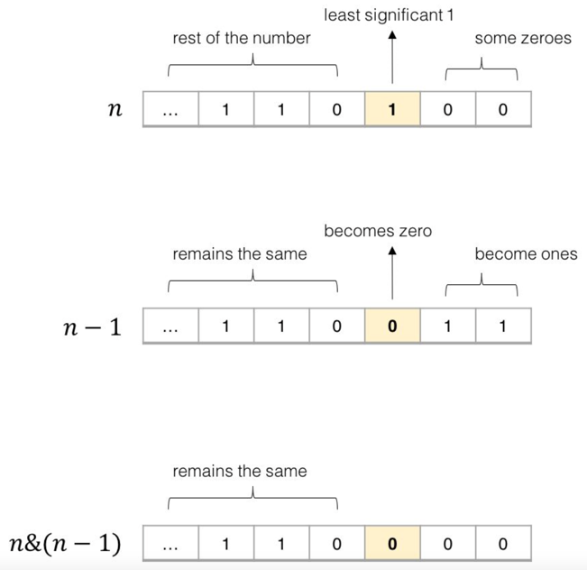
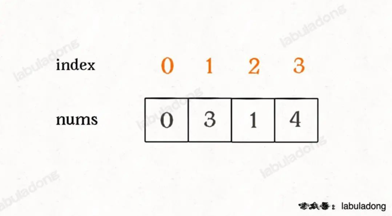
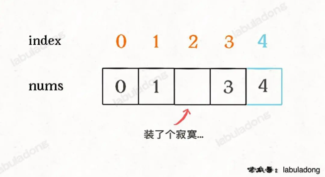

# 算法思维系列

## 回溯算法秒杀数独问题

LeetCode 37

经常拿回溯算法来说事儿的，无非就是八皇后问题和数独问题了。那我们今天就通过实际且有趣的例子来讲一下如何用回溯算法来解决数独问题。

### 一、直观感受

**算法的核心思路非常非常的简单，就是对每一个空着的格子穷举 1 到 9，如果遇到不合法的数字（在同一行或同一列或同一个 3×3 的区域中存在相同的数字）则跳过，如果找到一个合法的数字，则继续穷举下一个空格子。**

对于数独游戏，也许我们还会有另一个误区：就是下意识地认为如果给定的数字越少那么这个局面的难度就越大。

这个结论对人来说应该没毛病，但对于计算机而言，给的数字越少，反而穷举的步数就越少，得到答案的速度越快，至于为什么，我们后面探讨代码实现的时候会讲。

### 二、代码实现

见 LeetCode0037

现在可以回答一下之前的问题，为什么有时候算法执行的次数多，有时候少？为什么对于计算机而言，确定的数字越少，反而算出答案的速度越快？

我们已经实现了一遍算法，掌握了其原理，回溯就是从 1 开始对每个格子穷举，最后只要试出一个可行解，就会立即停止后续的递归穷举。所以暴力试出答案的次数和随机生成的棋盘关系很大，这个是说不准的。

那么你可能问，既然运行次数说不准，那么这个算法的时间复杂度是多少呢？

对于这种时间复杂度的计算，我们只能给出一个最坏情况，也就是 O(9^M)，其中M是棋盘中空着的格子数量。你想嘛，对每个空格子穷举 9 个数，结果就是指数级的。

这个复杂度非常高，但稍作思考就能发现，实际上我们并没有真的对每个空格都穷举 9 次，有的数字会跳过，有的数字根本就没有穷举，因为当我们找到一个可行解的时候就立即结束了，后续的递归都没有展开。

这个 O(9^M) 的复杂度实际上是完全穷举，或者说是找到所有可行解的时间复杂度。

如果给定的数字越少，相当于给出的约束条件越少，对于计算机这种穷举策略来说，是更容易进行下去，而不容易走回头路进行回溯的，所以说如果仅仅找出一个可行解，这种情况下穷举的速度反而比较快。

## 回溯算法最佳实践：括号⽣成

LeetCode 22

括号问题可以简单分成两类，一类是判断括号合法性的，我放在次条了 ；一类是合法括号的生成，本文介绍。

对于括号合法性的判断，主要是借助「栈」这种数据结构，而对于括号的生成，一般都要利用回溯递归的思想，比如前文 如何拆解复杂问题：实现一个计算器(开篇词)就用递归处理了括号优先级的问题。

1. 一个「合法」括号组合的左括号数量一定等于右括号数量，这个显而易见。

2. 对于一个「合法」的括号字符串组合p，必然对于任何0 <= i < len(p)都有：子串p[0..i]中左括号的数量都大于或等于右括号的数量。

## 常用位操作

### 一、几个有趣的位操作

1. 利用或操作 | 和空格将英文字符转换为小写

```java
('a' | ' ') = 'a'
('A' | ' ') = 'a'
```

2. 利用与操作 & 和下划线将英文字符转换为大写

```java
('b' & '_') = 'B'
('B' & '_') = 'B'
```

3. 利用异或操作 ^ 和空格进行英文字符大小写互换

```java
('d' ^ ' ') = 'D'
('D' ^ ' ') = 'd'
```

4. 判断两个整数是否异号

```java
int x = -1, y = 2;
bool f = ((x ^ y) < 0); // true

int x = 3, y = 2;
bool f = ((x ^ y) < 0); // false
```

PS：这个技巧还是很实用的，利用的是补码编码的符号位。如果不用位运算来判断是否异号，需要使用 if else 分支，还挺麻烦的。读者可能想利用乘积或者商来判断两个数是否异号，但是这种处理方式可能造成溢出，从而出现错误。关于补码编码和溢出，可参见前文 x * x >= 0 一定成立吗？。

5. 交换两个数

```java
int a = 1, b = 2;
a ^= b;
b ^= a;
a ^= b;
// 现在 a = 2, b = 1
```

6. 加一

```java
int n = 1;
n = -~n;
// 现在 n = 2
```

7. 减一

```java
int n = 2;
n = ~-n;
// 现在 n = 1
```

PS：上面这三个操作就纯属装逼

### 二、算法常用操作 n&(n-1)

**这个操作是算法中常见的，作用是消除数字 n 的二进制表示中的最后一个 1。**



1. 计算汉明权重（Hamming Weight）：就是让你返回 n 的二进制表示中有几个 1。因为 n & (n - 1) 可以消除最后一个 1，所以可以用一个循环不停地消除 1 同时计数，直到 n 变成 0 为止。

```java
int hammingWeight(uint32_t n) {
    int res = 0;
    while (n != 0) {
        n = n & (n - 1);
        res++;
    }
    return res;
}
```

2. 判断一个数是不是 2 的指数

一个数如果是 2 的指数，那么它的二进制表示一定只含有一个 1

```java
bool isPowerOfTwo(int n) {
    if (n <= 0) return false;
    return (n & (n - 1)) == 0;
}
```

### 三、index & (arr.length - 1) 的运用

我在单调栈解题套路中介绍过环形数组，其实就是利用求模（余数）的方式让数组看起来头尾相接形成一个环形，永远都走不完：

```java
int[] arr = {1,2,3,4};
        int index = 0;
        while (true) {
        // 在环形数组中转圈
        print(arr[index % arr.length]);
        index++;
        }
// 输出：1,2,3,4,1,2,3,4,1,2,3,4...
```

但模运算%对计算机来说其实是一个比较昂贵的操作，所以我们可以用&运算来求余数：

```java
int[] arr = {1,2,3,4};
int index = 0;
while (true) {
    // 在环形数组中转圈
    print(arr[index & (arr.length - 1)]);
    index++;
}
// 输出：1,2,3,4,1,2,3,4,1,2,3,4...
```

简单说，& (arr.length - 1)这个位运算能够替代% arr.length的模运算，性能会更好一些。

那问题来了，现在是不断地index++，你做到了循环遍历。但如果不断地index--，还能做到环形数组的效果吗？

答案是，如果你使用%求模的方式，那么当index小于 0 之后求模的结果也会出现负数，你需要特殊处理。但通过&与运算的方式，index不会出现负数，依然可以正常工作：

```java
int[] arr = {1,2,3,4};
int index = 0;
while (true) {
    // 在环形数组中转圈
    print(arr[index & (arr.length - 1)]);
    index--;
}
// 输出：1,4,3,2,1,4,3,2,1,4,3,2,1...
```

### 四、a ^ a = 0 的运用

LeetCode 136,268

异或运算的性质是需要我们牢记的： **一个数和它本身做异或运算结果为 0，即a ^ a = 0；一个数和 0 做异或运算的结果为它本身，即a ^ 0 = a。**

对于LeetCode 268：给定一个包含 [0, n] 中 n 个数的数组 nums ，找出 [0, n] 这个范围内没有出现在数组中的那个数。

* 排序法：把这个数组排个序，然后遍历一遍，不就很容易找到缺失的那个元素了吗？O(NlogN)

* HashSet法：借助数据结构的特性，用一个 HashSet 把数组里出现的数字都储存下来，再遍历[0,n]之间的数字，去 HashSet 中查询，也可以很容易查出那个缺失的元素。时间复杂度是 O(N)，但是还需要 O(N) 的空间复杂度

* 等差数列法：等差数列0, 1, 2,..., n，其中少了某一个数字，请你把它找出来。那这个数字不就是sum(0,1,..n) - sum(nums)

* 位运算：一个数和它本身做异或运算结果为 0，一个数和 0 做异或运算还是它本身。而且异或运算满足交换律和结合律。

比如说nums = [0,3,1,4]：



为了容易理解，我们假设先把索引补一位，然后让每个元素和自己相等的索引相对应：



这样做了之后，就可以发现除了缺失元素之外，所有的索引和元素都组成一对儿了，现在如果把这个落单的索引 2 找出来，也就找到了缺失的那个元素。

如何找这个落单的数字呢，**只要把所有的元素和索引做异或运算，成对儿的数字都会消为 0，只有这个落单的元素会剩下**，也就达到了我们的目的：

```java
int missingNumber(int[] nums) {
    int n = nums.length;
    int res = 0;
    // 先和新补的索引异或一下
    res ^= n;
    // 和其他的元素、索引做异或
    for (int i = 0; i < n; i++)
        res ^= i ^ nums[i];
    return res;
}
```


由于异或运算满足交换律和结合律，所以总是能把成对儿的数字消去，留下缺失的那个元素。


