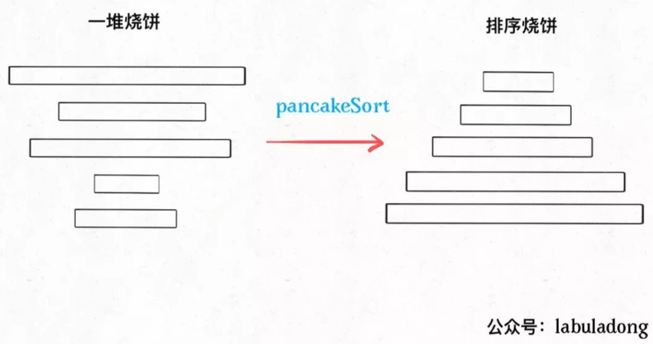
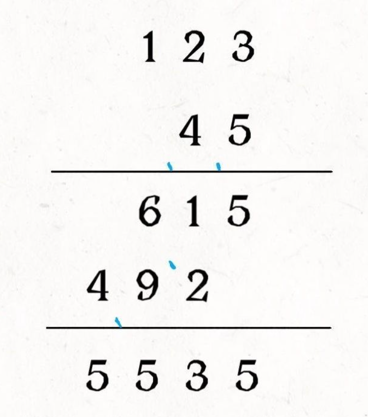
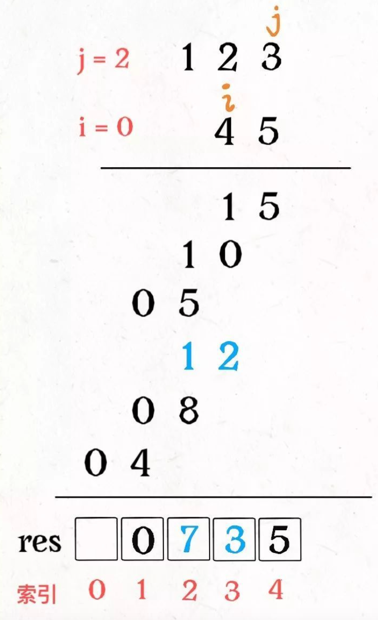
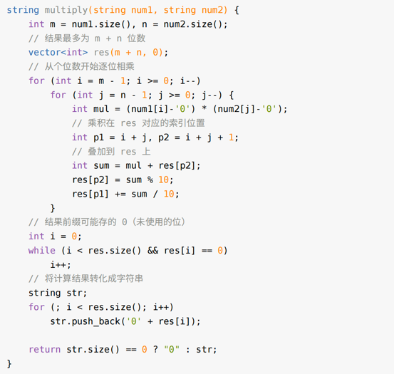
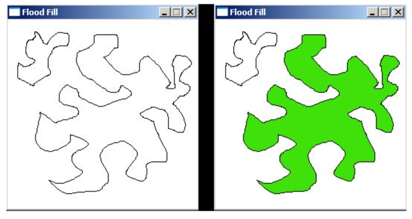
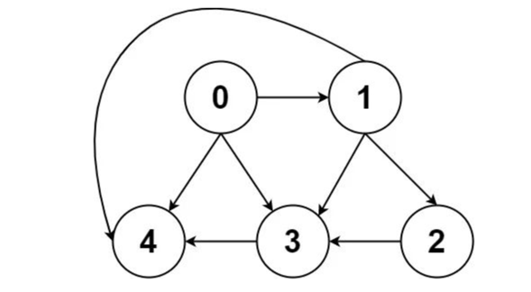
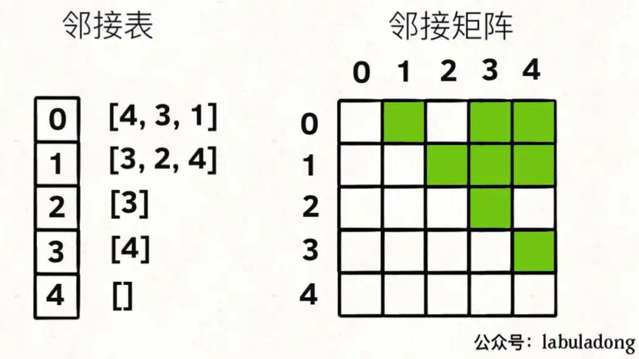

# 算法思维系列

## 回溯算法秒杀数独问题

LeetCode 37

经常拿回溯算法来说事儿的，无非就是八皇后问题和数独问题了。那我们今天就通过实际且有趣的例子来讲一下如何用回溯算法来解决数独问题。

### 一、直观感受

**算法的核心思路非常非常的简单，就是对每一个空着的格子穷举 1 到 9，如果遇到不合法的数字（在同一行或同一列或同一个 3×3 的区域中存在相同的数字）则跳过，如果找到一个合法的数字，则继续穷举下一个空格子。**

对于数独游戏，也许我们还会有另一个误区：就是下意识地认为如果给定的数字越少那么这个局面的难度就越大。

这个结论对人来说应该没毛病，但对于计算机而言，给的数字越少，反而穷举的步数就越少，得到答案的速度越快，至于为什么，我们后面探讨代码实现的时候会讲。

### 二、代码实现

见 LeetCode0037

现在可以回答一下之前的问题，为什么有时候算法执行的次数多，有时候少？为什么对于计算机而言，确定的数字越少，反而算出答案的速度越快？

我们已经实现了一遍算法，掌握了其原理，回溯就是从 1 开始对每个格子穷举，最后只要试出一个可行解，就会立即停止后续的递归穷举。所以暴力试出答案的次数和随机生成的棋盘关系很大，这个是说不准的。

那么你可能问，既然运行次数说不准，那么这个算法的时间复杂度是多少呢？

对于这种时间复杂度的计算，我们只能给出一个最坏情况，也就是 O(9^M)，其中M是棋盘中空着的格子数量。你想嘛，对每个空格子穷举 9 个数，结果就是指数级的。

这个复杂度非常高，但稍作思考就能发现，实际上我们并没有真的对每个空格都穷举 9 次，有的数字会跳过，有的数字根本就没有穷举，因为当我们找到一个可行解的时候就立即结束了，后续的递归都没有展开。

这个 O(9^M) 的复杂度实际上是完全穷举，或者说是找到所有可行解的时间复杂度。

如果给定的数字越少，相当于给出的约束条件越少，对于计算机这种穷举策略来说，是更容易进行下去，而不容易走回头路进行回溯的，所以说如果仅仅找出一个可行解，这种情况下穷举的速度反而比较快。

## 回溯算法最佳实践：括号⽣成

LeetCode 22

括号问题可以简单分成两类，一类是判断括号合法性的，我放在次条了 ；一类是合法括号的生成，本文介绍。

对于括号合法性的判断，主要是借助「栈」这种数据结构，而对于括号的生成，一般都要利用回溯递归的思想，比如前文 如何拆解复杂问题：实现一个计算器(开篇词)就用递归处理了括号优先级的问题。

1. 一个「合法」括号组合的左括号数量一定等于右括号数量，这个显而易见。

2. 对于一个「合法」的括号字符串组合p，必然对于任何0 <= i < len(p)都有：子串p[0..i]中左括号的数量都大于或等于右括号的数量。

## 常用位操作

### 一、几个有趣的位操作

1. 利用或操作 | 和空格将英文字符转换为小写

```java
('a' | ' ') = 'a'
('A' | ' ') = 'a'
```

2. 利用与操作 & 和下划线将英文字符转换为大写

```java
('b' & '_') = 'B'
('B' & '_') = 'B'
```

3. 利用异或操作 ^ 和空格进行英文字符大小写互换

```java
('d' ^ ' ') = 'D'
('D' ^ ' ') = 'd'
```

4. 判断两个整数是否异号

```java
int x = -1, y = 2;
bool f = ((x ^ y) < 0); // true

int x = 3, y = 2;
bool f = ((x ^ y) < 0); // false
```

PS：这个技巧还是很实用的，利用的是补码编码的符号位。如果不用位运算来判断是否异号，需要使用 if else 分支，还挺麻烦的。读者可能想利用乘积或者商来判断两个数是否异号，但是这种处理方式可能造成溢出，从而出现错误。关于补码编码和溢出，可参见前文 x * x >= 0 一定成立吗？。

5. 交换两个数

```java
int a = 1, b = 2;
a ^= b;
b ^= a;
a ^= b;
// 现在 a = 2, b = 1
```

6. 加一

```java
int n = 1;
n = -~n;
// 现在 n = 2
```

7. 减一

```java
int n = 2;
n = ~-n;
// 现在 n = 1
```

PS：上面这三个操作就纯属装逼

### 二、算法常用操作 n&(n-1)

**这个操作是算法中常见的，作用是消除数字 n 的二进制表示中的最后一个 1。**


1. 计算汉明权重（Hamming Weight）：就是让你返回 n 的二进制表示中有几个 1。因为 n & (n - 1) 可以消除最后一个 1，所以可以用一个循环不停地消除 1 同时计数，直到 n 变成 0 为止。

```java
int hammingWeight(uint32_t n) {
    int res = 0;
    while (n != 0) {
        n = n & (n - 1);
        res++;
    }
    return res;
}
```

2. 判断一个数是不是 2 的指数

一个数如果是 2 的指数，那么它的二进制表示一定只含有一个 1

```java
bool isPowerOfTwo(int n) {
    if (n <= 0) return false;
    return (n & (n - 1)) == 0;
}
```

### 三、index & (arr.length - 1) 的运用

我在单调栈解题套路中介绍过环形数组，其实就是利用求模（余数）的方式让数组看起来头尾相接形成一个环形，永远都走不完：

```java
int[] arr = {1,2,3,4};
        int index = 0;
        while (true) {
        // 在环形数组中转圈
        print(arr[index % arr.length]);
        index++;
        }
// 输出：1,2,3,4,1,2,3,4,1,2,3,4...
```

但模运算%对计算机来说其实是一个比较昂贵的操作，所以我们可以用&运算来求余数：

```java
int[] arr = {1,2,3,4};
int index = 0;
while (true) {
    // 在环形数组中转圈
    print(arr[index & (arr.length - 1)]);
    index++;
}
// 输出：1,2,3,4,1,2,3,4,1,2,3,4...
```

简单说，& (arr.length - 1)这个位运算能够替代% arr.length的模运算，性能会更好一些。

那问题来了，现在是不断地index++，你做到了循环遍历。但如果不断地index--，还能做到环形数组的效果吗？

答案是，如果你使用%求模的方式，那么当index小于 0 之后求模的结果也会出现负数，你需要特殊处理。但通过&与运算的方式，index不会出现负数，依然可以正常工作：

```java
int[] arr = {1,2,3,4};
int index = 0;
while (true) {
    // 在环形数组中转圈
    print(arr[index & (arr.length - 1)]);
    index--;
}
// 输出：1,4,3,2,1,4,3,2,1,4,3,2,1...
```

### 四、a ^ a = 0 的运用

LeetCode 136,268

异或运算的性质是需要我们牢记的： **一个数和它本身做异或运算结果为 0，即a ^ a = 0；一个数和 0 做异或运算的结果为它本身，即a ^ 0 = a。**

对于LeetCode 268：给定一个包含 [0, n] 中 n 个数的数组 nums ，找出 [0, n] 这个范围内没有出现在数组中的那个数。

* 排序法：把这个数组排个序，然后遍历一遍，不就很容易找到缺失的那个元素了吗？O(NlogN)

* HashSet法：借助数据结构的特性，用一个 HashSet 把数组里出现的数字都储存下来，再遍历[0,n]之间的数字，去 HashSet 中查询，也可以很容易查出那个缺失的元素。时间复杂度是 O(N)，但是还需要 O(N) 的空间复杂度

* 等差数列法：等差数列0, 1, 2,..., n，其中少了某一个数字，请你把它找出来。那这个数字不就是sum(0,1,..n) - sum(nums)

* 位运算：一个数和它本身做异或运算结果为 0，一个数和 0 做异或运算还是它本身。而且异或运算满足交换律和结合律。

比如说nums = [0,3,1,4]：


为了容易理解，我们假设先把索引补一位，然后让每个元素和自己相等的索引相对应：


这样做了之后，就可以发现除了缺失元素之外，所有的索引和元素都组成一对儿了，现在如果把这个落单的索引 2 找出来，也就找到了缺失的那个元素。

如何找这个落单的数字呢，**只要把所有的元素和索引做异或运算，成对儿的数字都会消为 0，只有这个落单的元素会剩下**，也就达到了我们的目的：

```java
int missingNumber(int[] nums) {
    int n = nums.length;
    int res = 0;
    // 先和新补的索引异或一下
    res ^= n;
    // 和其他的元素、索引做异或
    for (int i = 0; i < n; i++)
        res ^= i ^ nums[i];
    return res;
}
```


由于异或运算满足交换律和结合律，所以总是能把成对儿的数字消去，留下缺失的那个元素。

## 烧饼排序

烧饼排序是个很有意思的实际问题：假设盘子上有n块面积大小不一的烧饼，你如何用一把锅铲进行若干次翻转，让这些烧饼的大小有序（小的在上，大的在下）？



设想一下用锅铲翻转一堆烧饼的情景，其实是有一点限制的，我们**每次只能将最上面的若干块饼子同时翻转**。

我们的问题是，**如何使用算法得到一个翻转序列，使得烧饼堆变得有序？**

如何解决这个问题呢？其实类似上篇文章 递归思维：k 个一组反转链表，这也是需要递归思想的。

### 一、思路分析

为什么说这个问题有递归性质呢？比如说我们需要实现这样一个函数：

```java
// cakes 是一堆烧饼，函数会将最上面 n 个烧饼排序
void sort(int[] cakes, int n);
```
如果我们找到了前n个烧饼中最大的那个，然后设法将这个饼子翻转到最底下，那么，原问题的规模就可以减小，只需要排序剩下的 n-1 块饼就行了。也就是说递归调用pancakeSort(A, n-1)即可。

接下来，对于上面的这n-1块饼，如何排序呢？还是先从中找到最大的一块饼，然后把这块饼放到底下，再递归调用pancakeSort(A, n-1-1)……

你看，这就是递归性质，总结一下思路就是：

1. 找到n个饼中最大的那个。

2. 把这个最大的饼移到最底下。

3. 递归调用pancakeSort(A, n - 1)。

base case：n == 1时，排序 1 个饼时不需要翻转。

那么，最后剩下个问题，如何设法将某块烧饼翻到最后呢？

其实很简单，比如第 3 块饼是最大的，我们想把它换到最后，也就是换到第n块。可以这样操作：

1. 用锅铲将前 3 块饼翻转一下，这样最大的饼就翻到了最上面。

2. 用锅铲将前n块饼全部翻转，这样最大的饼就翻到了第n块，也就是最后一块。

以上两个流程理解之后，基本就可以写出解法了，不过题目要求我们写出具体的反转操作序列，这也很简单，只要在每次翻转烧饼时记录下来就行了。

### 二、代码实现

只要把上述的思路用代码实现即可，唯一需要注意的是，数组索引从 0 开始，而我们要返回的结果是从 1 开始算的。

算法的时间复杂度很容易计算，因为递归调用的次数是n，每次递归调用都需要一次 for 循环，时间复杂度是 O(n)，所以总的复杂度是 O(n^2)。

最后，可以思考一个问题：按照我们这个思路，得出的操作序列长度应该为2(n - 1)，因为每次递归都要进行 2 次翻转并记录操作，总共有n层递归，但由于 base case 直接返回结果，不进行翻转，所以最终的操作序列长度应该是固定的2(n - 1)。

显然，这个结果不是最优的（最短的），比如说一堆煎饼 [3,2,4,1]，我们的算法得到的翻转序列是 [3,4,2,3,1,2]，但是最快捷的翻转方法应该是 [2,3,4]：

初始状态 ：[3,2,4,1]
翻前 2 个：[2,3,4,1]
翻前 3 个：[4,3,2,1]
翻前 4 个：[1,2,3,4]


## 前缀和技巧：解决子数组问题

给一个整数数组和一个整数k，算出一共有几个和为 k 的子数组。

### 一、什么是前缀和

前缀和数组preSum的含义也很好理解，preSum[i]就是nums[0..i-1]的和。那么如果我们想求nums[i..j]的和，只需要一步操作preSum[j+1]-preSum[i]即可，而不需要重新去遍历数组了。

```java
int subarraySum(int[] nums, int k) {
    int n = nums.length;
    // 构造前缀和
    int[] sum = new int[n + 1];
    sum[0] = 0; 
    for (int i = 0; i < n; i++)
        sum[i + 1] = sum[i] + nums[i];

    int ans = 0;
    // 穷举所有子数组
    for (int i = 1; i <= n; i++)
        for (int j = 0; j < i; j++)
            // sum of nums[j..i-1]
            if (sum[i] - sum[j] == k)
                ans++;

    return ans;
}
```
时间复杂度O(N^2)，空间复杂度O(N)。

### 二、优化解法

第二层 for 循环在干嘛呢？翻译一下就是，在计算，有几个j能够使得sum[i]和sum[j]的差为 k。毎找到一个这样的j，就把结果加一。

我们可以把 if 语句里的条件判断移项，这样写：

```java
if (sum[j] == sum[i] - k)
ans++;
```

优化的思路是：我直接记录下有几个sum[j]和sum[i]-k相等，直接更新结果，就避免了内层的 for 循环。我们可以用哈希表，在记录前缀和的同时记录该前缀和出现的次数。

### 三、总结

前缀和不难，却很有用，主要用于处理数组区间的问题。

比如说，让你统计班上同学考试成绩在不同分数段的百分比，也可以利用前缀和技巧。

## 字符串乘法

对于比较小的数字，做运算可以直接使用编程语言提供的运算符，但是如果相乘的两个因数非常大，语言提供的数据类型可能就会溢出，所以不可以把他们直接转成整型然后运算，唯一的思路就是模仿我们手算乘法。

比如说我们手算123 × 45，应该会这样计算：



整个计算过程大概是这样，有两个指针i，j在num1和num2上游走，计算乘积，同时将乘积叠加到res的正确位置：细心观察之后就发现，num1[i]和num2[j]的乘积对应的就是res[i+j]和res[i+j+1]这两个位置。





## Flood Fill 算法详解

为了继续深化 框架思维，本文讲解 FloodFill 算法的原理，以及该算法在「自动魔棒工具」和「扫雷」中的灵活应用。

啥是 FloodFill 算法呢，最直接的一个应用就是「颜色填充」，就是 Windows 绘画本中那个小油漆桶的标志，可以把一块被圈起来的区域全部染色。



像消消乐这类游戏，相同方块积累到一定数量，就全部消除，也是 FloodFill 算法的功劳。

### 一、构建框架

以上几个例子，都可以抽象成一个二维矩阵（图片其实就是像素点矩阵），然后从某个点开始向四周扩展，直到无法再扩展为止。

矩阵，可以抽象为一幅「图」，这就是一个图的遍历问题，也就类似一个 N 叉树遍历的问题。几行代码就能解决，直接上框架：

```java
// (x, y) 为坐标位置
void fill(int x, int y) {
    fill(x - 1, y); // 上
    fill(x + 1, y); // 下
    fill(x, y - 1); // 左
    fill(x, y + 1); // 右
}
```

**这个框架可以解决几乎所有在二维矩阵中遍历的问题**，说得高端一点，这就叫深度优先搜索（Depth First Search，简称 DFS），说得简单一点，这就叫四叉树遍历框架。坐标 (x, y) 就是 root，四个方向就是 root 的四个子节点。

### 二、研究细节

当 origColor 和 newColor 相同时，会陷入无限递归。为什么会陷入无限递归呢，很好理解，因为每个坐标都要搜索上下左右，那么对于一个坐标，一定也会被上下左右的坐标多次重复搜索。**被重复搜索时，必须保证递归函数能够能正确地退出，否则就会陷入死循环**。

### 三、处理细节

如何避免上述问题的发生，最容易想到的就是用一个和 image 一样大小的二维 bool 数组记录走过的地方，一旦发现重复探索立即 return。

或者 回溯算法：

```java
void fill(int[][] image, int x, int y, int origColor, int newColor) {
    // 出界：超出数组边界
    if (!inArea(image, x, y)) return;
    // 碰壁：遇到其他颜⾊，超出 origColor 区域
    if (image[x][y] != origColor) return;
    // 已探索过的 origColor 区域
    if (image[x][y] == -1) return;
    image[x][y] = -1;
    fill(image, x, y + 1, origColor, newColor);
    fill(image, x, y - 1, origColor, newColor);
    fill(image, x - 1, y, origColor, newColor);
    fill(image, x + 1, y, origColor, newColor);
    // unchoose：将标记替换为 newColor
    image[x][y] = newColor;
}
```
这种解决⽅法是最常⽤的，相当于使⽤⼀个特殊值 -1 代替 visited 数组的作 ⽤，达到不⾛回头路的效果。为什么是 -1，因为题⽬中说了颜⾊取值在 0 - 65535 之间，所以 -1 ⾜够特殊，能和颜⾊区分开。


### 四、拓展延伸：自动魔棒工具和扫雷

## DFS 算法秒杀五道岛屿问题

LeetCode 200, 1254, 1020, 1905, 694, 695

岛屿问题是经典的面试高频题，虽然基本的岛屿问题并不难，但是岛屿问题有一些有意思的扩展，比如求子岛屿数量，求形状不同的岛屿数量等等，本文就来把这些问题一网打尽。

**岛屿系列问题的核心考点就是用 DFS/BFS 算法遍历二维数组**。

本文主要来讲解如何用 DFS 算法来秒杀岛屿系列问题，不过用 BFS 算法的核心思路是完全一样的，无非就是把 DFS 改写成 BFS 而已。

那么如何在二维矩阵中使用 DFS 搜索呢？如果你把二维矩阵中的每一个位置看做一个节点，这个节点的上下左右四个位置就是相邻节点，那么整个矩阵就可以抽象成一幅网状的「图」结构。

根据 学习数据结构和算法的框架思维，完全可以根据二叉树的遍历框架改写出二维矩阵的 DFS 代码框架：

```java
// 二叉树遍历框架
void traverse(TreeNode root) {
    traverse(root.left);
    traverse(root.right);
}

// 二维矩阵遍历框架
void dfs(int[][] grid, int i, int j, boolean[] visited) {
    int m = grid.length, n = grid[0].length;
    if (i < 0 || j < 0 || i >= m || j >= n) {
        // 超出索引边界
        return;
    }
    if (visited[i][j]) {
        // 已遍历过 (i, j)
        return;
    }
    // 前序：进入节点 (i, j)
    visited[i][j] = true;
    dfs(grid, i - 1, j); // 上
    dfs(grid, i + 1, j); // 下
    dfs(grid, i, j - 1); // 左
    dfs(grid, i, j + 1); // 右
    // 后序：离开节点 (i, j)
    // visited[i][j] = true;
}
```

因为二维矩阵本质上是一幅「图」，所以遍历的过程中需要一个visited布尔数组防止走回头路，如果你能理解上面这段代码，那么搞定所有岛屿问题都很简单。

这里额外说一个处理二维数组的常用小技巧，你有时会看到使用「方向数组」来处理上下左右的遍历，和前文 图遍历框架 的代码很类似：

```java
// 方向数组，分别代表上、下、左、右
int[][] dirs = new int[][]{{-1,0}, {1,0}, {0,-1}, {0,1}};

void dfs(int[][] grid, int i, int j, boolean[][] visited) {
    int m = grid.length, n = grid[0].length;
    if (i < 0 || j < 0 || i >= m || j >= n) {
        // 超出索引边界
        return;
    }
    if (visited[i][j]) {
        // 已遍历过 (i, j)
        return;
    }

    // 进入节点 (i, j)
    visited[i][j] = true;
    // 递归遍历上下左右的节点
    for (int[] d : dirs) {
        int next_i = i + d[0];
        int next_j = j + d[1];
        dfs(grid, next_i, next_j);
    }
    // 离开节点 (i, j)
    // visited[i][j] = true;
}
```
这种写法无非就是用 for 循环处理上下左右的遍历罢了，你可以按照个人喜好选择写法。

### 子岛屿数量

LeetCode 1905

思路：

这道题的关键在于，如何快速判断子岛屿？肯定可以借助 Union Find 并查集算法 来判断，不过本文重点在 DFS 算法，就不展开并查集算法了。

什么情况下grid2中的一个岛屿B是grid1中的一个岛屿A的子岛？

当岛屿B中所有陆地在岛屿A中也是陆地的时候，岛屿B是岛屿A的子岛。

**反过来说，如果岛屿B中存在一片陆地，在岛屿A的对应位置是海水，那么岛屿B就不是岛屿A的子岛**。

那么，我们只要遍历grid2中的所有岛屿，把那些不可能是子岛的岛屿排除掉，剩下的就是子岛。


## 为什么我没写过「图」相关的算法？

本质上图可以认为是多叉树的延伸。

面试笔试很少出现图相关的问题，就算有，大多也是简单的遍历问题，基本上可以完全照搬多叉树的遍历。

至于最小生成树，Dijkstra，网络流这些算法问题，他们当然很牛逼，但是，就算法笔试来说，学习的成本高但收益低，没什么性价比，不如多刷几道动态规划，真的。

那么，本文依然秉持我们号的风格，只讲「图」最实用的，离我们最近的部分，让你心里对图有个直观的认识。

### 图的逻辑结构和具体实现

一幅图是由节点和边构成的，逻辑结构如下：



什么叫「逻辑结构」？就是说为了方便研究，我们把图抽象成这个样子。

根据这个逻辑结构，我们可以认为每个节点的实现如下：

```java
/* 图节点的逻辑结构 */
class Vertex {
    int id;
    Vertex[] neighbors;
}
```
看到这个实现，你有没有很熟悉？它和我们之前说的多叉树节点几乎完全一样：

```java
/* 基本的 N 叉树节点 */
class TreeNode {
    int val;
    TreeNode[] children;
}
```

所以说，图真的没啥高深的，就是高级点的多叉树而已。

不过呢，**上面的这种实现是「逻辑上的」，实际上我们很少用这个Vertex类实现图，而是用常说的邻接表和邻接矩阵来实现**。

邻接表很直观，我把每个节点x的邻居都存到一个列表里，然后把x和这个列表关联起来，这样就可以通过一个节点x找到它的所有相邻节点。

邻接矩阵则是一个二维布尔数组，我们权且成为matrix，如果节点x和y是相连的，那么就把matrix[x][y]设为true。如果想找节点x的邻居，去扫一圈matrix[x][..]就行了。



那么，为什么有这两种存储图的方式呢？肯定是因为他们各有优劣。

对于邻接表，好处是占用的空间少。

你看邻接矩阵里面空着那么多位置，肯定需要更多的存储空间。

但是，邻接表无法快速判断两个节点是否相邻。

比如说我想判断节点1是否和节点3相邻，我要去邻接表里1对应的邻居列表里查找3是否存在。但对于邻接矩阵就简单了，只要看看matrix[1][3]就知道了，效率高。

所以说，使用哪一种方式实现图，要看具体情况。


### 图的遍历

图怎么遍历？还是那句话，参考多叉树，多叉树的遍历框架如下：

```java
/* 多叉树遍历框架 */
void traverse(TreeNode root) {
    if (root == null) return;

    for (TreeNode child : root.children)
        traverse(child);
}
```

图和多叉树最大的区别是，**图是可能包含环的**，你从图的某一个节点开始遍历，有可能走了一圈又回到这个节点。

所以，**如果图包含环，遍历框架就要一个visited数组进行辅助**：

```java
Graph graph;
boolean[] visited;

/* 图遍历框架 */
void traverse(Graph graph, int s) {
    if (visited[s]) return;
    // 经过节点 s
    visited[s] = true;
    for (TreeNode neighbor : graph.neighbors(s))
        traverse(neighbor);
    // 离开节点 s
    visited[s] = false;   
}
```

好吧，看到这个框架，你是不是又想到了 回溯算法核心套路 中的回溯算法框架？

这个visited数组的操作很像**回溯算法做「做选择」和「撤销选择」**，区别在于位置，回溯算法的「做选择」和「撤销选择」在 for 循环里面，而**对visited数组的操作在 for 循环外面**。

在 for 循环里面和外面唯一的区别就是对根节点的处理。

比如下面两种多叉树的遍历：

```java
void traverse(TreeNode root) {
    if (root == null) return;
    System.out.println("enter: " + root.val);
    for (TreeNode child : root.children) {
        traverse(child);
    }
    System.out.println("leave: " + root.val);
}

void traverse(TreeNode root) {
    if (root == null) return;
    for (TreeNode child : root.children) {
        System.out.println("enter: " + child.val);
        traverse(child);
        System.out.println("leave: " + child.val);
    }
}
```

前者会正确打印所有节点的进入和离开信息，而后者唯独会少打印整棵树根节点的进入和离开信息。

为什么回溯算法框架会用后者？因为回溯算法关注的不是节点，而是树枝，不信你看 回溯算法核心套路 里面的图，它可以忽略根节点。

显然，对于这里「图」的遍历，我们应该把visited的操作放到 for 循环外面，否则会漏掉起始点的遍历。

当然，当有向图含有环的时候才需要visited数组辅助，如果不含环，连visited数组都省了，基本就是多叉树的遍历。

### 题目实践
LeetCode 797

## 区间调度之区间合并问题

LeetCode 56

上篇文章 贪心算法之区间调度问题 用贪心算法解决了区间调度问题：给你很多区间，让你求其中的最大不重叠子集。

其实对于区间相关的问题，还有很多其他类型，本文就来讲讲区间合并问题（Merge Interval）。


