# 高频面试题系列

## BFS 算法秒杀各种益智游戏

### 一、题目解析

略

### 二、思路分析

对于这种计算最小步数的问题，我们就要敏感地想到 BFS 算法。

这个题目转化成 BFS 问题是有一些技巧的，我们面临如下问题：

* 1、一般的 BFS 算法，是从一个起点start开始，向终点target进行寻路，但是拼图问题不是在寻路，而是在不断交换数字，这应该怎么转化成 BFS 算法问题呢？

* 2、即便这个问题能够转化成 BFS 问题，如何处理起点start和终点target？它们都是数组哎，把数组放进队列，套 BFS 框架，想想就比较麻烦且低效。

首先回答第一个问题，**BFS 算法并不只是一个寻路算法，而是一种暴力搜索算法**，只要涉及暴力穷举的问题，BFS 就可以用，而且可以最快地找到答案。

明白了这个道理，我们的问题就转化成了：**如何穷举出board当前局面下可能衍生出的所有局面**？这就简单了，看数字 0 的位置呗，和上下左右的数字进行交换就行了：

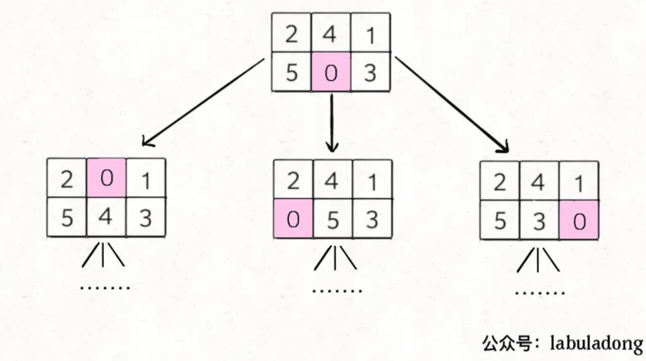

这样其实就是一个 BFS 问题，每次先找到数字 0，然后和周围的数字进行交换，形成新的局面加入队列…… 当第一次到达target时，就得到了赢得游戏的最少步数。

对于第二个问题，我们这里的board仅仅是 2x3 的二维数组，所以可以压缩成一个一维字符串。**其中比较有技巧性的点在于，二维数组有「上下左右」的概念，压缩成一维后，如何得到某一个索引上下左右的索引**？

很简单，我们只要手动写出来这个映射就行了

```java
int[][] neighbors = {{1, 3}, {0, 2, 4}, {1, 5}, {0, 4}, {1, 3, 5}, {2, 4}};
```

这个含义就是，在一维字符串中，索引i在二维数组中的的相邻索引为neighbor[i]，：

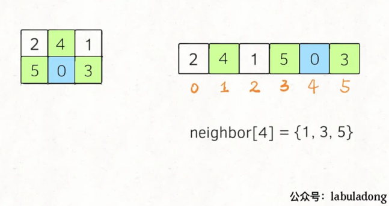

至此，我们就把这个问题完全转化成标准的 BFS 问题了，借助前文 BFS 算法框架套路详解 的代码框架，直接就可以套出解法代码了~

其实框架完全没有变，套路都是一样的，我们只是花了比较多的时间将滑动拼图游戏转化成 BFS 算法。

**很多益智游戏都是这样，虽然看起来特别巧妙，但都架不住暴力穷举，常用的算法就是回溯算法或者 BFS 算法**，感兴趣的话我们以后再聊。

## 如何⾼效寻找素数

素数的定义很简单，如果一个数如果只能被 1 和它本身整除，那么这个数就是素数。

不要觉得素数的定义简单，恐怕没多少人真的能把素数相关的算法写得高效。本文就主要聊这样一个函数：

```java
// 返回区间 [2, n) 中有几个素数 
int countPrimes(int n)

// 比如 countPrimes(10) 返回 4
// 因为 2,3,5,7 是素数
```

你会如何写这个函数？当然可以这样写：

```java
int countPrimes(int n) {
    int count = 0;
    for (int i = 2; i < n; i++)
        if (isPrim(i)) count++;
    return count;
}

// 判断整数 n 是否是素数
boolean isPrime(int n) {
    for (int i = 2; i < n; i++)
        if (n % i == 0)
            // 有其他整除因子
            return false;
    return true;
}
```

这样写的话时间复杂度 O(n^2)，问题很大。**首先你用 isPrime 函数来辅助的思路就不够高效；而且就算你要用 isPrime 函数，这样实现也是存在计算冗余的**。

先来简单说下如果你要判断一个数是不是素数，应该如何写算法。只需稍微修改一下上面的 isPrime 代码中的 for 循环条件：

```java
boolean isPrime(int n) {
    for (int i = 2; i * i <= n; i++)
        ...
}
```

换句话说，i不需要遍历到n，而只需要到sqrt(n)即可。为什么呢，我们举个例子，假设n = 12。

```java
12 = 2 × 6
12 = 3 × 4
12 = sqrt(12) × sqrt(12)
12 = 4 × 3
12 = 6 × 2
```

可以看到，后两个乘积就是前面两个反过来，反转的分界点就在sqrt(n)。

换句话说，如果在[2,sqrt(n)]这个区间之内没有发现可整除因子，就可以直接断定n是素数了，因为在区间[sqrt(n),n]也一定不会发现可整除因子。

这样，isPrime函数的时间复杂度降为了 O(sqrt(N))，但是我们实现countPrimes函数其实并不需要这个函数，以上只是希望读者明白sqrt(n)的含义，因为等会还会用到。

### 高效实现 countPrimes

高效解决这个问题的核心思路是和上面的常规思路反着来：

首先从 2 开始，我们知道 2 是一个素数，那么 2 × 2 = 4, 3 × 2 = 6, 4 × 2 = 8… 都不可能是素数了。

然后我们发现 3 也是素数，那么 3 × 2 = 6, 3 × 3 = 9, 3 × 4 = 12… 也都不可能是素数了。

看到这里，你是否有点明白这个排除法的逻辑了呢？先看我们的第一版代码：

```java
int countPrimes(int n) {
    boolean[] isPrim = new boolean[n];
    // 将数组都初始化为 true
    Arrays.fill(isPrim, true);

    for (int i = 2; i < n; i++) 
        if (isPrim[i]) 
            // i 的倍数不可能是素数了
            for (int j = 2 * i; j < n; j += i) 
                    isPrim[j] = false;

    int count = 0;
    for (int i = 2; i < n; i++)
        if (isPrim[i]) count++;

    return count;
}

```

如果上面这段代码你能够理解，那么你已经掌握了整体思路，但是还有两个细微的地方可以优化。

首先，回想刚才判断一个数是否是素数的isPrime函数，由于因子的对称性，其中的 for 循环只需要遍历[2,sqrt(n)]就够了。这里也是类似的，我们外层的 for 循环也只需要遍历到sqrt(n)：

```java
for (int i = 2; i * i < n; i++) 
    if (isPrim[i]) 
        ...
```

除此之外，很难注意到内层的 for 循环也可以优化。我们之前的做法是：

```java
for (int j = 2 * i; j < n; j += i) 
    isPrim[j] = false;
```

这样可以把i的整数倍都标记为false，但是仍然存在计算冗余。

比如i = 4时算法会标记 4 × 2 = 8，4 × 3 = 12 等等数字，但是 8 和 12 已经被i = 2和i = 3的 2 × 4 和 3 × 4 标记过了。

我们可以稍微优化一下，让j从i的平方开始遍历，而不是从2 * i开始

```java
for (int j = i * i; j < n; j += i) 
    isPrim[j] = false;
```

这样，素数计数的算法就高效实现了。其实这个算法有一个名字，叫做 Sieve of Eratosthenes。

该算法的时间复杂度比较难算，显然时间跟这个嵌套 for 循环有关，其操作数应该是：
n/2 + n/3 + n/5 + n/7 + … = n × (1/2 + 1/3 + 1/5 + 1/7…)

括号中是素数的倒数和。其最终结果是 O(N * loglogN)，有兴趣的读者可以查一下该算法的时间复杂度证明。

## 快速模幂算法

LeetCode 372

**要求你的算法返回幂运算a^b的计算结果与 1337 取模（mod，也就是余数）后的结果**。就是你先得计算幂a^b，但是这个b会非常大，所以b是用数组的形式表示的。

这个算法其实就是广泛应用于离散数学的模幂算法，至于为什么要对 1337 求模我们不管，单就这道题可以有三个难点：

**一是如何处理用数组表示的指数**，现在b是一个数组，也就是说b可以非常大，没办法直接转成整型，否则可能溢出。你怎么把这个数组作为指数，进行运算呢？

**二是如何得到求模之后的结果**？按道理，起码应该先把幂运算结果算出来，然后做% 1337这个运算。但问题是，指数运算你懂得，真实结果肯定会大得吓人，也就是说，算出来真实结果也没办法表示，早都溢出报错了。

**三是如何高效进行幂运算**，进行幂运算也是有算法技巧的，如果你不了解这个算法，后文会讲解。

那么对于这几个问题，我们分开思考，逐个击破。

### 如何处理数组指数

首先明确问题：现在b是一个数组，不能表示成整型，而且数组的特点是随机访问，删除最后一个元素比较高效。

不考虑求模的要求，以b = [1,5,6,4]来举例，结合指数运算的法则，我们可以发现这样的一个规律：

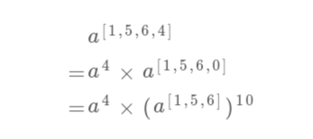

看到这，我们的老读者肯定已经敏感地意识到了，这就是递归的标志呀！因为问题的规模缩小了：

```java
    superPow(a, [1,5,6,4])
=>  superPow(a, [1,5,6])
```

那么，发现了这个规律，我们可以先简单翻译出代码框架：
```java
// 计算 a 的 k 次方的结果
// 后文我们会手动实现
int mypow(int a, int k);

int superPow(int a, vector<int>& b) {
    // 递归的 base case
    if (b.empty()) return 1;
    // 取出最后一个数
    int last = b.back();
    b.pop_back();
    // 将原问题化简，缩小规模递归求解
    int part1 = mypow(a, last);
    int part2 = mypow(superPow(a, b), 10);
    // 合并出结果
    return part1 * part2;
}
```

到这里，应该都不难理解吧！我们已经解决了b是一个数组的问题，现在来看看如何处理 mod，避免结果太大而导致的整型溢出。

### 如何处理 mod 运算

首先明确问题：由于计算机的编码方式，形如(a * b) % base这样的运算，乘法的结果可能导致溢出，我们希望找到一种技巧，能够化简这种表达式，避免溢出同时得到结果。

比如在二分查找中，我们求中点索引时用(l+r)/2转化成l+(r-l)/2，避免溢出的同时得到正确的结果。

那么，说一个关于模运算的技巧吧，毕竟模运算在算法中比较常见：

(a*b)%k = (a%k)(b%k)%k

证明很简单，假设：

a=Ak+B；b=Ck+D

其中 A,B,C,D 是任意常数，那么：

ab = ACk^2+ADk+BCk+BD

ab%k = BD%k

又因为：

a%k = B；b%k = D

所以：

(a%k)(b%k)%k = BD%k

综上，就可以得到我们化简求模的等式了。

**换句话说，对乘法的结果求模，等价于先对每个因子都求模，然后对因子相乘的结果再求模**。

那么扩展到这道题，求一个数的幂不就是对这个数连乘么？所以说只要简单扩展刚才的思路，即可给幂运算求模：

```java
int base = 1337;
// 计算 a 的 k 次方然后与 base 求模的结果
int mypow(int a, int k) {
    // 对因子求模
    a %= base;
    int res = 1;
    for (int _ = 0; _ < k; _++) {
        // 这里有乘法，是潜在的溢出点
        res *= a;
        // 对乘法结果求模
        res %= base;
    }
    return res;
}

int superPow(int a, vector<int>& b) {
    if (b.empty()) return 1;
    int last = b.back();
    b.pop_back();

    int part1 = mypow(a, last);
    int part2 = mypow(superPow(a, b), 10);
    // 每次乘法都要求模
    return (part1 * part2) % base;
}

```
你看，**先对因子a求模，然后每次都对乘法结果res求模，这样可以保证res *= a这句代码执行时两个因子都是小于base的，也就一定不会造成溢出**，同时结果也是正确的。

至此，这个问题就已经完全解决了，已经可以通过 LeetCode 的判题系统了。

但是有的读者可能会问，这个求幂的算法就这么简单吗，直接一个 for 循环累乘就行了？复杂度会不会比较高，有没有更高效的算法呢？

有更高效的算法的，但是单就这道题来说，已经足够了。

因为你想想，调用mypow函数传入的k最多有多大？k不过是b数组中的一个数，也就是在 0 到 9 之间，所以可以说这里每次调用mypow的时间复杂度就是 O(1)。整个算法的时间复杂度是 O(N)，N 为b的长度。

但是既然说到幂运算了，不妨顺带说一下如何高效计算幂运算吧。

### 如何高效求幂

快速求幂的算法不止一个，就说一个我们应该掌握的基本思路吧。利用幂运算的性质，我们可以写出这样一个递归式：

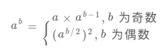

这个思想肯定比直接用 for 循环求幂要高效，因为有机会直接把问题规模（b的大小）直接减小一半，该算法的复杂度肯定是 log 级了。

那么就可以修改之前的mypow函数，翻译这个递归公式，再加上求模的运算：

```java
int base = 1337;

int mypow(int a, int k) {
    if (k == 0) return 1;
    a %= base;

    if (k % 2 == 1) {
        // k 是奇数
        return (a * mypow(a, k - 1)) % base;
    } else {
        // k 是偶数
        int sub = mypow(a, k / 2);
        return (sub * sub) % base;
    }
}
```
这个递归解法很好理解对吧，如果改写成迭代写法，那就是大名鼎鼎的快速幂算法。至于如何改成迭代，很巧妙，这里推荐一位大佬的文章 [让技术一瓜共食：快速幂算法](https://mp.weixin.qq.com/s?__biz=MzA5MTM1NTc2Ng==&mid=2458321758&idx=1&sn=e92e7a72d245831c29acb3d2a29607da&scene=21#wechat_redirect)。

虽然对于题目，这个优化没有啥特别明显的效率提升，但是这个求幂算法已经升级了，以后如果别人让你写幂算法，起码要写出这个算法。

至此，Super Pow 就算完全解决了，包括了递归思想以及处理模运算、幂运算的技巧，可以说这个题目还是挺有意思的，你有什么有趣的题目，可以留言分享一下。

## Union-Find算法详解

Union-Find 算法，也就是常说的并查集算法，主要是解决图论中「动态连通性」问题的。

### ⼀、问题介绍

简单说，动态连通性其实可以抽象成给⼀幅图连线。⽐如下⾯这幅图，总共 有 10 个节点，他们互不相连，分别⽤ 0~9 标记：

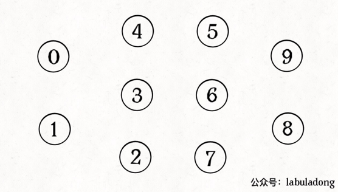

现在我们的 Union-Find 算法主要需要实现这两个 API：
* 判断a,b是否连通
* 将a,b连通

```java
class UF {
    /* 将 p 和 q 连接 */
    public void union(int p, int q);
    /* 判断 p 和 q 是否连通 */
    public boolean connected(int p, int q);
    /* 返回图中有多少个连通分量 */
    public int count();
}
```

这里所说的「连通」是一种等价关系，也就是说具有如下三个性质：

* 1、自反性：节点p和p是连通的。

* 2、对称性：如果节点p和q连通，那么q和p也连通。

* 3、传递性：如果节点p和q连通，q和r连通，那么p和r也连通。

比如说之前那幅图，0～9 任意两个不同的点都不连通，调用connected都会返回 false，连通分量为 10 个。

如果现在调用union(0, 1)，那么 0 和 1 被连通，连通分量降为 9 个。

再调用union(1, 2)，这时 0,1,2 都被连通，调用connected(0, 2)也会返回 true，连通分量变为 8 个。

判断这种「等价关系」非常实用，比如说**编译器判断同一个变量的不同引用**，**比如社交网络中的朋友圈计算**等等。

这样，你应该大概明白什么是动态连通性了，Union-Find 算法的关键就在于union和connected函数的效率。那么用**什么模型**来表示这幅图的连通状态呢？用**什么数据结构**来实现代码呢？

### 二、基本思路

注意我刚才把「模型」和具体的「数据结构」分开说，这么做是有原因的。因为我们使用森林（若干棵树）来表示图的动态连通性，用数组来具体实现这个森林。

怎么用森林来表示连通性呢？我们设定树的每个节点有一个指针指向其父节点，如果是根节点的话，这个指针指向自己。

比如说刚才那幅 10 个节点的图，一开始的时候没有相互连通，就是这样：

```java
class UF {
    // 记录连通分量
    private int count;
    // 节点 x 的节点是 parent[x]
    private int[] parent;

    /* 构造函数，n 为图的节点总数 */
    public UF(int n) {
        // 一开始互不连通
        this.count = n;
        // 父节点指针初始指向自己
        parent = new int[n];
        for (int i = 0; i < n; i++)
            parent[i] = i;
    }

    /* 其他函数 */
}
```


**如果某两个节点被连通，则让其中的（任意）一个节点的根节点接到另一个节点的根节点上**：

```java
public void union(int p, int q) {
    int rootP = find(p);
    int rootQ = find(q);
    if (rootP == rootQ)
        return;
    // 将两棵树合并为一棵
    parent[rootP] = rootQ;
    // parent[rootQ] = rootP 也一样
    count--; // 两个分量合二为一
}

/* 返回某个节点 x 的根节点 */
private int find(int x) {
    // 根节点的 parent[x] == x
    while (parent[x] != x)
        x = parent[x];
    return x;
}

/* 返回当前的连通分量个数 */
public int count() { 
    return count;
}
```

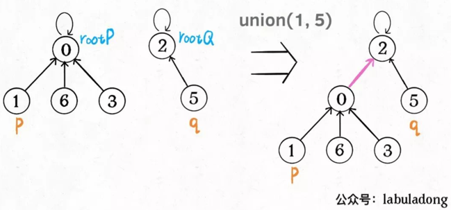


这样，如果节点p和q连通的话，它们一定拥有相同的根节点：

```java
public boolean connected(int p, int q) {
    int rootP = find(p);
    int rootQ = find(q);
    return rootP == rootQ;
}
```

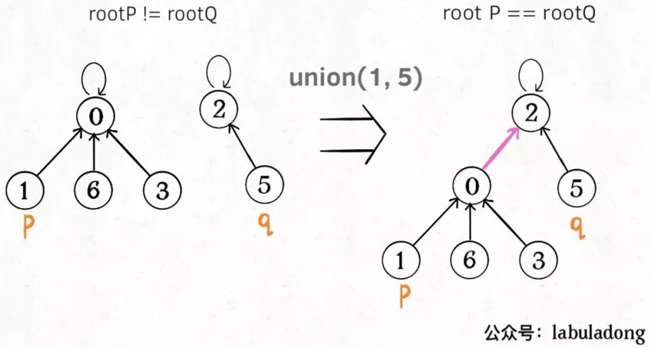

至此，Union-Find 算法就基本完成了。是不是很神奇？竟然可以这样使用数组来模拟出一个森林，如此巧妙的解决这个比较复杂的问题！

那么这个算法的复杂度是多少呢？我们发现，主要 API connected和union中的复杂度都是find函数造成的，所以说它们的复杂度和find一样。

find主要功能就是从某个节点向上遍历到树根，其时间复杂度就是树的高度。我们可能习惯性地认为树的高度就是logN，但这并不一定。**logN的高度只存在于平衡二叉树，对于一般的树可能出现极端不平衡的情况，使得「树」几乎退化成「链表」，树的高度最坏情况下可能变成N**。

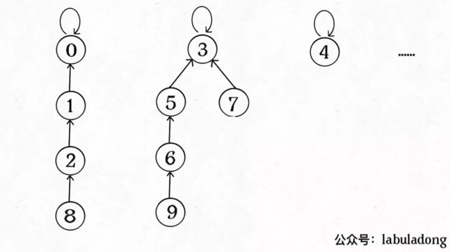

所以说上面这种解法，find,union,connected的时间复杂度都是 O(N)。这个复杂度很不理想的，你想图论解决的都是诸如社交网络这样数据规模巨大的问题，对于union和connected的调用非常频繁，每次调用需要线性时间完全不可忍受。

问题的关键在于，如何想办法避免树的不平衡呢？只需要略施小计即可。

### 三、平衡性优化

我们一开始就是简单粗暴的把p所在的树接到q所在的树的根节点下面，那么这里就可能出现「头重脚轻」的不平衡状况，比如下面这种局面：

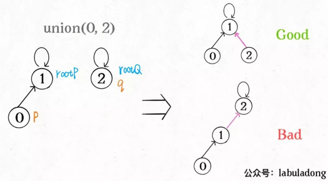

长此以往，树可能生长得很不平衡。我们其实是希望，**小一些的树接到大一些的树下面，这样就能避免头重脚轻，更平衡一些**。解决方法是额外使用一个size数组，记录每棵树包含的节点数，我们不妨称为「重量」：

```java
class UF {
    private int count;
    private int[] parent;
    // 新增一个数组记录树的“重量”
    private int[] size;

    public UF(int n) {
        this.count = n;
        parent = new int[n];
        // 最初每棵树只有一个节点
        // 重量应该初始化 1
        size = new int[n];
        for (int i = 0; i < n; i++) {
            parent[i] = i;
            size[i] = 1;
        }
    }
    /* 其他函数 */
}
```

比如说size[3] = 5表示，以节点3为根的那棵树，总共有5个节点。这样我们可以修改一下union方法：

```java
public void union(int p, int q) {
    int rootP = find(p);
    int rootQ = find(q);
    if (rootP == rootQ)
        return;

    // 小树接到大树下面，较平衡
    if (size[rootP] > size[rootQ]) {
        parent[rootQ] = rootP;
        size[rootP] += size[rootQ];
    } else {
        parent[rootP] = rootQ;
        size[rootQ] += size[rootP];
    }
    count--;
}

```

这样，通过比较树的重量，就可以保证树的生长相对平衡，树的高度大致在logN这个数量级，极大提升执行效率。

此时，find,union,connected的时间复杂度都下降为 O(logN)，即便数据规模上亿，所需时间也非常少。

### 四、路径压缩

这步优化特别简单，所以非常巧妙。我们能不能进一步压缩每棵树的高度，使树高始终保持为常数？

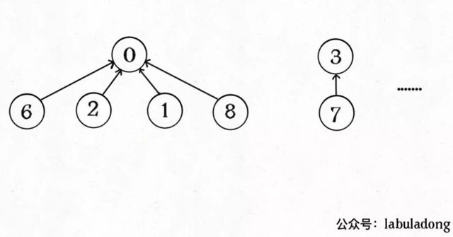

这样find就能以 O(1) 的时间找到某一节点的根节点，相应的，connected和union复杂度都下降为 O(1)。

要做到这一点，非常简单，只需要在find中加一行代码：

```java
private int find(int x) {
    while (parent[x] != x) {
        // 进行路径压缩
        parent[x] = parent[parent[x]];
        x = parent[x];
    }
    return x;
}
```

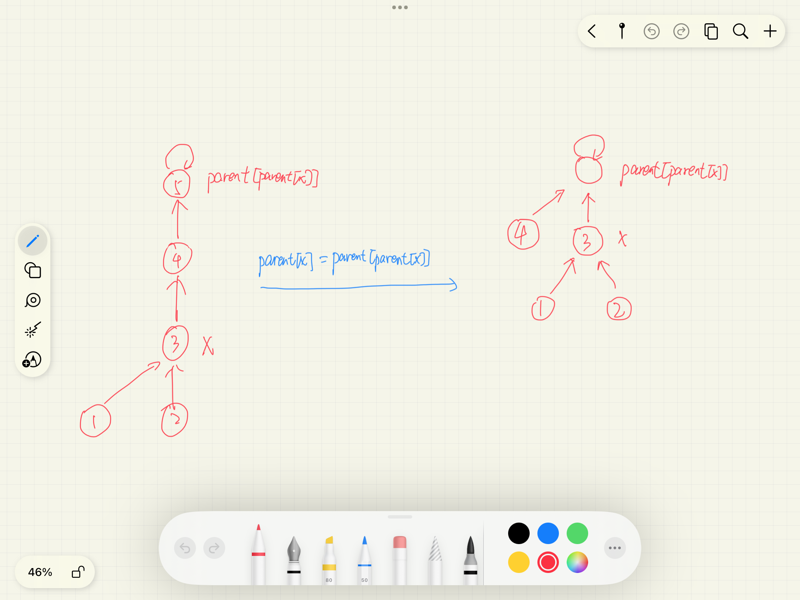

可见，调用find函数每次向树根遍历的同时，顺手将树高缩短了，最终所有树高都不会超过 3（union的时候树高可能达到 3）。

Union-Find 算法的复杂度可以这样分析：构造函数初始化数据结构需要 O(N) 的时间和空间复杂度；连通两个节点union、判断两个节点的连通性connected、计算连通分量count所需的时间复杂度均为 O(1)。

## Union-Find 算法怎么应用？

算法的关键点有 3 个：

1、用parent数组记录每个节点的父节点，相当于指向父节点的指针，所以parent数组内实际存储着一个森林（若干棵多叉树）。

2、用size数组记录着每棵树的重量，目的是让union后树依然拥有平衡性，而不会退化成链表，影响操作效率。

3、在find函数中进行路径压缩，保证任意树的高度保持在常数，使得union和connectedAPI 时间复杂度为 O(1)。

有的读者问，既然有了路径压缩，size数组的重量平衡还需要吗？这个问题很有意思，因为路径压缩保证了树高为常数（不超过 3），那么树就算不平衡，高度也是常数，基本没什么影响。

我认为，论时间复杂度的话，确实，不需要重量平衡也是 O(1)。但是如果加上size数组辅助，效率还是略微高一些，比如下面这种情况：

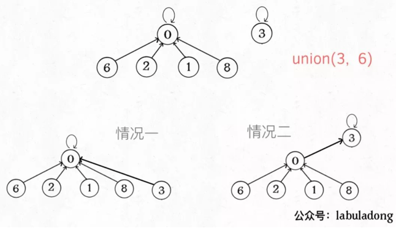

如果带有重量平衡优化，一定会得到情况一，而不带重量优化，可能出现情况二。高度为 3 时才会触发路径压缩那个while循环，所以情况一根本不会触发路径压缩，而情况二会多执行很多次路径压缩，将第三层节点压缩到第二层。

**也就是说，去掉重量平衡，虽然对于单个的find函数调用，时间复杂度依然是 O(1)，但是对于 API 调用的整个过程，效率会有一定的下降**。当然，好处就是减少了一些空间，不过对于 Big O 表示法来说，时空复杂度都没变。

下面言归正传，来看看这个算法有什么实际应用。

### 一、DFS 的替代方案

LeetCode 130

很多使用 DFS 深度优先算法解决的问题，也可以用 Union-Find 算法解决。

比如第 130 题，被围绕的区域：给你一个 M×N 的二维矩阵，其中包含字符X和O，让你找到矩阵中完全被X围住的O，并且把它们替换成X。

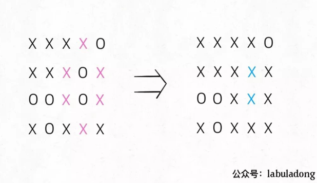


解决这个问题的传统方法也不困难，先用 for 循环遍历棋盘的四边，用 DFS 算法把那些与边界相连的O换成一个特殊字符，比如#；然后再遍历整个棋盘，把剩下的O换成X，把#恢复成O。这样就能完成题目的要求，时间复杂度 O(MN)。

这个问题也可以用 Union-Find 算法解决，虽然实现复杂一些，甚至效率也略低，但这是使用 Union-Find 算法的通用思想，值得一学。

你可以把那些不需要被替换的O看成一个拥有独门绝技的门派，它们有一个共同祖师爷叫dummy，这些O和dummy互相连通，而那些需要被替换的O与dummy不连通。

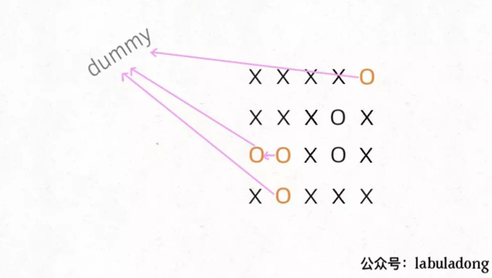

首先要解决的是，根据我们的实现，Union-Find 底层用的是一维数组，构造函数需要传入这个数组的大小，而题目给的是一个二维棋盘。

这个很简单，二维坐标(x,y)可以转换成x * n + y这个数（m是棋盘的行数，n是棋盘的列数）。敲黑板，**这是将二维坐标映射到一维的常用技巧**。

其次，我们之前描述的「祖师爷」是虚构的，需要给他老人家留个位置。索引[0.. m*n-1]都是棋盘内坐标的一维映射，那就让这个虚拟的dummy节点占据索引m*n好了，只有和边界O相连的O才具有和dummy的连通性，他们不会被替换。

说实话，Union-Find 算法解决这个简单的问题有点杀鸡用牛刀，它可以解决更复杂，更具有技巧性的问题，**主要思路是适时增加虚拟节点，想办法让元素「分门别类」，建立动态连通关系**。

### 二、判定合法算式

LeetCode 990

这个问题用 Union-Find 算法就显得十分优美了。

我们前文说过，动态连通性其实就是一种等价关系，具有「自反性」「传递性」和「对称性」，其实==关系也是一种等价关系，具有这些性质。所以这个问题用 Union-Find 算法就很自然。

核心思想是，**将equations中的算式根据==和!=分成两部分，先处理==算式，使得他们通过相等关系各自勾结成门派；然后处理!=算式，检查不等关系是否破坏了相等关系的连通性**。

### 三、简单总结

使用 Union-Find 算法，**主要是如何把原问题转化成图的动态连通性问题。对于算式合法性问题，可以直接利用等价关系，对于棋盘包围问题，则是利用一个虚拟节点，营造出动态连通特性**。

另外，将二维数组映射到一维数组，利用方向数组d来简化代码量，都是在写算法时常用的一些小技巧，如果没见过可以注意一下。


