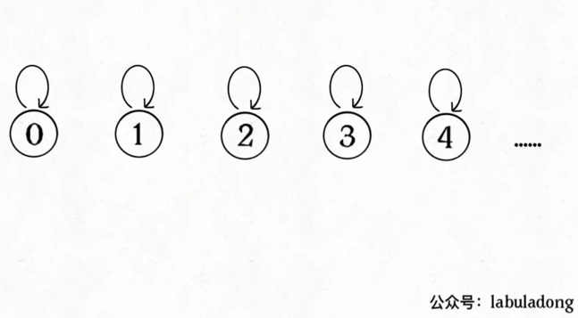

# 高频面试题系列

## Union-Find算法详解

Union-Find 算法，也就是常说的并查集算法，主要是解决图论中「动态连通性」问题的。

### ⼀、问题介绍

简单说，动态连通性其实可以抽象成给⼀幅图连线。⽐如下⾯这幅图，总共 有 10 个节点，他们互不相连，分别⽤ 0~9 标记：


现在我们的 Union-Find 算法主要需要实现这两个 API：
* 判断a,b是否连通
* 将a,b连通

```java
class UF {
    /* 将 p 和 q 连接 */
    public void union(int p, int q);
    /* 判断 p 和 q 是否连通 */
    public boolean connected(int p, int q);
    /* 返回图中有多少个连通分量 */
    public int count();
}
```

这里所说的「连通」是一种等价关系，也就是说具有如下三个性质：

* 1、自反性：节点p和p是连通的。

* 2、对称性：如果节点p和q连通，那么q和p也连通。

* 3、传递性：如果节点p和q连通，q和r连通，那么p和r也连通。

比如说之前那幅图，0～9 任意两个不同的点都不连通，调用connected都会返回 false，连通分量为 10 个。

如果现在调用union(0, 1)，那么 0 和 1 被连通，连通分量降为 9 个。

再调用union(1, 2)，这时 0,1,2 都被连通，调用connected(0, 2)也会返回 true，连通分量变为 8 个。

判断这种「等价关系」非常实用，比如说**编译器判断同一个变量的不同引用**，**比如社交网络中的朋友圈计算**等等。

这样，你应该大概明白什么是动态连通性了，Union-Find 算法的关键就在于union和connected函数的效率。那么用**什么模型**来表示这幅图的连通状态呢？用**什么数据结构**来实现代码呢？

### 二、基本思路

注意我刚才把「模型」和具体的「数据结构」分开说，这么做是有原因的。因为我们使用森林（若干棵树）来表示图的动态连通性，用数组来具体实现这个森林。

怎么用森林来表示连通性呢？我们设定树的每个节点有一个指针指向其父节点，如果是根节点的话，这个指针指向自己。

比如说刚才那幅 10 个节点的图，一开始的时候没有相互连通，就是这样：

```java
class UF {
    // 记录连通分量
    private int count;
    // 节点 x 的节点是 parent[x]
    private int[] parent;

    /* 构造函数，n 为图的节点总数 */
    public UF(int n) {
        // 一开始互不连通
        this.count = n;
        // 父节点指针初始指向自己
        parent = new int[n];
        for (int i = 0; i < n; i++)
            parent[i] = i;
    }

    /* 其他函数 */
}
```



**如果某两个节点被连通，则让其中的（任意）一个节点的根节点接到另一个节点的根节点上**：

```java
public void union(int p, int q) {
    int rootP = find(p);
    int rootQ = find(q);
    if (rootP == rootQ)
        return;
    // 将两棵树合并为一棵
    parent[rootP] = rootQ;
    // parent[rootQ] = rootP 也一样
    count--; // 两个分量合二为一
}

/* 返回某个节点 x 的根节点 */
private int find(int x) {
    // 根节点的 parent[x] == x
    while (parent[x] != x)
        x = parent[x];
    return x;
}

/* 返回当前的连通分量个数 */
public int count() { 
    return count;
}
```


这样，如果节点p和q连通的话，它们一定拥有相同的根节点：

```java
public boolean connected(int p, int q) {
    int rootP = find(p);
    int rootQ = find(q);
    return rootP == rootQ;
}
```


至此，Union-Find 算法就基本完成了。是不是很神奇？竟然可以这样使用数组来模拟出一个森林，如此巧妙的解决这个比较复杂的问题！

那么这个算法的复杂度是多少呢？我们发现，主要 API connected和union中的复杂度都是find函数造成的，所以说它们的复杂度和find一样。

find主要功能就是从某个节点向上遍历到树根，其时间复杂度就是树的高度。我们可能习惯性地认为树的高度就是logN，但这并不一定。**logN的高度只存在于平衡二叉树，对于一般的树可能出现极端不平衡的情况，使得「树」几乎退化成「链表」，树的高度最坏情况下可能变成N**。


所以说上面这种解法，find,union,connected的时间复杂度都是 O(N)。这个复杂度很不理想的，你想图论解决的都是诸如社交网络这样数据规模巨大的问题，对于union和connected的调用非常频繁，每次调用需要线性时间完全不可忍受。

问题的关键在于，如何想办法避免树的不平衡呢？只需要略施小计即可。

### 三、平衡性优化

我们一开始就是简单粗暴的把p所在的树接到q所在的树的根节点下面，那么这里就可能出现「头重脚轻」的不平衡状况，比如下面这种局面：


长此以往，树可能生长得很不平衡。我们其实是希望，**小一些的树接到大一些的树下面，这样就能避免头重脚轻，更平衡一些**。解决方法是额外使用一个size数组，记录每棵树包含的节点数，我们不妨称为「重量」：

```java
class UF {
    private int count;
    private int[] parent;
    // 新增一个数组记录树的“重量”
    private int[] size;

    public UF(int n) {
        this.count = n;
        parent = new int[n];
        // 最初每棵树只有一个节点
        // 重量应该初始化 1
        size = new int[n];
        for (int i = 0; i < n; i++) {
            parent[i] = i;
            size[i] = 1;
        }
    }
    /* 其他函数 */
}
```

比如说size[3] = 5表示，以节点3为根的那棵树，总共有5个节点。这样我们可以修改一下union方法：

```java
public void union(int p, int q) {
    int rootP = find(p);
    int rootQ = find(q);
    if (rootP == rootQ)
        return;

    // 小树接到大树下面，较平衡
    if (size[rootP] > size[rootQ]) {
        parent[rootQ] = rootP;
        size[rootP] += size[rootQ];
    } else {
        parent[rootP] = rootQ;
        size[rootQ] += size[rootP];
    }
    count--;
}

```

这样，通过比较树的重量，就可以保证树的生长相对平衡，树的高度大致在logN这个数量级，极大提升执行效率。

此时，find,union,connected的时间复杂度都下降为 O(logN)，即便数据规模上亿，所需时间也非常少。

### 四、路径压缩

这步优化特别简单，所以非常巧妙。我们能不能进一步压缩每棵树的高度，使树高始终保持为常数？


这样find就能以 O(1) 的时间找到某一节点的根节点，相应的，connected和union复杂度都下降为 O(1)。

要做到这一点，非常简单，只需要在find中加一行代码：

```java
private int find(int x) {
    while (parent[x] != x) {
        // 进行路径压缩
        parent[x] = parent[parent[x]];
        x = parent[x];
    }
    return x;
}
```


可见，调用find函数每次向树根遍历的同时，顺手将树高缩短了，最终所有树高都不会超过 3（union的时候树高可能达到 3）。

Union-Find 算法的复杂度可以这样分析：构造函数初始化数据结构需要 O(N) 的时间和空间复杂度；连通两个节点union、判断两个节点的连通性connected、计算连通分量count所需的时间复杂度均为 O(1)。

## Union-Find 算法怎么应用？

算法的关键点有 3 个：

1、用parent数组记录每个节点的父节点，相当于指向父节点的指针，所以parent数组内实际存储着一个森林（若干棵多叉树）。

2、用size数组记录着每棵树的重量，目的是让union后树依然拥有平衡性，而不会退化成链表，影响操作效率。

3、在find函数中进行路径压缩，保证任意树的高度保持在常数，使得union和connectedAPI 时间复杂度为 O(1)。

有的读者问，既然有了路径压缩，size数组的重量平衡还需要吗？这个问题很有意思，因为路径压缩保证了树高为常数（不超过 3），那么树就算不平衡，高度也是常数，基本没什么影响。

我认为，论时间复杂度的话，确实，不需要重量平衡也是 O(1)。但是如果加上size数组辅助，效率还是略微高一些，比如下面这种情况：


如果带有重量平衡优化，一定会得到情况一，而不带重量优化，可能出现情况二。高度为 3 时才会触发路径压缩那个while循环，所以情况一根本不会触发路径压缩，而情况二会多执行很多次路径压缩，将第三层节点压缩到第二层。

**也就是说，去掉重量平衡，虽然对于单个的find函数调用，时间复杂度依然是 O(1)，但是对于 API 调用的整个过程，效率会有一定的下降**。当然，好处就是减少了一些空间，不过对于 Big O 表示法来说，时空复杂度都没变。

下面言归正传，来看看这个算法有什么实际应用。

### 一、DFS 的替代方案

LeetCode 130

很多使用 DFS 深度优先算法解决的问题，也可以用 Union-Find 算法解决。

比如第 130 题，被围绕的区域：给你一个 M×N 的二维矩阵，其中包含字符X和O，让你找到矩阵中完全被X围住的O，并且把它们替换成X。


解决这个问题的传统方法也不困难，先用 for 循环遍历棋盘的四边，用 DFS 算法把那些与边界相连的O换成一个特殊字符，比如#；然后再遍历整个棋盘，把剩下的O换成X，把#恢复成O。这样就能完成题目的要求，时间复杂度 O(MN)。

这个问题也可以用 Union-Find 算法解决，虽然实现复杂一些，甚至效率也略低，但这是使用 Union-Find 算法的通用思想，值得一学。

你可以把那些不需要被替换的O看成一个拥有独门绝技的门派，它们有一个共同祖师爷叫dummy，这些O和dummy互相连通，而那些需要被替换的O与dummy不连通。


首先要解决的是，根据我们的实现，Union-Find 底层用的是一维数组，构造函数需要传入这个数组的大小，而题目给的是一个二维棋盘。

这个很简单，二维坐标(x,y)可以转换成x * n + y这个数（m是棋盘的行数，n是棋盘的列数）。敲黑板，**这是将二维坐标映射到一维的常用技巧**。

其次，我们之前描述的「祖师爷」是虚构的，需要给他老人家留个位置。索引[0.. m*n-1]都是棋盘内坐标的一维映射，那就让这个虚拟的dummy节点占据索引m*n好了，只有和边界O相连的O才具有和dummy的连通性，他们不会被替换。

说实话，Union-Find 算法解决这个简单的问题有点杀鸡用牛刀，它可以解决更复杂，更具有技巧性的问题，**主要思路是适时增加虚拟节点，想办法让元素「分门别类」，建立动态连通关系**。

### 二、判定合法算式

LeetCode 990

这个问题用 Union-Find 算法就显得十分优美了。

我们前文说过，动态连通性其实就是一种等价关系，具有「自反性」「传递性」和「对称性」，其实==关系也是一种等价关系，具有这些性质。所以这个问题用 Union-Find 算法就很自然。

核心思想是，**将equations中的算式根据==和!=分成两部分，先处理==算式，使得他们通过相等关系各自勾结成门派；然后处理!=算式，检查不等关系是否破坏了相等关系的连通性**。

### 三、简单总结

使用 Union-Find 算法，**主要是如何把原问题转化成图的动态连通性问题。对于算式合法性问题，可以直接利用等价关系，对于棋盘包围问题，则是利用一个虚拟节点，营造出动态连通特性**。

另外，将二维数组映射到一维数组，利用方向数组d来简化代码量，都是在写算法时常用的一些小技巧，如果没见过可以注意一下。


