# 热点题目详解

## 详解一道腾讯面试题：编辑距离（LeetCode 72）

看起来十分困难，解法却出奇得简单漂亮，而且它是少有的比较实用的算法（是的，我承认很多算法问题都不太实用）。

为什么说这个问题难呢，因为显而易见，它就是难，让人手足无措，望而生畏。

为什么说它实用呢，因为前几天我就在日常生活中用到了这个算法。之前有一篇公众号文章由于疏忽，写错位了一段内容，我决定修改这部分内容让逻辑通顺。但是公众号文章最多只能修改 20 个字，且只支持增、删、替换操作（跟编辑距离问题一模一样），于是我就用算法求出了一个最优方案，只用了 16 步就完成了修改。

再比如高大上一点的应用，DNA 序列是由 A,G,C,T 组成的序列，可以类比成字符串。编辑距离可以衡量两个 DNA 序列的相似度，编辑距离越小，说明这两段 DNA 越相似，说不定这俩 DNA 的主人是远古近亲啥的。

下面言归正传，详细讲解一下编辑距离该怎么算，相信本文会让你有收获。

### 一、思路

前文 最长公共子序列 说过，**解决两个字符串的动态规划问题，一般都是用两个指针i,j分别指向两个字符串的最后，然后一步步往前走，缩小问题的规模**。如果i走完s1时j还没走完了s2，那就只能用插入操作把s2剩下的字符全部插入s1。等会会看到，这两种情况就是算法的 base case。

### 二、代码详解

base case 是i走完s1或j走完s2，可以直接返回另一个字符串剩下的长度。

对于每对儿字符s1[i]和s2[j]，可以有四种操作：

```java
if s1[i] == s2[j]:
    啥都别做（skip）
    i, j 同时向前移动
else:
    三选一：
        插入（insert）
        删除（delete）
        替换（replace）
```

dp(i, j) 递归函数的定义是这样的：

```python
def dp(i, j) -> int
# 返回 s1[0..i] 和 s2[0..j] 的最小编辑距离
```

记住这个定义之后，先来看这段代码：

```python
if s1[i] == s2[j]:
    return dp(i - 1, j - 1)  # 啥都不做
# 解释：
# 本来就相等，不需要任何操作
# s1[0..i] 和 s2[0..j] 的最小编辑距离等于
# s1[0..i-1] 和 s2[0..j-1] 的最小编辑距离
# 也就是说 dp(i, j) 等于 dp(i-1, j-1)
```

如果s1[i]！=s2[j]，就要对三个操作递归了，稍微需要点思考：

```python
dp(i, j - 1) + 1,    # 插入
# 解释：
# 我直接在 s1[i] 后插入一个和 s2[j] 一样的字符
# 那么 s2[j] 就被匹配了，前移 j，继续跟 i 对比
# 别忘了操作数加一

dp(i - 1, j) + 1,    # 删除
# 解释：
# 我直接把 s[i] 这个字符删掉
# 前移 i，继续跟 j 对比
# 操作数加一

dp(i - 1, j - 1) + 1 # 替换
# 解释：
# 我直接把 s1[i] 替换成 s2[j]，这样它俩就匹配了
# 同时前移 i，j 继续对比
# 操作数加一
```

### 三、动态规划优化

#### 备忘录优化：

```java
def minDistance(s1, s2) -> int:
    memo = dict() # 备忘录
    def dp(i, j):
        if (i, j) in memo:
            return memo[(i, j)]
        ...
    
        if s1[i] == s2[j]:
            memo[(i, j)] = ...
        else:
            memo[(i, j)] = ...
        return memo[(i, j)]
    return dp(len(s1) - 1, len(s2) - 1)
```

#### DP table 的解法：

首先明确 dp 数组的含义，dp 数组是一个二维数组，长这样:


dp[i][j]的含义和之前的 dp 函数类似：

```python
def dp(i, j) -> int
# 返回 s1[0..i] 和 s2[0..j] 的最小编辑距离

dp[i][j]
# 存储 s1[0..i] 和 s2[0..j] 的最小编辑距离
```

```java
public int minDistance(String word1, String word2) {
    int m = word1.length();
    int n = word2.length();
    int[][] dp = new int[m + 1][n + 1];
    // base case
    for (int i = 1; i <= m; i++){
        dp[i][0] = i;
    }
    for (int j = 1; j <= n; j++){
        dp[0][j] = j;
    }
    // 自底向上求解
    for (int i = 1; i <= m; i++){
        for (int j = 1; j <= n; j++){
            if (word1.charAt(i - 1) == word2.charAt(j - 1)){
                dp[i][j] = dp[i - 1][j - 1];
            } else {
                dp[i][j] = Math.min(Math.min(dp[i - 1][j] + 1, dp[i][j - 1] + 1), dp[i - 1][j - 1] + 1);
            }
        }
    }
    return dp[m][n];
}
```

### 四、扩展延伸

一般来说，处理两个字符串的动态规划问题，都是按本文的思路处理，建立 DP table。为什么呢，因为易于找出状态转移的关系，比如编辑距离的 DP table：


还有一个细节，既然每个dp[i][j]只和它附近的三个状态有关，空间复杂度是可以压缩成 O(min(M,N)) 的（M，N 是两个字符串的长度）。不难，但是可解释性大大降低，可以尝试优化一下。

你可能还会问，**这里只求出了最小的编辑距离，那具体的操作是什么**？之前举的修改公众号文章的例子，只有一个最小编辑距离肯定不够，还得知道具体怎么修改才行。

这个其实很简单，代码稍加修改，给 dp 数组增加额外的信息即可：

```java
// int[][] dp;
Node[][] dp;

class Node {
    int val;
    int choice;
    // 0 代表啥都不做
    // 1 代表插入
    // 2 代表删除
    // 3 代表替换
}
```

val属性就是之前的 dp 数组的数值，choice属性代表操作。在做最优选择时，顺便把操作记录下来，然后就从结果反推具体操作。

我们的最终结果不是dp[m][n]吗，这里的val存着最小编辑距离，choice存着最后一个操作，比如说是插入操作，那么就可以左移一格：


重复此过程，可以一步步回到起点dp[0][0]，形成一条路径，按这条路径上的操作编辑对应索引的字符，就是最佳方案：


这就是编辑距离算法的全部内容，希望本文对你有帮助。

## 经典动态规划：最小路径和（LeetCode 64）

太简单，略

## 经典面试题：最长公共子序列

最长公共子序列（Longest Common Subsequence，简称 LCS）是一道非常经典的面试题目，因为它的解法是典型的二维动态规划，大部分比较困难的字符串问题都和这个问题一个套路，比如说编辑距离。而且，这个算法稍加改造就可以用于解决其他问题，所以说 LCS 算法是值得掌握的。

肯定有读者会问，为啥这个问题就是动态规划来解决呢？因为子序列类型的问题，穷举出所有可能的结果都不容易，而**动态规划算法做的就是穷举 + 剪枝**，它俩天生一对儿。所以可以说只要涉及子序列问题，十有八九都需要动态规划来解决，往这方面考虑就对了。

### 一、动态规划思路

#### 第一步，**一定要明确dp数组的含义**。对于两个字符串的动态规划问题，套路是通用的。

比如说对于字符串s1和s2，一般来说都要构造一个这样的 DP table：

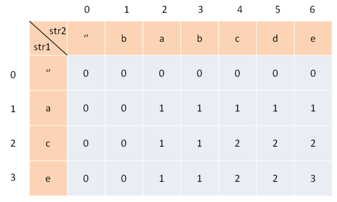

为了方便理解此表，我们暂时认为索引是从 1 开始的，待会的代码中只要稍作调整即可。其中，dp[i][j]的含义是：对于s1[1..i]和s2[1..j]，它们的 LCS 长度是dp[i][j]。

比如上图的例子，d[2][4] 的含义就是：对于"ac"和"babc"，它们的 LCS 长度是 2。我们最终想得到的答案应该是dp[3][6]。

#### 第二步，定义 base case。

我们专门让索引为 0 的行和列表示空串，dp[0][..]和dp[..][0]都应该初始化为 0，这就是 base case。

比如说，按照刚才 dp 数组的定义，dp[0][3]=0的含义是：对于字符串""和"bab"，其 LCS 的长度为 0。因为有一个字符串是空串，它们的最长公共子序列的长度显然应该是 0。

#### 第三步，找状态转移方程。

这是动态规划最难的一步，不过**好在这种字符串问题的套路都差不多**，权且借这道题来聊聊处理这类问题的思路。

状态转移说简单些就是做选择，比如说这个问题，是求s1和s2的最长公共子序列，不妨称这个子序列为lcs。那么对于s1和s2中的每个字符，有什么选择？很简单，两种选择，要么在lcs中，要么不在。

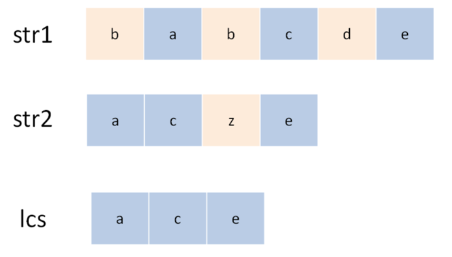

这个「在」和「不在」就是选择，关键是，应该如何选择呢？这个需要动点脑筋：如果某个字符应该在lcs中，那么这个字符肯定同时存在于s1和s2中，因为lcs是最长公共子序列嘛。所以本题的思路是这样：

用两个指针i和j从后往前遍历s1和s2，如果s1[i]==s2[j]，那么这个字符一定在lcs中；否则的话，s1[i]和s2[j]这两个字符至少有一个不在lcs中，需要丢弃一个。先看一下递归解法，比较容易理解：

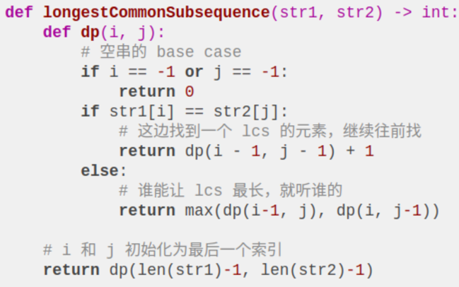

对于第一种情况，找到一个lcs中的字符，同时将i, j向前移动一位，并给lcs的长度加一；对于后者，则尝试两种情况，取更大的结果。

其实这段代码就是暴力解法，我们可以通过备忘录或者 DP table 来优化时间复杂度，比如通过前文描述的 DP table 来解决：

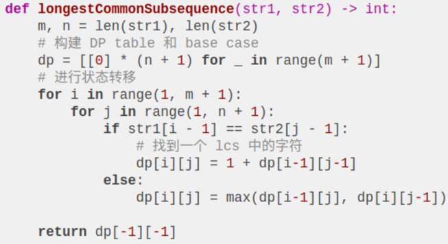

### 二、疑难解答

对于s1[i]和s2[j]不相等的情况，至少有一个字符不在lcs中，会不会两个字符都不在呢？比如下面这种情况：

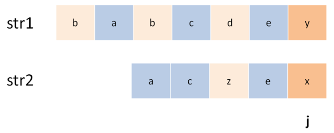

所以代码是不是应该考虑这种情况，改成这样：

```python
if str1[i - 1] == str2[j - 1]:
    # ...
else:
    dp[i][j] = max(dp[i-1][j], 
                   dp[i][j-1],
                   dp[i-1][j-1])
```

我一开始也有这种怀疑，其实可以这样改，也能得到正确答案，但是多此一举，因为dp[i-1][j-1]永远是三者中最小的，max 根本不可能取到它。

原因在于我们对 dp 数组的定义：对于s1[1..i]和s2[1..j]，它们的 LCS 长度是dp[i][j]。

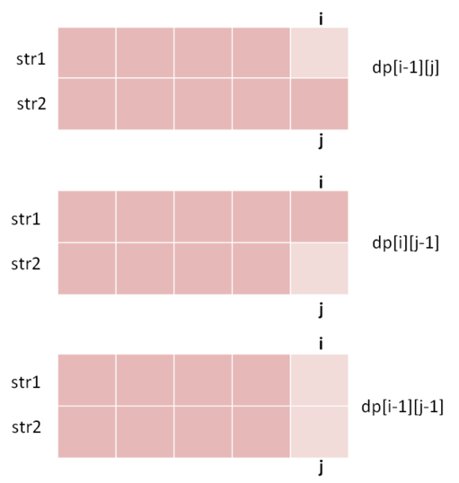

这样一看，显然dp[i-1][j-1]对应的lcs长度不可能比前两种情况大，所以没有必要参与比较。

### 总结

对于两个字符串的动态规划问题，一般来说都是像本文一样定义 DP table，因为这样定义有一个好处，就是容易写出状态转移方程，dp[i][j]的状态可以通过之前的状态推导出来：

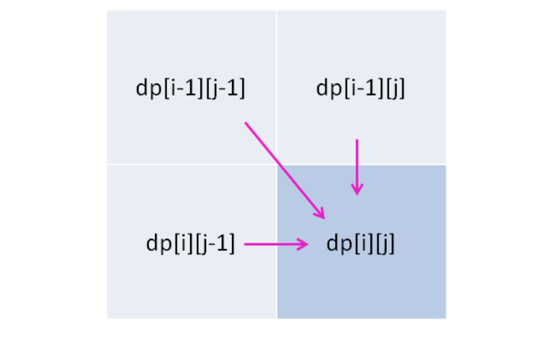

找状态转移方程的方法是，思考每个状态有哪些「选择」，只要我们能用正确的逻辑做出正确的选择，算法就能够正确运行。


## 子序列解题模板：最长回文子序列（LeetCode 516）

子序列问题本身就相对子串、子数组更困难一些，因为前者是不连续的序列，而后两者是连续的，就算穷举都不容易，更别说求解相关的算法问题了。

子序列问题的套路，其实就有**两种模板**，相关问题只要往这两种思路上想，十拿九稳。

一般来说，这类问题都是让你求一个最长子序列，因为最短子序列就是一个字符嘛，没啥可问的。一旦涉及到子序列和最值，那几乎可以肯定，考察的是动态规划技巧，时间复杂度一般都是 O(n^2)。

### 一、两种思路

#### 1、第一种思路模板是一个一维的 dp 数组：

```java
int n = array.length;
int[] dp = new int[n];

for (int i = 1; i < n; i++) {
    for (int j = 0; j < i; j++) {
        dp[i] = 最值(dp[i], dp[j] + ...)
    }
}
```
eg：最长递增子序列 （LeetCode 300）

这道题在这个思路中 dp 数组的定义是： 在子数组array[0..i]中，以array[i]结尾的目标子序列（最长递增子序列）的长度是dp[i]。

#### 2、第二种思路模板是一个二维的 dp 数组：

```java
int n = arr.length;
int[][] dp = new dp[n][n];

for (int i = 0; i < n; i++) {
    for (int j = 1; j < n; j++) {
        if (arr[i] == arr[j]) 
            dp[i][j] = dp[i][j] + ...
        else
            dp[i][j] = 最值(...)
    }
}
```

这种思路运用相对更多一些，尤其是涉及两个字符串/数组的子序列。本思路中 dp 数组含义又分为「只涉及一个字符串」和「涉及两个字符串」两种情况。

* 2.1 涉及两个字符串/数组时（比如最长公共子序列），dp 数组的含义如下：

    在子数组arr1[0..i]和子数组arr2[0..j]中，我们要求的子序列（最长公共子序列）长度为dp[i][j]。

* 2.2 只涉及一个字符串/数组时（比如本文要讲的最长回文子序列），dp 数组的含义如下：

    在子数组array[i..j]中，我们要求的子序列（最长回文子序列）的长度为dp[i][j]。

下面就借最长回文子序列这个问题，详解一下第二种情况下如何使用动态规划。

### 二、最长回文子序列

dp 数组的定义是：在子串s[i..j]中，最长回文子序列的长度为dp[i][j]。

```python
if (s[i] == s[j])
    // 它俩一定在最长回文子序列中
    dp[i][j] = dp[i + 1][j - 1] + 2;
else
    // s[i+1..j] 和 s[i..j-1] 谁的回文子序列更长？
    dp[i][j] = max(dp[i + 1][j], dp[i][j - 1]);
```

### 三、代码实现

base case：如果只有一个字符，显然最长回文子序列长度是 1，也就是dp[i][j] = 1,(i == j)，i肯定小于等于j，所以对于那些i > j的位置，根本不存在什么子序列，应该初始化为 0。

想求dp[i][j]需要知道dp[i+1][j-1]，dp[i+1][j]，dp[i][j-1]这三个位置；再看看我们确定的 base case，填入 dp 数组之后是这样：

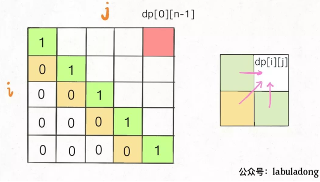

**这部分注意遍历顺序**，为了保证每次计算dp[i][j]，左、下、左下三个方向的位置已经被计算出来，只能斜着遍历或者反着遍历：

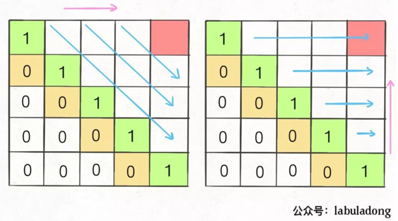

主要还是正确定义 dp 数组的含义，遇到子序列问题，首先想到两种动态规划思路，然后根据实际问题看看哪种思路容易找到状态转移关系。

另外，找到状态转移和 base case 之后，一定要观察 DP table，看看怎么遍历才能保证通过已计算出来的结果解决新的问题

## 动态规划设计之最长递增子序列（LeetCode 300）

### 一、动态规划解法 O(N^2)

动态规划的核心设计思想是数学归纳法。

dp数组定义：dp[i] 表示以 nums[i] 这个数结尾的最长递增子序列的长度。

根据这个定义，我们的最终结果（子序列的最大长度）应该是 dp 数组中的最大值。

```java
int res = 0;
for (int i = 0; i < dp.length; i++) {
    res = Math.max(res, dp[i]);
}
return res;
```

如果已经知道了 dp[0...4] 的所有结果，我们如何通过这些已知结果推出 dp[5] 呢？

根据刚才我们对 dp 数组的定义，现在想求 dp[5] 的值，也就是想求以 nums[5] 为结尾的最长递增子序列。nums[5] = 3，既然是递增子序列，我们只要找到前面那些结尾比 3 小的子序列，然后把 3 接到最后，就可以形成一个新的递增子序列，而且这个新的子序列长度加一。

当然，可能形成很多种新的子序列，但是我们只要最长的，把最长子序列的长度作为 dp[5] 的值即可。

```java
for (int i = 1; i < n; i++){
    for (int j = 0; j < i; j++){
        if (nums[j] < nums[i]){
            dp[i] = Math.max(dp[i], dp[j] + 1);
        }
    }
}
```

还有一个细节问题，就是 base case。dp 数组应该全部初始化为 1，因为子序列最少也要包含自己，所以长度最小为 1。

### 二、二分查找解法 O(NlogN)

这个解法的时间复杂度会将为 O(NlogN)，但是说实话，正常人基本想不到这种解法（也许玩过某些纸牌游戏的人可以想出来）。所以如果大家了解一下就好，正常情况下能够给出动态规划解法就已经很不错了。

根据题目的意思，我都很难想象这个问题竟然能和二分查找扯上关系。其实最长递增子序列和一种叫做 patience game 的纸牌游戏有关，甚至有一种排序方法就叫做 patience sorting（耐心排序）。

为了简单起见，后文跳过所有数学证明，通过一个简化的例子来理解一下思路。

首先，给你一排扑克牌，我们像遍历数组那样从左到右一张一张处理这些扑克牌，最终要把这些牌分成若干堆。

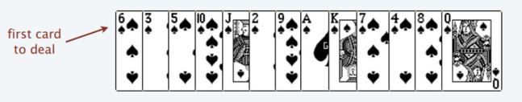

处理这些扑克牌要遵循以下规则：

* 只能把点数小的牌压到点数比它大的牌上。如果当前牌点数较大没有可以放置的堆，则新建一个堆，把这张牌放进去。如果当前牌有多个堆可供选择，则选择最左边的堆放置。

* 比如说上述的扑克牌最终会被分成这样 5 堆（我们认为 A 的值是最大的，而不是 1）。

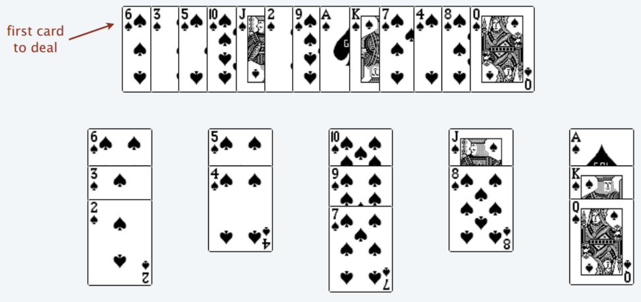

为什么遇到多个可选择堆的时候要放到最左边的堆上呢？因为这样可以保证牌堆顶的牌有序（2, 4, 7, 8, Q），证明略。

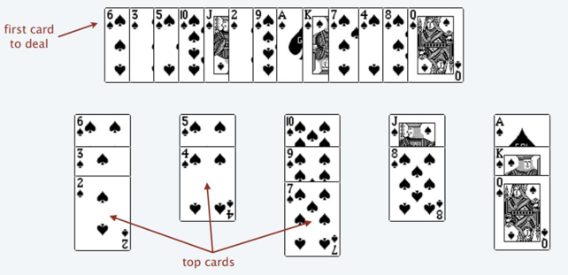

按照上述规则执行，可以算出最长递增子序列，牌的堆数就是我们想求的最长递增子序列的长度，证明略。

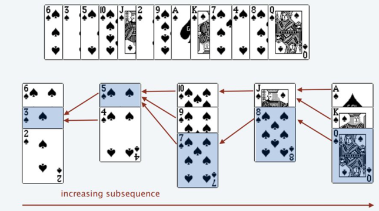

我们只要把处理扑克牌的过程编程写出来即可。每次处理一张扑克牌不是要找一个合适的牌堆顶来放吗，牌堆顶的牌不是有序吗，这就能用到二分查找了：用二分查找来搜索当前牌应放置的位置。

这个解法确实很难想到。首先涉及数学证明，谁能想到按照这些规则执行，就能得到最长递增子序列呢？其次还有二分查找的运用，要是对二分查找的细节不清楚，给了思路也很难写对。

所以，这个方法作为思维拓展好了。但动态规划的设计方法应该完全理解：假设之前的答案已知，利用数学归纳的思想正确进行状态的推演转移，最终得到答案。

### 三、拓展到二维（LeetCode 354）

这道题目其实是最长递增子序列的一个变种，因为每次合法的嵌套是大的套小的，相当于在二维平面中找一个最长递增的子序列，其长度就是最多能嵌套的信封个数

前面说的标准 LIS 算法只能在一维数组中寻找最长子序列，而我们的信封是由(w, h)这样的二维数对形式表示的，如何把 LIS 算法运用过来呢？

**先对宽度w进行升序排序，如果遇到w相同的情况，则按照高度h降序排序；之后把所有的h作为一个数组，在这个数组上计算 LIS 的长度就是答案**。

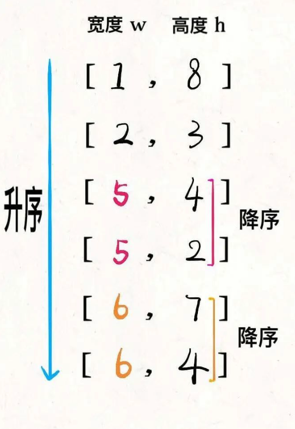

然后在h上寻找最长递增子序列，这个子序列就是最优的嵌套方案：3-->4-->7

为什么呢？稍微思考一下就明白了：

首先，对宽度w从小到大排序，确保了w这个维度可以互相嵌套，所以我们只需要专注高度h这个维度能够互相嵌套即可。

其次，两个w相同的信封不能相互包含，所以对于宽度w相同的信封，对高度h进行降序排序，保证 LIS 中不存在多个w相同的信封（因为题目说了长宽相同也无法嵌套）。

为了清晰，我将代码分为了两个函数， 你也可以合并，这样可以节省下height数组的空间。

如果使用二分搜索版的lengthOfLIS函数，此算法的时间复杂度为O(NlogN)，因为排序和计算 LIS 各需要O(NlogN)的时间。空间复杂度为O(N)，因为计算 LIS 的函数中需要一个top数组。

## 合并K个升序链表（LeetCode23）

```java
public ListNode mergeKLists(ListNode[] lists) {
    ListNode ans = null;
    for (int i = 0; i < lists.length; ++i) {
        ans = mergeTwoLists(ans, lists[i]);
    }
    return ans;
}

public ListNode mergeTwoLists(ListNode a, ListNode b) {
    if (a == null || b == null) {
        return a != null ? a : b;
    }
    ListNode head = new ListNode(0);
    ListNode tail = head, aPtr = a, bPtr = b;
    while (aPtr != null && bPtr != null) {
        if (aPtr.val < bPtr.val) {
            tail.next = aPtr;
            aPtr = aPtr.next;
        } else {
            tail.next = bPtr;
            bPtr = bPtr.next;
        }
        tail = tail.next;
    }
    tail.next = (aPtr != null ? aPtr : bPtr);
    return head.next;
}
```


## 一行代码就能解决的智力题

### 一、Nim 游戏

LeetCode 292

游戏规则是这样的：你和你的朋友面前有一堆石子，你们轮流拿，一次至少拿一颗，最多拿三颗，谁拿走最后一颗石子谁获胜。

假设你们都很聪明，由你第一个开始拿，请你写一个算法，输入一个正整数 n，返回你是否能赢（true 或 false）。

比如现在有 4 颗石子，算法应该返回 false。因为无论你拿 1 颗 2 颗还是 3 颗，对方都能一次性拿完，拿走最后一颗石子，所以你一定会输。

首先，这道题肯定可以使用动态规划，因为显然原问题存在子问题，且子问题存在重复。但是因为你们都很聪明，涉及到你和对手的博弈，动态规划会比较复杂。

**我们解决这种问题的思路一般都是反着思考**：

如果我能赢，那么最后轮到我取石子的时候必须要剩下 1~3 颗石子，这样我才能一把拿完。

如何营造这样的一个局面呢？显然，如果对手拿的时候只剩 4 颗石子，那么无论他怎么拿，总会剩下 1~3 颗石子，我就能赢。

如何逼迫对手面对 4 颗石子呢？要想办法，让我选择的时候还有 5~7 颗石子，这样的话我就有把握让对方不得不面对 4 颗石子。

如何营造 5~7 颗石子的局面呢？让对手面对 8 颗石子，无论他怎么拿，都会给我剩下 5~7 颗，我就能赢。

这样一直循环下去，我们发现只要踩到 4 的倍数，就落入了圈套，永远逃不出 4 的倍数，而且一定会输。所以这道题的解法非常简单：

```java
bool canWinNim(int n) {
    // 如果上来就踩到 4 的倍数，那就认输吧
    // 否则，可以把对方控制在 4 的倍数，必胜
    return n % 4 != 0;
}
```

### 二、石头游戏

LeetCode 877, 1140, 1406, 1510, 1563, 1686, 1690, 1872, 2029

游戏规则是这样的：你和你的朋友面前有一排石头堆，用一个数组 piles 表示，piles[i] 表示第 i 堆石子有多少个。你们轮流拿石头，一次拿一堆，但是只能拿走最左边或者最右边的石头堆。所有石头被拿完后，谁拥有的石头多，谁获胜。

**假设你们都很聪明**，由你第一个开始拿，请你写一个算法，输入一个数组 piles，返回你是否能赢（true 或 false）。

这道题涉及到两人的博弈，也可以用动态规划算法暴力试，比较麻烦。但我们只要对规则深入思考，就会大惊失色：只要你足够聪明，你是必胜无疑的，因为你是先手。

```java
boolean stoneGame(int[] piles) {
    return true;
}
```

这是为什么呢，因为题目有两个条件很重要：一是石头总共有偶数堆，石头的总数是奇数。这两个看似增加游戏公平性的条件，反而使该游戏成为了一个**割韭菜游戏**。我们以 piles=[2, 1, 9, 5] 讲解，假设这四堆石头从左到右的索引分别是 1，2，3，4。

如果我们把这四堆石头**按索引的奇偶分为两组**，即第 1、3 堆和第 2、4 堆，那么这两组石头的数量一定不同，也就是说一堆多一堆少。因为石头的总数是奇数，不能被平分。

而**作为第一个拿石头的人，你可以控制自己拿到所有偶数堆，或者所有的奇数堆**。

你最开始可以选择第 1 堆或第 4 堆。如果你想要偶数堆，你就拿第 4 堆，这样留给对手的选择只有第 1、3 堆，他不管怎么拿，第 2 堆又会暴露出来，你就可以拿。同理，如果你想拿奇数堆，你就拿第 1 堆，留给对手的只有第 2、4 堆，他不管怎么拿，第 3 堆又给你暴露出来了。

也就是说，**你可以在第一步就观察好，奇数堆的石头总数多，还是偶数堆的石头总数多，然后步步为营，就一切尽在掌控之中了**。

### 三、电灯开关问题

我们当然可以用一个布尔数组表示这些灯的开关情况，然后模拟这些操作过程，最后去数一下就能出结果。但是这样显得没有灵性，最好的解法是这样的：

```java
int bulbSwitch(int n) {
    return (int)Math.sqrt(n);
}
```

什么？这个问题跟平方根有什么关系？其实这个解法挺精妙，如果没人告诉你解法，还真不好想明白。

首先，因为电灯一开始都是关闭的，所以某一盏灯最后如果是点亮的，必然要被按奇数次开关。

我们假设只有 6 盏灯，而且我们只看第 6 盏灯。需要进行 6 轮操作对吧，请问对于第 6 盏灯，会被按下几次开关呢？这不难得出，第 1 轮会被按，第 2 轮，第 3 轮，第 6 轮都会被按。

为什么第 1、2、3、6 轮会被按呢？因为 6=1×6=2×3。一般情况下，因子都是成对出现的，也就是说开关被按的次数一般是偶数次。但是有特殊情况，比如说总共有 16 盏灯，那么第 16 盏灯会被按几次?

16=1×16=2×8=4×4

其中因子 4 重复出现，所以第 16 盏灯会被按 5 次，奇数次。现在你应该理解这个问题为什么和平方根有关了吧？

不过，我们不是要算最后有几盏灯亮着吗，这样直接平方根一下是啥意思呢？稍微思考一下就能理解了。

就假设现在总共有 16 盏灯，我们求 16 的平方根，等于 4，这就说明最后会有 4 盏灯亮着，它们分别是第 1×1=1 盏、第 2×2=4 盏、第 3×3=9 盏和第 4×4=16 盏。

我们不是想求有多少个可开方的数吗，4 是最大的平方根，那么小于 4 的正整数的平方都是在 1~16 内的，是会被按奇数次开关，最终亮着的灯。

就算有的 n 平方根结果是小数，强转成 int 型，也相当于一个最大整数上界，比这个上界小的所有整数，平方后的索引都是最后亮着的灯的索引。所以说我们直接把平方根转成整数，就是这个问题的答案。

最后拓展一下，虽然本文第二题「石头游戏」可以直接返回 true，但是这个问题的动态规划解法是十分有价值的，对于这种两个聪明人的博弈过程，如何设计 dp 数组描述这个过程，如何列出状态转移方程？

如果把题目推广一下，石头堆数可以是奇数，石头总数可以是偶数，让你求最后两人博弈后获得的分数（石头数）之差，怎么办？这就必须用动态规划解决了。

不过，庆幸的是我们之前已经有好几篇讲解动态规划套路的文章了，解决这个问题完全足够。期待的话，点个在看分个享，下篇文章聊聊石头游戏的动态规划解法。

