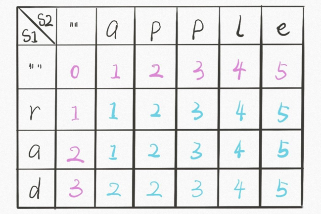
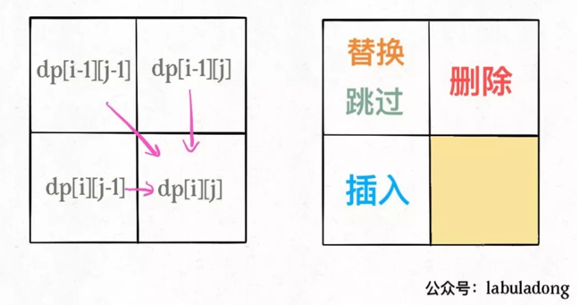
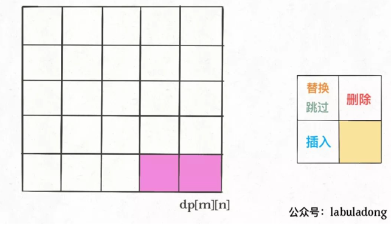
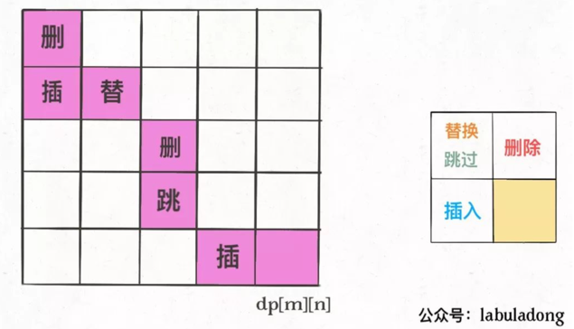

# 热点题目详解

## 详解一道腾讯面试题：编辑距离（LeetCode 72）

看起来十分困难，解法却出奇得简单漂亮，而且它是少有的比较实用的算法（是的，我承认很多算法问题都不太实用）。

为什么说这个问题难呢，因为显而易见，它就是难，让人手足无措，望而生畏。

为什么说它实用呢，因为前几天我就在日常生活中用到了这个算法。之前有一篇公众号文章由于疏忽，写错位了一段内容，我决定修改这部分内容让逻辑通顺。但是公众号文章最多只能修改 20 个字，且只支持增、删、替换操作（跟编辑距离问题一模一样），于是我就用算法求出了一个最优方案，只用了 16 步就完成了修改。

再比如高大上一点的应用，DNA 序列是由 A,G,C,T 组成的序列，可以类比成字符串。编辑距离可以衡量两个 DNA 序列的相似度，编辑距离越小，说明这两段 DNA 越相似，说不定这俩 DNA 的主人是远古近亲啥的。

下面言归正传，详细讲解一下编辑距离该怎么算，相信本文会让你有收获。

### 一、思路

前文 最长公共子序列 说过，**解决两个字符串的动态规划问题，一般都是用两个指针i,j分别指向两个字符串的最后，然后一步步往前走，缩小问题的规模**。如果i走完s1时j还没走完了s2，那就只能用插入操作把s2剩下的字符全部插入s1。等会会看到，这两种情况就是算法的 base case。

### 二、代码详解

base case 是i走完s1或j走完s2，可以直接返回另一个字符串剩下的长度。

对于每对儿字符s1[i]和s2[j]，可以有四种操作：

```java
if s1[i] == s2[j]:
    啥都别做（skip）
    i, j 同时向前移动
else:
    三选一：
        插入（insert）
        删除（delete）
        替换（replace）
```

dp(i, j) 递归函数的定义是这样的：

```python
def dp(i, j) -> int
# 返回 s1[0..i] 和 s2[0..j] 的最小编辑距离
```

记住这个定义之后，先来看这段代码：

```python
if s1[i] == s2[j]:
    return dp(i - 1, j - 1)  # 啥都不做
# 解释：
# 本来就相等，不需要任何操作
# s1[0..i] 和 s2[0..j] 的最小编辑距离等于
# s1[0..i-1] 和 s2[0..j-1] 的最小编辑距离
# 也就是说 dp(i, j) 等于 dp(i-1, j-1)
```

如果s1[i]！=s2[j]，就要对三个操作递归了，稍微需要点思考：

```python
dp(i, j - 1) + 1,    # 插入
# 解释：
# 我直接在 s1[i] 后插入一个和 s2[j] 一样的字符
# 那么 s2[j] 就被匹配了，前移 j，继续跟 i 对比
# 别忘了操作数加一

dp(i - 1, j) + 1,    # 删除
# 解释：
# 我直接把 s[i] 这个字符删掉
# 前移 i，继续跟 j 对比
# 操作数加一

dp(i - 1, j - 1) + 1 # 替换
# 解释：
# 我直接把 s1[i] 替换成 s2[j]，这样它俩就匹配了
# 同时前移 i，j 继续对比
# 操作数加一
```

### 三、动态规划优化

#### 备忘录优化：

```java
def minDistance(s1, s2) -> int:
    memo = dict() # 备忘录
    def dp(i, j):
        if (i, j) in memo:
            return memo[(i, j)]
        ...
    
        if s1[i] == s2[j]:
            memo[(i, j)] = ...
        else:
            memo[(i, j)] = ...
        return memo[(i, j)]
    return dp(len(s1) - 1, len(s2) - 1)
```

#### DP table 的解法：

首先明确 dp 数组的含义，dp 数组是一个二维数组，长这样:



dp[i][j]的含义和之前的 dp 函数类似：

```python
def dp(i, j) -> int
# 返回 s1[0..i] 和 s2[0..j] 的最小编辑距离

dp[i][j]
# 存储 s1[0..i] 和 s2[0..j] 的最小编辑距离
```

```java
public int minDistance(String word1, String word2) {
    int m = word1.length();
    int n = word2.length();
    int[][] dp = new int[m + 1][n + 1];
    // base case
    for (int i = 1; i <= m; i++){
        dp[i][0] = i;
    }
    for (int j = 1; j <= n; j++){
        dp[0][j] = j;
    }
    // 自底向上求解
    for (int i = 1; i <= m; i++){
        for (int j = 1; j <= n; j++){
            if (word1.charAt(i - 1) == word2.charAt(j - 1)){
                dp[i][j] = dp[i - 1][j - 1];
            } else {
                dp[i][j] = Math.min(Math.min(dp[i - 1][j] + 1, dp[i][j - 1] + 1), dp[i - 1][j - 1] + 1);
            }
        }
    }
    return dp[m][n];
}
```

### 四、扩展延伸

一般来说，处理两个字符串的动态规划问题，都是按本文的思路处理，建立 DP table。为什么呢，因为易于找出状态转移的关系，比如编辑距离的 DP table：



还有一个细节，既然每个dp[i][j]只和它附近的三个状态有关，空间复杂度是可以压缩成 O(min(M,N)) 的（M，N 是两个字符串的长度）。不难，但是可解释性大大降低，可以尝试优化一下。

你可能还会问，**这里只求出了最小的编辑距离，那具体的操作是什么**？之前举的修改公众号文章的例子，只有一个最小编辑距离肯定不够，还得知道具体怎么修改才行。

这个其实很简单，代码稍加修改，给 dp 数组增加额外的信息即可：

```java
// int[][] dp;
Node[][] dp;

class Node {
    int val;
    int choice;
    // 0 代表啥都不做
    // 1 代表插入
    // 2 代表删除
    // 3 代表替换
}
```

val属性就是之前的 dp 数组的数值，choice属性代表操作。在做最优选择时，顺便把操作记录下来，然后就从结果反推具体操作。

我们的最终结果不是dp[m][n]吗，这里的val存着最小编辑距离，choice存着最后一个操作，比如说是插入操作，那么就可以左移一格：



重复此过程，可以一步步回到起点dp[0][0]，形成一条路径，按这条路径上的操作编辑对应索引的字符，就是最佳方案：



这就是编辑距离算法的全部内容，希望本文对你有帮助。

## 经典动态规划：最小路径和（LeetCode 64）

略


