# 开篇词

## 学习算法和刷题的思路指南

### 数据结构的存储⽅式

**数据结构的存储⽅式只有两种：数组（顺序存储）和链表（链式存储）。**  

「图」的两种表⽰⽅法，邻接表就是链表，邻接矩阵就是⼆维数组。邻接矩 阵判断连通性迅速，并可以进⾏矩阵运算解决⼀些问题，但是如果图⽐较稀 疏的话很耗费空间。邻接表⽐较节省空间，但是很多操作的效率上肯定⽐不 过邻接矩阵。   

「散列表」就是通过散列函数把键映射到⼀个⼤数组⾥。⽽且对于解决散列 冲突的⽅法，拉链法需要链表特性，操作简单，但需要额外的空间存储指 针；线性探查法就需要数组特性，以便连续寻址，不需要指针的存储空间， 但操作稍微复杂些。   

「树」，⽤数组实现就是「堆」，因为「堆」是⼀个完全⼆叉树，⽤数组存 储不需要节点指针，操作也⽐较简单；⽤链表实现就是很常⻅的那种 「树」，因为不⼀定是完全⼆叉树，所以不适合⽤数组存储。为此，在这种 链表「树」结构之上，⼜衍⽣出各种巧妙的设计，⽐如⼆叉搜索树、AVL 树、红⿊树、区间树、B 树等等，以应对不同的问题。

### 数据结构的基本操作

基本操作⽆⾮遍历 + 访问，再具体⼀点就是：增删查改。各种数据结构的遍历 + 访问⽆⾮两种形式：线性的和⾮线性的。  

**线性就是 for/while 迭代为代表，⾮线性就是递归为代表。**

## 动态规划

计算机解决问题其实没有任何奇技淫巧，它唯⼀的解决办法就是穷举，穷举所有可能性。算法设计⽆⾮就是先思考“如何穷举”，然后再追求“如何聪明地穷举”。 

### 动态规划的一般思路流程：

**递归方法--(从上至下，增加备忘录记录子问题解)-->备忘录方法--(找到初始值，从下至上记录解)-->DP**

**明确「状态」 -> 定义 dp 数组/函数的含义 -> 明确「选择」-> 明确 base case。**

## 回溯算法

**解决⼀个回溯问题，实际上就是⼀个决策树的遍历过程。**

你只需要思考3个问题： 
* 路径：也就是已经做出的选择。 
* 选择列表：也就是你当前可以做的选择。 
* 结束条件：也就是到达决策树底层，⽆法再做选择的条件。

如果你不理解这三个词语的解释，没关系，我们后⾯会⽤「全排列」和「N 皇后问题」这两个经典的回溯算法问题来帮你理解这些词语是什么意思，现在你先留着印象。

**回溯算法框架中，要注意，核⼼就是 for 循环⾥⾯的递归，在递归调⽤之前「做选择」，在递归调⽤ 之后「撤销选择」**

### 总结

回溯算法就是个多叉树的遍历问题，关键就是在前序遍历和后序遍历的位置 做⼀些操作，算法框架如下：
```java
void backtrack(List<Integer> path, List<Integer> choices){
    // if 满足结束条件 ,假设做10次选择后结束
    if (path.size() == 10){
        pathList.add(path);
        return;
    }

    // for 选择 in 选择列表
    for (Integer choice : choices){
        // 做选择
        path.add(choice);
        backtrack(path, choices);
        // 撤销选择
        path.remove(path.size() - 1);
    }
}
```

**写 backtrack 函数时，需要维护⾛过的「路径」和当前可以做的「选择列 表」，当触发「结束条件」时，将「路径」记⼊结果集。**

其实想想看，回溯算法和动态规划是不是有点像呢？我们在动态规划系列⽂章中多次强调，动态规划的三个需要明确的点就是「状态」「选择」和 「base case」，是不是就对应着⾛过的「路径」，当前的「选择列表」和 「结束条件」？

某种程度上说，**动态规划的暴⼒求解阶段就是回溯算法**。只是有的问题具有重叠⼦问题性质，可以⽤ dp table 或者备忘录优化，将递归树⼤幅剪枝，这就变成了动态规划。⽽今天的两个问题，都**没有重叠⼦问题**，也就是回溯算法问题了，复杂度⾮常⾼是不可避免的。

## BFS 算法框架套路详解

**DFS算法就是回溯算法～**

BFS相对DFS的最主要的区别是：**BFS找到的路径⼀定是最短的，但代价就是空间复杂度⽐DFS⼤很多**

### 算法框架

**问题的本质就是让你在⼀幅「图」中找到从起点 start 到终点 target 的最近距离，BFS 算法问题其实都是在⼲这个事⼉。**

```java
int bfs(Node start, Node target) {
    // 核⼼数据结构
    Queue<Node> q = new LinkedList<>();
    // 避免⾛回头路
    Set<Node> visited = new HashSet<>();

    q.offer(start);
    visited.add(start);
    int step = 0;

    while (!q.isEmpty()) {
        int len = q.size();
        // 将当前队列节点向四周扩散
        for (int i = 0; i < len; i++) {
            Node cur = q.poll();
            /* 划重点：这⾥判断是否到达终点 */
            if (cur == target) {
                return step;
            }
            /* 将 cur 的相邻节点加⼊队列 */
            for (Node next : cur.nexts) {
                /**
                 * 队列 q 就不说了，BFS 的核⼼数据结构； cur.nexts 泛指 cur 相邻的节点;
                 * visited 的主要作⽤是防⽌⾛回头路，⼤部分时候都是必须的，但是像⼀般的⼆叉树结构，
                 * 没有⼦节点到⽗节点的指针，不会⾛回头路就不需要 visited 。
                 */
                if (!visited.contains(next)) {
                    q.offer(next);
                    visited.add(next);
                }
            }
        }
        /* 划重点：更新步数在这⾥ */
        step++;
    }
    return step;
}
```

eg:

[二叉树的最小深度](https://leetcode.cn/problems/minimum-depth-of-binary-tree/)

[解开密码锁的最少次数](https://leetcode.cn/problems/open-the-lock/) : **这个题还是需要仔细品味下的，如果没见过很难想到**

#### 1、为什么 BFS 可以找到最短距离，DFS 不⾏吗？
BFS 的逻辑， depth 每增加⼀次，队列中的所有节点都向前迈⼀步，这保证了第⼀次到达终点的时候，⾛的步数是最少的。

DFS 不能找最短路径吗？其实也是可以的，但是时间复杂度相对⾼很多。 DFS实际上是靠递归的堆栈记录⾛过的路径，要找到最短路径，肯定得把⼆叉树中所有树杈都探索完才能对⽐出最短的路径有多⻓，⽽ BFS 借助队列做到⼀次⼀步「⻬头并进」，是可以在不遍历完整棵树的条件下找到最短距离的。

#### 2、既然 BFS 那么好，为啥 DFS 还要存在？
BFS 可以找到最短距离，但是空间复杂度⾼，⽽ DFS 的空间复杂度较低。 
拿求二叉树的最小深度的例⼦，假设这个⼆叉树是满⼆叉树，节点数为 N ，对于 DFS 算法来说，空间复杂度⽆⾮就是递归堆栈，最坏情况下顶多就是树的⾼度，也就是 O(logN) 。
BFS算法，队列中每次都会储存着⼆叉树⼀层的节点，这样的话最坏情况下空间复杂度应该是树的最底层节点的数量，也就是 N/2 ，⽤ Big O 表⽰的话也就是 O(N) 。

由此观之，BFS 还是有代价的，**⼀般来说在找最短路径的时候使⽤BFS， 其他时候还是 DFS 使⽤得多⼀些（主要是递归代码好写）。**

### 双向 BFS 优化

BFS 算法还有⼀种稍微⾼级⼀点的优化思路：双向BFS，可以进⼀步提⾼算法的效率。**传统的 BFS 框架就是从起点开始向四周扩散，遇到终点时停⽌；⽽双向 BFS 则是从起点和终点同时开始扩散，当两边有交集的时候停⽌。** 时间复杂度未变，优化了常数时间。

## 二分查找详解

⼆分查找并不简单，Knuth ⼤佬（发明 KMP 算法的那位）都说⼆分查找：**思路很简单，细节是魔⿁**。

很多⼈喜欢拿整型溢出的 bug 说事⼉，但是⼆分查找真正的坑根本就不是那个细节问题，⽽是在于**到底要给 mid 加⼀还是 减⼀，while ⾥到底⽤ <= 还是 <**。

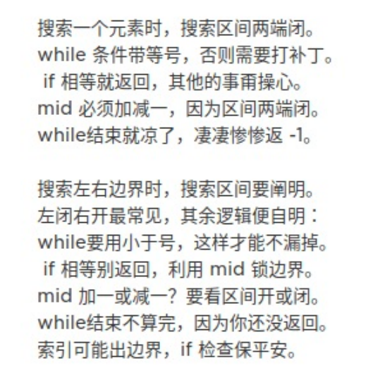

本⽂就来探究⼏个最常⽤的⼆分查找场景：寻找⼀个数、寻找左侧边界、寻找右侧边界。

### ⼆分查找框架

```java
int binarySearch(int[] nums, int target) {
    int left = 0, right = nums.length - 1;
    while (left <= right){
        int mid = left + ((right - left) >> 1);
        if (nums[mid] == target) {
            return mid;
        } else if (nums[mid] < target) {
            left = mid + 1;
        } else if (nums[mid] > target) {
            right = mid - 1;
        }
    }
    return -1;
}
```

**分析⼆分查找的⼀个技巧是：不要出现 else，⽽是把所有情况⽤ else if 写清楚，这样可以清楚地展现所有细节。**

1.寻找⼀个数（基本的⼆分搜索）

2.寻找左侧边界的⼆分搜索

3.寻找右侧边界的⼆分查找

## 滑动窗口算法框架

### 先导：双指针算法：快慢指针，左右指针

#### 一、快慢指针的常见算法（主要解决链表中的问题）

1.判定链表中是否含有环

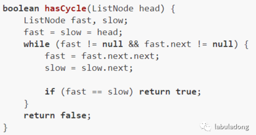

2.已知链表中含有环，返回这个环的起始位置

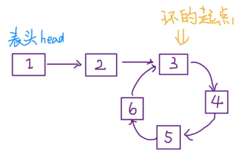

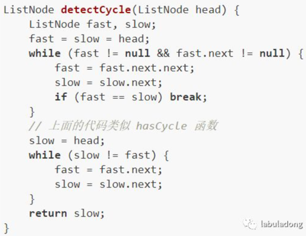

3.寻找链表的中点(下面算法当链表的长度是奇数时，slow 恰巧停在中点位置；如果长度是偶数，slow 最终的位置是中间偏右)

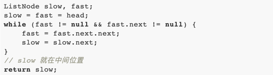

寻找链表中点的一个重要作用是对链表进行归并排序。回想数组的归并排序：求中点索引递归地把数组二分，最后合并两个有序数组。对于链表，合并两个有序链表是很简单的，难点就在于二分。

4.寻找链表的倒数第 k 个元素

快慢指针，让快指针先走 k 步，然后快慢指针开始同速前进。这样当快指针走到链表末尾 null 时，慢指针所在的位置就是倒数第 k 个链表节点（为了简化，假设 k 不会超过链表长度）

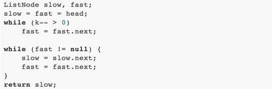


#### 二、左右指针的常用算法（主要解决数组或字符串的问题，如二分查找）

1.二分查找

2.两数之和

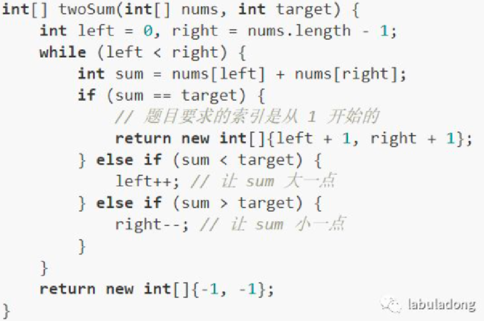

3.反转数组

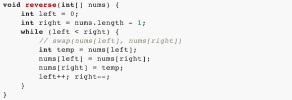

4.滑动窗口算法（主要解决字符串/数组等）

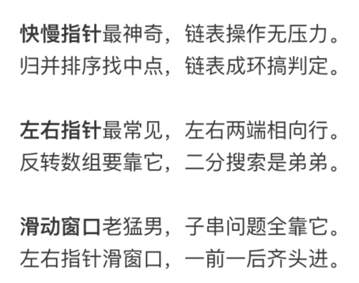

### 滑动窗口算法例题

#### LeetCode 0076 最小覆盖子串

滑动窗口算法的思路：

1、我们在字符串S中使用双指针中的左右指针技巧，初始化left = right = 0，把索引左闭右开区间[left, right)称为一个「窗口」。

2、我们先不断地增加right指针扩大窗口[left, right)，直到窗口中的字符串符合要求（包含了T中的所有字符）。

3、此时，我们停止增加right，转而不断增加left指针缩小窗口[left, right)，直到窗口中的字符串不再符合要求（不包含T中的所有字符了）。同时，每次增加left，我们都要更新一轮结果。

4、重复第 2 和第 3 步，直到right到达字符串S的尽头。

needs和window相当于计数器，分别记录T中字符出现次数和「窗口」中的相应字符的出现次数。

初始状态：

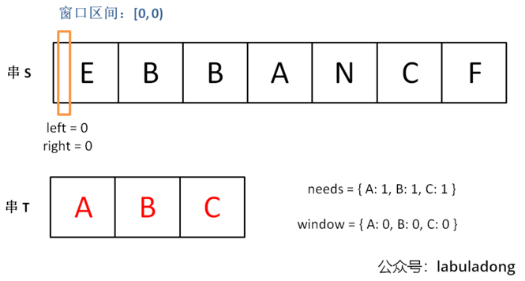

增加right，直到窗口[left, right)包含了T中所有字符：

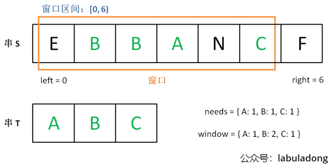

现在开始增加left，缩小窗口[left, right):

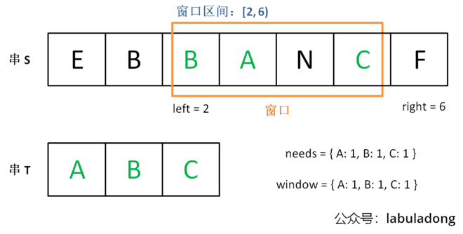

直到窗口中的字符串不再符合要求，left不再继续移动:

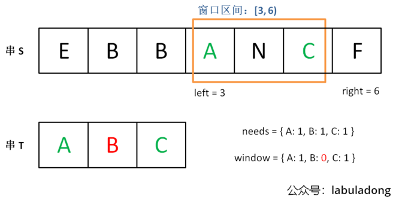

之后重复上述过程，先移动right，再移动left…… 直到right指针到达字符串S的末端，算法结束。

#### LeetCode 0567 字符串排列
两个条件：窗口大小等于字符串长度且每个字符出现次数相同

#### LeetCode 0438 找所有字母异位词

#### LeetCode 0003 最长无重复子串
简单题，连need和valid都不需要，更新窗口内数据也只需要简单的更新计数器window即可。 当window[c]值大于 1 时，说明窗口中存在重复字符，不符合条件，移动left缩小窗口。在收缩窗口完成后更新res，因为窗口收缩的 while 条件是存在重复元素，收缩完成后一定保证窗口中没有重复，保存最大的res即可。

## 团灭 LeetCode 股票买卖问题

LeetCode: 121,122,123,188,309,714

⽤状态机的技巧来解决，不要觉得这个名词⾼⼤上，⽂学词汇⽽已，实际上就是 DP table

### 一、穷举框架
对于LeetCode188，我们具体到每⼀天，看看总共有⼏种可能的「状态」，再找出每个「状态」对应的「选择」。我们要穷举所有「状态」，穷举的⽬的是根据对应的「选择」更新状态。听起来抽象，你只要记住「状态」和「选择」两个词就⾏，下⾯实操⼀下就很容易明⽩了。

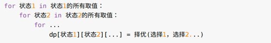

**每天有三种「选择」**：买⼊、卖出、⽆操作，我们⽤ buy, sell, rest 表⽰这三种选择。sell 必须在 buy 之后，buy 必须在 sell 之后。那么 rest 操作还应该分两种状态，⼀种是 buy 之后的 rest（持有了股票），⼀种是 sell 之 后的 rest（没有持有股票）

**每天有三个「状态」**，第⼀个是天数，第⼆个是允许交易的最⼤次数，第三个是当前的持有状态（即之前说的 rest 的状态，我们不妨⽤ 1 表⽰持有，0 表⽰没有持有），下面是全部的状态：

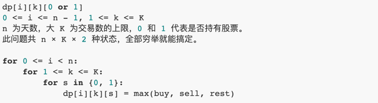

想求的最终答案是dp[n - 1][K][0]


### 二、状态转移框架

完成了「状态」的穷举，我们开始思考每种「状态」有哪些「选择」，应该如何更新「状态」。

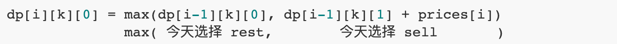

1、我昨天就没有持有，且截至昨天最大交易次数限制为k；然后我今天选择rest，所以我今天还是没有持有，最大交易次数限制依然为k。

2、我昨天持有股票，且截至昨天最大交易次数限制为k；但是今天我sell了，所以我今天没有持有股票了，最大交易次数限制依然为k。

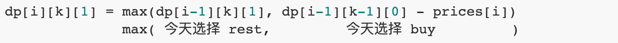

1、我昨天就持有着股票，且截至昨天最大交易次数限制为k；然后今天选择rest，所以我今天还持有着股票，最大交易次数限制依然为k。

2、我昨天本没有持有，且截至昨天最大交易次数限制为k - 1；但今天我选择buy，所以今天我就持有股票了，最大交易次数限制为k。

base case分析

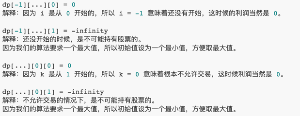

总结下：

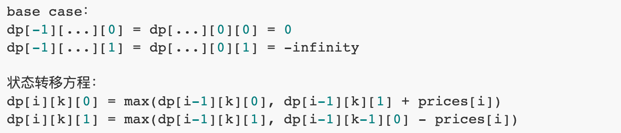

### 三、秒杀题目

k = 1 时；

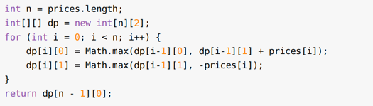

显然 i = 0 时 dp[i-1] 是不合法的。这是因为我们没有对 i 的 base case 进⾏处理。可以这样处理：

```java
for (int i = 0; i < n; i++){
    if (i - 1 == -1) {
        dp[i][0] = 0;
        dp[i][1] = -prices[i];
        continue;
    }
    dp[i][0] = Math.max(dp[i - 1][0], dp[i - 1][1] + prices[i]);
    dp[i][1] = Math.max(dp[i - 1][1], -prices[i]);
}
return dp[n - 1][0];
```

不限制交易次数时（可用于有冷冻时间，手续费等），低空间复杂度解题模板：

```java
public static int maxProfit(int[] prices) {
    int n = prices.length;
    int dp_i_0 = 0;
    int dp_i_1 = Integer.MIN_VALUE;
    for (int i = 0; i < n; i++){
        int tmp = dp_i_0;
        dp_i_0 = Math.max(dp_i_0, dp_i_1 + prices[i]);
        dp_i_1 = Math.max(dp_i_1, tmp - prices[i]);
    }

    return dp_i_0;
}
```

## 团灭 LeetCode 打家劫舍问题

LeetCode: 198, 213, 337

这类题目动态规划的特征很明显，解决动态规划问题就是找「状态」和「选择」，仅此而已。

从左到右走过这一排房子，在每间房子前都有两种选择：抢或者不抢。

如果你抢了这间房子，那么你肯定不能抢相邻的下一间房子了，只能从下下间房子开始做选择。

如果你不抢这间房子，那么你可以走到下一间房子前，继续做选择。

当你走过了最后一间房子后，你就没得抢了，能抢到的钱显然是 0（base case）。

**多观察，注意如何缩短空间复杂度（状态压缩，如果只依赖固定相邻状态，看是否可以用O(1)空间复杂度）**，如LeetCode198最终题解方法

## ⼀个⽅法团灭 nSum 问题

LeetCode: 1, 15, 18

### 一、twoSum 问题

### 二、threeSum 问题

### 三、nSum 问题

```java
 /**
 * @param nums   有序数组
 * @param n      n数之和
 * @param start  数组开始位置
 * @param target 目标值
 * @return
 */
public static List<List<Integer>> nSumTarget(int[] nums, int n, int start, int target) {
    int sz = nums.length;
    List<List<Integer>> res = new ArrayList<>();
    if (n < 2 || sz < n) {
        return res;
    }
    if (n == 2) {
        // 双指针
        return twoSumTarget(nums, start, target);
    } else {
        // n > 2 时，递归计算 (n-1)Sum 的结果
        for (int i = 0; i < sz; i++) {
            List<List<Integer>> tuples = nSumTarget(nums, n - 1, i + 1, target - nums[i]);
            for (List<Integer> tuple : tuples) {
                // (n-1)Sum 加上 nums[i] 就是 nSum
                tuple.add(nums[i]);
                res.add(tuple);
            }
            while (i < sz - 1 && nums[i] == nums[i + 1]) {
                i++;
            }
        }
    }
    return res;
}
```
## 经典动态规划问题：⾼楼扔鸡蛋

LeetCode: 887

### 一、解析题目

#### 什么叫「最坏情况」下「至少」要扔几次呢?

现在先不管鸡蛋个数的限制，有 7 层楼，你怎么去找鸡蛋恰好摔碎的那层楼？最原始的方式就是线性扫描：我先在 1 楼扔一下，没碎，我再去 2 楼扔一下，没碎，我再去 3 楼……以这种策略，最坏情况应该就是我试到第 7 层鸡蛋也没碎（F = 7），也就是我扔了 7 次鸡蛋。

现在你应该理解什么叫做「最坏情况」下了，鸡蛋破碎一定发生在**搜索区间穷尽**时，不会说你在第 1 层摔一下鸡蛋就碎了，这是你**运气好**，不是最坏情况，最坏情况要拿到**确切的值**。


#### 什么叫「至少」要扔几次

依然不考虑鸡蛋个数限制，同样是 7 层楼，我们可以优化策略。

最好的策略是使用二分查找思路，我先去第(1 + 7) / 2 = 4层扔一下，如果碎了说明F小于 4，我就去第(1 + 3) / 2 = 2层试…… 如果没碎说明F大于等于 4，我就去第(5 + 7) / 2 = 6层试……

以这种策略，最坏情况应该是试到第 7 层鸡蛋还没碎（F = 7），或者鸡蛋一直碎到第 1 层（F = 0）。然而无论那种最坏情况，只需要试log7向上取整等于 3 次，比刚才的 7 次要少，这就是所谓的至少要扔几次。

实际上，如果不限制鸡蛋个数的话，二分思路显然可以得到最少尝试的次数，但问题是，**现在给你了鸡蛋个数的限制K，直接使用二分思路就不行了**。

### 二、思路分析

对动态规划问题，直接套我们以前多次强调的框架即可：这个问题有什么「状态」，有什么「选择」，然后穷举。

**「状态」很明显，就是当前拥有的鸡蛋数K和需要测试的楼层数N**。随着测试的进行，鸡蛋个数可能减少，楼层的搜索范围会减小，这就是状态的变化。

**「选择」其实就是去选择哪层楼扔鸡蛋**。回顾刚才的线性扫描和二分思路，二分查找每次选择到楼层区间的中间去扔鸡蛋，而线性扫描选择一层层向上测试。不同的选择会造成状态的转移。

现在明确了「状态」和「选择」，动态规划的基本思路就形成了：肯定是个**二维的dp数组或者带有两个状态参数的dp函数来表示状态转移；外加一个 for 循环(顺序或二分)来遍历所有选择，择最优的选择更新结果**

```java
// 当前状态为 (K 个鸡蛋，N 层楼)
// 返回这个状态下的最优结果
public int dp(K, N){
    int res;
    for (int i = 0; i < N; i++){
        res = Math.min(res, 这次在第 i 层楼扔鸡蛋)
    }
    return res;
}
```

这段伪码还没有展示递归和状态转移，不过大致的算法框架已经完成了。

递归的 base case 很容易理解：当楼层数N等于 0 时，显然不需要扔鸡蛋；当鸡蛋数K为 1 时，显然只能线性扫描所有楼层

对于dp(k,n)，枚举第一个鸡蛋扔在x层，由于我们并不知道真正的f值，因而我们必须保证 **鸡蛋碎了之后接下来需要的步数** 和 **鸡蛋没碎之后接下来需要的步数** 二者的 **最大值** 最小，这样就保证了在 最坏的情况下（也就是无论f的值如何），dp(k,n)的值最小

## 经典动态规划问题：⾼楼扔鸡蛋（进阶篇）

### 一、二分搜索优化

#### 原始动态规划的思路：

* 1、暴力穷举尝试在所有楼层1 <= i <= N扔鸡蛋，每次选择尝试次数最少的那一层；（二分法优化的是这里，选择第一次扔鸡蛋的楼层）

* 2、每次扔鸡蛋有两种可能，要么碎，要么没碎；

* 3、如果鸡蛋碎了，F应该在第i层下面，否则，F应该在第i层上面；

* 4、鸡蛋是碎了还是没碎，取决于哪种情况下尝试次数更多，因为我们想求的是最坏情况下的结果。

核心的状态转移代码是这段：

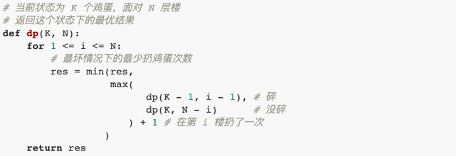

这个 for 循环就是下面这个状态转移方程的具体代码实现：

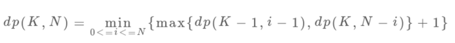

dp(K - 1, i - 1)和dp(K, N - i)这两个函数，其中i是从 1 到N单增的，如果我们固定K和N，把这两个函数看做关于i的函数，前者随着i的增加应该也是单调递增的，而后者随着i的增加应该是单调递减的，这时候求二者的较大值，再求这些最大值之中的最小值，其实就是求这两条直线交点，也就是红色折线的最低点。

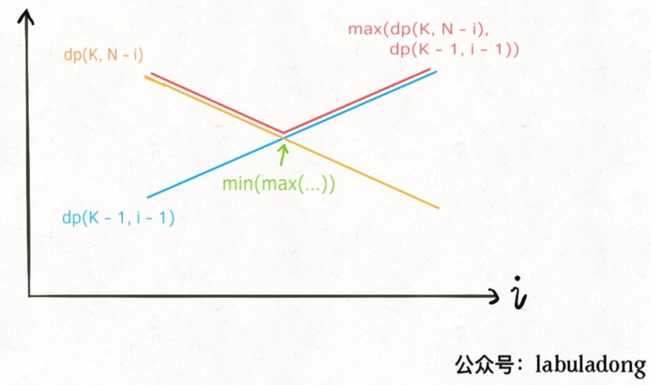

### 二、重写状态转移

前文 [动态规划：不同的定义产生不同的解法](https://mp.weixin.qq.com/s?__biz=MzAxODQxMDM0Mw==&mid=2247484469&idx=1&sn=e8d321c8ad62483874a997e9dd72da8f&chksm=9bd7fa3daca0732b316aa0afa58e70357e1cb7ab1fe0855d06bc4a852abb1b434c01c7dd19d6&scene=21#wechat_redirect) 就提过，
找动态规划的状态转移本就是见仁见智，比较玄学的事情。不同的状态定义可以衍生出不同的解法，其解法和复杂程度都可能有巨大差异。这里就是一个很好的例子。

再回顾一下我们之前定义的dp数组含义：

```java
dp[k][n] = m
# 当前状态为 k 个鸡蛋，面对 n 层楼
# 这个状态下最少的扔鸡蛋次数为 m
```

按照这个定义，就是确定当前的鸡蛋个数和面对的楼层数，就知道最小扔鸡蛋次数。最终我们想要的答案就是dp(K, N)的结果。上面的二分搜索优化也只是做了「剪枝」，减小了搜索空间，但本质思路没有变，只不过是更聪明的穷举。

现在，我们稍微修改dp数组的定义，确定当前的鸡蛋个数和最多允许的扔鸡蛋次数，就知道能够确定F的最高楼层数。有点绕口，具体来说是这个意思：

```java
dp[k][m] = n
# 当前有 k 个鸡蛋，可以尝试扔 m 次鸡蛋
# 这个状态下，最坏情况下最多能确切测试一栋 n 层的楼

# 比如说 dp[1][7] = 7 表示：
# 现在有 1 个鸡蛋，允许你扔 7 次;
# 这个状态下最多给你 7 层楼，
# 使得你可以确定楼层 F 使得鸡蛋恰好摔不碎
# （一层一层线性探查嘛）
```

这其实就是我们原始思路的一个「反向」版本，我们先不管这种思路的状态转移怎么写，先来思考一下这种定义之下，最终想求的答案是什么？ 我们最终要求的其实是扔鸡蛋次数m，但是这时候m在状态之中而不是dp数组的结果，可以这样处理：

```java
int superEggDrop(int K, int N) {
    int m = 0;
    while (dp[K][m] < N) {
        m++;
        // 状态转移...
    }
    return m;
}
```

题目不是给你K鸡蛋，N层楼，让你求最坏情况下最少的测试次数m 吗？while循环结束的条件是dp[K][m] == N，也就是给你K个鸡蛋，允许测试m次，最坏情况下最多能测试N层楼。

注意看这两段描述，是完全一样的！所以说这样组织代码是正确的，关键就是状态转移方程怎么找呢？还得从我们原始的思路开始讲。之前的解法配了这样图帮助大家理解状态转移思路：

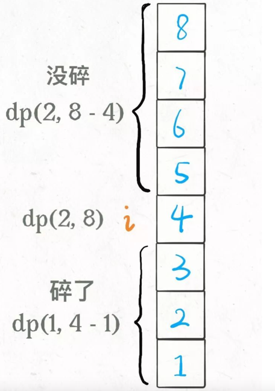

这个图描述的仅仅是某一个楼层i，原始解法还得**线性或者二分扫描所有楼层**，要求最大值、最小值。但是现在这种dp定义根本不需要这些了，基于下面两个事实：

**1、无论你在哪层楼扔鸡蛋，鸡蛋只可能摔碎或者没摔碎，碎了的话就测楼下，没碎的话就测楼上。**

**2、无论你上楼还是下楼，总的楼层数 = 楼上的楼层数 + 楼下的楼层数 + 1（当前这层楼）。**

根据这个特点，可以写出下面的状态转移方程：

**dp[k][m] = dp[k][m-1] + dp[k-1][m-1] + 1**

dp[k][m - 1]就是楼上的楼层数，因为鸡蛋个数k不变，也就是鸡蛋没碎，扔鸡蛋次数m减一；

dp[k - 1][m - 1]就是楼下的楼层数，因为鸡蛋个数k减一，也就是鸡蛋碎了，同时扔鸡蛋次数m减一。

PS：这个m为什么要减一而不是加一？之前定义得很清楚，这个m是一个允许的次数上界，而不是扔了几次。

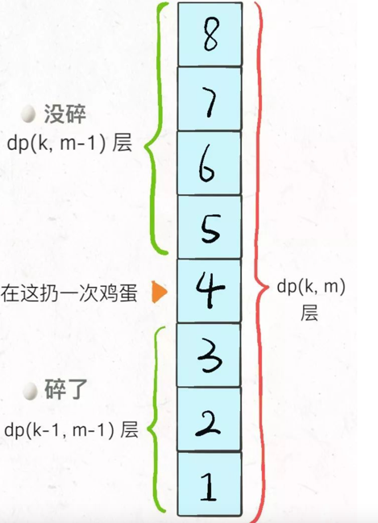

至此，整个思路就完成了，只要把状态转移方程填进框架即可：

```java
int superEggDrop(int K, int N) {
    // m 最多不会超过 N 次（线性扫描）
    int[][] dp = new int[K + 1][N + 1];
    // base case:
    // dp[0][..] = 0
    // dp[..][0] = 0
    // Java 默认初始化数组都为 0
    int m = 0;
    while (dp[K][m] < N) {
        m++;
        for (int k = 1; k <= K; k++)
            dp[k][m] = dp[k][m - 1] + dp[k - 1][m - 1] + 1;
    }
    return m;
}
```

如果你还觉得这段代码有点难以理解，其实它就等同于这样写：

```java
for (int m = 1; dp[K][m] < N; m++)
    for (int k = 1; k <= K; k++)
        dp[k][m] = dp[k][m - 1] + dp[k - 1][m - 1] + 1;
```

看到这种代码形式就熟悉多了吧，因为我们要求的不是dp数组里的值，而是某个符合条件的索引m，所以用while循环来找到这个m而已。

这个算法的时间复杂度是多少？很明显就是两个嵌套循环的复杂度 O(KN)。

另外注意到dp[m][k]转移只和左边和左上的两个状态有关，所以很容易优化成一维dp数组，这里就不写了。

### 三、进一步思考


