# 动态规划系列

## 动态规划答疑篇

这篇文章就给你讲明白以下几个问题：

1、到底什么才叫「最优子结构」，和动态规划什么关系。

2、如何判断一个问题是动态规划问题，即如何看出是否存在重叠子问题。

3、为什么经常看到将dp数组的大小设置为n + 1而不是n。

4、为什么动态规划遍历dp数组的方式五花八门，有的正着遍历，有的倒着遍历，有的斜着遍历。

**动态规划：递归-->自顶向下递归（备忘录）-->自底向上DP数组（迭代）**

### 一、最优子结构详解

「最优子结构」是某些问题的一种特定性质，并不是动态规划问题专有的。也就是说，很多问题其实都具有最优子结构，只是其中大部分不具有重叠子问题，所以我们不把它们归为动态规划系列问题而已。

我先举个很容易理解的例子：假设你们学校有 10 个班，你已经计算出了每个班的最高考试成绩。那么现在我要求你计算全校最高的成绩，你会不会算？当然会，而且你不用重新遍历全校学生的分数进行比较，而是只要在这 10 个最高成绩中取最大的就是全校的最高成绩。

我给你提出的这个问题就**符合最优子结构**：可以从子问题的最优结果推出更大规模问题的最优结果。让你算每个班的最优成绩就是子问题，你知道所有子问题的答案后，就可以借此推出全校学生的最优成绩这个规模更大的问题的答案。

你看，这么简单的问题都有最优子结构性质，只是因为显然**没有重叠子问题，所以我们简单地求最值肯定用不出动态规划**。

再举个例子：假设你们学校有 10 个班，你已知每个班的最大分数差（最高分和最低分的差值）。那么现在我让你计算全校学生中的最大分数差，你会不会算？可以想办法算，但是肯定不能通过已知的这 10 个班的最大分数差推到出来。因为这 10 个班的最大分数差不一定就包含全校学生的最大分数差，比如全校的最大分数差可能是 3 班的最高分和 6 班的最低分之差。

这次我给你提出的问题就**不符合最优子结构**，因为你没办通过每个班的最优值推出全校的最优值，没办法通过子问题的最优值推出规模更大的问题的最优值。前文 动态规划详解 说过，想满足最优子结，子问题之间必须互相独立。全校的最大分数差可能出现在两个班之间，显然子问题不独立，所以这个问题本身不符合最优子结构。

最优子结构并不是动态规划独有的一种性质，能求最值的问题大部分都具有这个性质；但反过来，**最优子结构性质作为动态规划问题的必要条件，一定是让你求最值的**

### 二、如何一眼看出重叠子问题

略

### 三、dp数组的大小设置

理论上，你怎么定义都可以，只要根据定义处理好 base case 就可以。避免索引出现 -1 的情况即可。

### 四、dp 数组的遍历方向（动态规划的迷惑行为）

我相信读者做动态规划问题时，肯定会对dp数组的遍历顺序有些头疼。我们拿二维dp数组来举例，有时候我们是正向遍历：

```java
int[][] dp = new int[m][n];
for (int i = 0; i < m; i++)
    for (int j = 0; j < n; j++)
        // 计算 dp[i][j]
```

有时候我们反向遍历：

```java
for (int i = m - 1; i >= 0; i--)
    for (int j = n - 1; j >= 0; j--)
        // 计算 dp[i][j]
```

有时候可能会斜向遍历：

```java
// 斜着遍历数组
for (int l = 2; l <= n; l++) {
    for (int i = 0; i <= n - l; i++) {
        int j = l + i - 1;
        // 计算 dp[i][j]
    }
}
```

甚至更让人迷惑的是，有时候发现正向反向遍历都可以得到正确答案，比如我们在 团灭 LeetCode 股票买卖问题 中有的地方就正反皆可。

那么，如果仔细观察的话可以发现其中的原因的。你只要把住两点就行了：

* 1、遍历的过程中，所需的状态必须是已经计算出来的。

* 2、遍历的终点必须是存储结果的那个位置。


## 状态压缩技巧：动态规划的降维打击

动态规划技巧对于算法效率的提升非常可观，一般来说都能把指数级和阶乘级时间复杂度的算法优化成 O(N^2)，堪称算法界的二向箔，把各路魑魅魍魉统统打成二次元。

动态规划本身也是可以进行阶段性优化的，比如说我们常听说的「状态压缩」技巧，就能够把很多动态规划解法的**空间复杂度进一步降低，由 O(N^2) 降低到 O(N)**。

能够使用状态压缩技巧的动态规划都是二维dp问题，你看它的状态转移方程，**如果计算状态dp[i][j]需要的都是dp[i][j]相邻的状态，那么就可以使用状态压缩技巧**，将二维的dp数组转化成一维，将空间复杂度从 O(N^2) 降低到 O(N)。

什么叫「和dp[i][j]相邻的状态」呢，比如前文 最长回文子序列 中，我们对dp[i][j]的更新，其实只依赖于dp[i+1][j-1], dp[i][j-1], dp[i+1][j]这三个状态：

```c++
// 状态转移方程
for (int i = n - 2; i >= 0; i--) {
    for (int j = i + 1; j < n; j++) {
        // 状态转移方程
        if (s[i] == s[j])
            dp[i][j] = dp[i + 1][j - 1] + 2;
        else
            dp[i][j] = max(dp[i + 1][j], dp[i][j - 1]);
    }
}
```

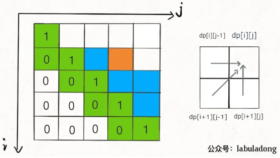

这就叫和dp[i][j]相邻，反正你计算dp[i][j]只需要这三个相邻状态，其实根本不需要那么大一个二维的 dp table 对不对？

**状态压缩的核心思路就是，将二维数组「投影」到一维数组**：

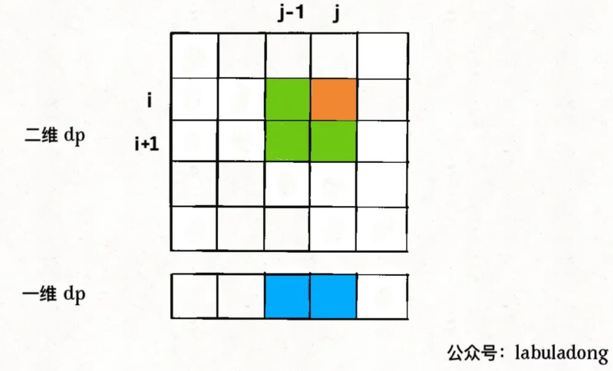

思路很直观，但是也有一个明显的问题，图中dp[i][j-1]和dp[i+1][j-1]这两个状态处在同一列，而一维数组中只能容下一个，那么当我计算dp[i][j]时，他俩必然有一个会被另一个覆盖掉，怎么办？

这就是状态压缩的难点，下面就来分析解决这个问题

想把二维dp数组压缩成一维，**一般来说是把第一个维度，也就是i这个维度去掉，只剩下j这个维度。压缩后的一维dp数组就是之前二维dp数组的dp[i][..]那一行**。

我们先将上述代码进行改造，直接无脑去掉i这个维度，把dp数组变成一维：

```c++
for (int i = n - 2; i >= 0; i--) {
    for (int j = i + 1; j < n; j++) {
        // 在这里，一维 dp 数组中的数是什么？
        if (s[i] == s[j])
            dp[j] = dp[j - 1] + 2;
        else
            dp[j] = max(dp[j], dp[j - 1]);
    }
}
```
上述代码的一维dp数组只能表示二维dp数组的一行dp[i][..]，那我怎么才能得到dp[i+1][j-1], dp[i][j-1], dp[i+1][j]这几个必要的的值，进行状态转移呢？

在代码中注释的位置，将要进行状态转移，更新dp[j]，那么我们要来思考两个问题：

* 1、在对dp[j]赋新值之前，dp[j]对应着二维dp数组中的什么位置？

* 2、dp[j-1]对应着二维dp数组中的什么位置？

**对于问题 1，在对dp[j]赋新值之前，dp[j]的值就是外层 for 循环上一次迭代算出来的值，也就是对应二维dp数组中dp[i+1][j]的位置**。

**对于问题 2，dp[j-1]的值就是内层 for 循环上一次迭代算出来的值，也就是对应二维dp数组中dp[i][j-1]的位置**。

那么问题已经解决了一大半了，只剩下二维dp数组中的dp[i+1][j-1]这个状态我们不能直接从一维dp数组中得到：

```c++
for (int i = n - 2; i >= 0; i--) {
    for (int j = i + 1; j < n; j++) {
        if (s[i] == s[j])
            // dp[i][j] = dp[i+1][j-1] + 2;
            dp[j] = ?? + 2;
        else
            // dp[i][j] = max(dp[i+1][j], dp[i][j-1]);
            dp[j] = max(dp[j], dp[j - 1]);
    }
}
```

因为 for 循环遍历i和j的顺序为从左向右，从下向上，所以可以发现，在更新一维dp数组的时候，dp[i+1][j-1]会被dp[i][j-1]覆盖掉，图中标出了这四个位置被遍历到的次序：


那么如果我们想得到dp[i+1][j-1]，就必须在它被覆盖之前用一个临时变量temp把它存起来，并把这个变量的值保留到计算dp[i][j]的时候。为了达到这个目的，结合上图，我们可以这样写代码：

```c++
for (int i = n - 2; i >= 0; i--) {
    // 存储 dp[i+1][j-1] 的变量
    int pre = 0;
    for (int j = i + 1; j < n; j++) {
        int temp = dp[j];
        if (s[i] == s[j])
            // dp[i][j] = dp[i+1][j-1] + 2;
            dp[j] = pre + 2;
        else
            dp[j] = max(dp[j], dp[j - 1]);
        // 到下一轮循环，pre 就是 dp[i+1][j-1] 了
        pre = temp;
    }
}
```

别小看这段代码，这是一维dp最精妙的地方，会者不难，难者不会。为了清晰起见，我用具体的数值来拆解这个逻辑：

假设现在i = 5, j = 7且s[5] == s[7]，那么现在会进入下面这个逻辑对吧：

```c++
if (s[5] == s[7])
    // dp[5][7] = dp[i+1][j-1] + 2;
    dp[7] = pre + 2;
```

我问你这个pre变量是什么？是内层 for 循环上一次迭代的temp值。

那我再问你内层 for 循环上一次迭代的temp值是什么？是dp[j-1]也就是dp[6]，但这是外层 for 循环上一次迭代对应的dp[6]，也就是二维dp数组中的dp[i+1][6] = dp[6][6]。

也就是说，pre变量就是dp[i+1][j-1] = dp[6][6]，也就是我们想要的结果。

那么现在我们成功对状态转移方程进行了降维打击，算是最硬的的骨头啃掉了，但注意到我们还有 base case 要处理呀：

如何把 base case 也打成一维呢？很简单，记住，**状态压缩就是投影**，我们把 base case 投影到一维看看：

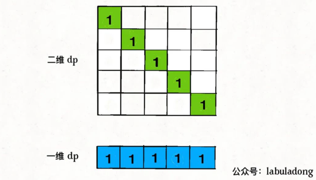

二维dp数组中的 base case 全都落入了一维dp数组，不存在冲突和覆盖，所以说我们直接把一维 dp 数组全部初始化为 1即可

至此，我们把 base case 和状态转移方程都进行了降维，实际上已经写出完整代码了：

```c++
int longestPalindromeSubseq(string s) {
    int n = s.size();
    // base case：一维 dp 数组全部初始化为 1
    vector<int> dp(n, 1);

    for (int i = n - 2; i >= 0; i--) {
        int pre = 0;
        for (int j = i + 1; j < n; j++) {
            int temp = dp[j];
            // 状态转移方程
            if (s[i] == s[j])
                dp[j] = pre + 2;
            else
                dp[j] = max(dp[j], dp[j - 1]);
            pre = temp;
        }
    }
    return dp[n - 1];
}
```

## 动态规划和回溯算法到底谁是谁爹？

回溯算法和动态规划到底是啥关系？它俩都涉及递归，算法模板看起来还挺像的，都涉及做「选择」，那么，它俩具体有啥区别呢？回溯算法和动态规划之间，是否可能互相转化呢？

今天就⽤⼒扣第 494 题「⽬标和」来详细对⽐⼀下回溯算法和动态规划，真可谓群魔乱舞：

### ⼀、回溯思路

对于每个数字 nums[i]，我们可以选择给一个正号 + 或者一个负号 -，然后利用回溯模板穷举出来所有可能的结果，数一数到底有几种组合能够凑出 target

### 二、消除重叠子问题

动态规划之所以比暴力算法快，是因为动态规划技巧消除了重叠子问题。

如何发现重叠子问题？看是否可能出现重复的「状态」。对于递归函数来说，函数参数中会变的参数就是「状态」，对于 backtrack 函数来说，会变的参数为 i 和 rest。

前文 动态规划之编辑距离 说了一种一眼看出重叠子问题的方法，先抽象出递归框架：

```c++
void backtrack(int i, int rest) {
    backtrack(i + 1, rest - nums[i]);
    backtrack(i + 1, rest + nums[i]);
}
```
举个简单的例子，如果 nums[i] = 0，会发生什么？

```c++
void backtrack(int i, int rest) {
    backtrack(i + 1, rest);
    backtrack(i + 1, rest);
}
```

你看，这样就出现了两个「状态」完全相同的递归函数，无疑这样的递归计算就是重复的。这就是重叠子问题，而且只要我们能够找到一个重叠子问题，那一定还存在很多的重叠子问题。因此，状态 (i, rest) 是可以用备忘录技巧进行优化的。

### 三、动态规划

消除重叠子问题之后，算法的时间复杂度是多少？其实最坏情况下依然是 O(2^N)。

为什么呢？因为我们只不过恰好发现了重叠子问题，顺手用备忘录技巧给优化了，但是底层思路没有变，依然是暴力穷举的回溯算法，依然在遍历一棵二叉树。这只能叫对回溯算法进行了「剪枝」，提升了算法在某些情况下的效率，但算不上质的飞跃。

其实，这个问题可以转化为一个子集划分问题，而子集划分问题又是一个典型的背包问题。动态规划总是这么玄学，让人摸不着头脑……

首先，如果我们把 nums 划分成两个子集 A 和 B，分别代表分配 + 的数和分配 - 的数，那么他们和 target 存在如下关系：

```java
sum(A) - sum(B) = target
sum(A) = target + sum(B)
sum(A) + sum(A) = target + sum(B) + sum(A)
2 * sum(A) = target + sum(nums)
```

综上，可以推出 sum(A) = (target + sum(nums)) / 2，也就是把原问题转化成：nums 中存在几个子集 A，使得 A 中元素的和为 (target + sum(nums)) / 2？

类似的子集划分问题我们前文 经典背包问题：子集划分 讲过，现在实现这么一个函数：

```java
/* 计算 nums 中有几个子集的和为 sum */
int subsets(int[] nums, int sum) {}
```

然后，可以这样调用这个函数：

```java
int findTargetSumWays(int[] nums, int target) {
    int sum = 0;
    for (int n : nums) sum += n;
    // 这两种情况，不可能存在合法的子集划分
    if (sum < target || (sum + target) % 2 == 1) {
        return 0;
    }
    return subsets(nums, (sum + target) / 2);
}
```

好的，变成背包问题的标准形式：**有一个背包，容量为 sum，现在给你 N 个物品，第 i 个物品的重量为 nums[i - 1]（注意 1 <= i <= N），每个物品只有一个，请问你有几种不同的方法能够恰好装满这个背包？**

现在，这就是一个正宗的动态规划问题了，下面按照我们一直强调的动态规划套路走流程：

**第一步要明确两点，「状态」和「选择」：**

对于背包问题，这个都是一样的，状态就是「背包的容量」和「可选择的物品」，选择就是「装进背包」或者「不装进背包」。

**第二步要明确 dp 数组的定义：**

dp[i][j] = x 表示，若只在前 i 个物品中选择，若当前背包的容量为 j，则最多有 x 种方法可以恰好装满背包。

翻译成我们探讨的子集问题就是，若只在 nums 的前 i 个元素中选择，若目标和为 j，则最多有 x 种方法划分子集。

根据这个定义，显然 dp[0][..] = 0，因为没有物品的话，根本没办法装背包；dp[..][0] = 1，因为如果背包的最大载重为 0，「什么都不装」就是唯一的一种装法。

我们所求的答案就是 dp[N][sum]，即使用所有 N 个物品，有几种方法可以装满容量为 sum 的背包。

**第三步，根据「选择」，思考状态转移的逻辑：**

如果不把 nums[i] 算入子集，或者说你不把这第 i 个物品装入背包，那么恰好装满背包的方法数就取决于上一个状态 dp[i-1][j]，继承之前的结果。

如果把 nums[i] 算入子集，或者说你把这第 i 个物品装入了背包，那么只要看前 i - 1 个物品有几种方法可以装满 j - nums[i-1] 的重量就行了，所以取决于状态 dp[i-1][j-nums[i-1]]。

PS：注意我们说的 i 是从 1 开始算的，而数组 nums 的索引时从 0 开始算的，所以 nums[i-1] 代表的是第 i 个物品的重量，j - nums[i-1] 就是背包装入物品 i 之后还剩下的容量。

由于 dp[i][j] 为装满背包的总方法数，所以应该以上两种选择的结果求和，得到状态转移方程：

```java
dp[i][j] = dp[i-1][j] + dp[i-1][j-nums[i-1]];
```

## 动态规划设计：最⻓递增⼦序列

LeetCode 300

见热点题目章节

## 经典动态规划：0-1 背包问题

简单描述：给你一个可装载重量为W的背包和N个物品，每个物品有重量和价值两个属性。其中第i个物品的重量为wt[i]，价值为val[i]，现在让你用这个背包装物品，最多能装的价值是多少？

题目就是这么简单，一个典型的动态规划问题。**这个题目中的物品不可以分割，要么装进包里，要么不装，不能说切成两块装一半**。这也许就是 0-1 背包这个名词的来历。

### 动规标准套路

* 第一步要明确两点，「状态」和「选择」:如何才能描述一个问题局面？只要给定几个可选物品和一个背包的容量限制，就形成了一个背包问题，对不对？所以状态有两个，就是「背包的容量」和「可选择的物品」;再说选择，也很容易想到啊，对于每件物品，你能选择什么？选择就是「装进背包」或者「不装进背包」嘛。

    明白了状态和选择，动态规划问题基本上就解决了，只要往这个框架套就完事儿了：
    ```java
    for 状态1 in 状态1的所有取值：
        for 状态2 in 状态2的所有取值：
            for ...
                dp[状态1][状态2][...] = 择优(选择1，选择2...)
    ```
* 第二步要明确dp数组的定义：dp数组是什么？其实就是描述问题局面的一个数组。换句话说，我们刚才明确问题有什么「状态」，现在需要用dp数组把状态表示出来。

  刚才找到的「状态」，有两个，也就是说我们需要一个二维dp数组，一维表示可选择的物品，一维表示背包的容量。

  dp[i][w]的定义如下：对于前i个物品，当前背包的容量为w，这种情况下可以装的最大价值是dp[i][w]。

  比如说，如果 dp[3][5] = 6，其含义为：对于给定的一系列物品中，若只对前 3 个物品进行选择，当背包容量为 5 时，最多可以装下的价值为 6。

  根据这个定义，我们想求的最终答案就是dp[N][W]。base case 就是dp[0][..] = dp[..][0] = 0，因为没有物品或者背包没有空间的时候，能装的最大价值就是 0。

  细化上面的框架：
  ```java
  int dp[N+1][W+1]
  dp[0][..] = 0
  dp[..][0] = 0
  
  for i in [1..N]:
      for w in [1..W]:
          dp[i][w] = max(
              把物品 i 装进背包,
              不把物品 i 装进背包
          )
  return dp[N][W]
  ```
* 第三步，根据「选择」，思考状态转移的逻辑。

  dp[i][w]表示：对于前i个物品，当前背包的容量为w时，这种情况下可以装下的最大价值是dp[i][w]。

  如果你没有把这第i个物品装入背包，那么很显然，最大价值dp[i][w]应该等于dp[i-1][w]。

  如果你把这第i个物品装入了背包，那么dp[i][w]应该等于dp[i-1][w-wt[i-1]] + val[i-1]。

  首先，由于i是从 1 开始的，所以对val和wt的取值是i-1。

  而dp[i-1][w-wt[i-1]]也很好理解：你如果想装第i个物品，你怎么计算这时候的最大价值？换句话说，在装第i个物品的前提下，背包能装的最大价值是多少？

  ```java
  for i in [1..N]:
      for w in [1..W]:
          dp[i][w] = max(
              dp[i-1][w],
              dp[i-1][w - wt[i-1]] + val[i-1]
          )
  return dp[N][W]
  ```
* 最后一步，把伪码翻译成代码，**处理一些边界情况**。

  如上伪代码，需要处理w - wt[i-1]可能小于 0 导致数组索引越界的问题；最终成解。

  ```java
   public static int knapsackDP(int W, int[] wt, int[] val){
      int N = wt.length;
      int[][] dp = new int[N + 1][W + 1];
      for (int i = 1; i <= N; i++){
          for (int w = 0; w <= W; w++){
              if (w - wt[i - 1] < 0){
                  dp[i][w] = dp[i - 1][w];
              } else {
                  dp[i][w] = Math.max(dp[i-1][w], dp[i-1][w - wt[i-1]] + val[i-1]);
              }
  
          }
      }
      return dp[N][W];
  }
  ```


## 经典动态规划：戳⽓球

LeetCode 312

### 一、回溯思路

**我们前文多次强调过，很显然只要涉及求最值，没有任何奇技淫巧，一定是穷举所有可能的结果，然后对比得出最值。**

所以说，只要遇到求最值的算法问题，首先要思考的就是：如何穷举出所有可能的结果？

穷举主要有两种算法，就是**回溯算法和动态规划，前者就是暴力穷举**，而后者是根据状态转移方程推导「状态」。

如何将我们的扎气球问题转化成回溯算法呢？这个应该不难想到的，我们其实就是**想穷举戳气球的顺序**，不同的戳气球顺序可能得到不同的分数，我们需要把所有可能的分数中最高的那个找出来

那么，这不就是一个「全排列」问题嘛，我们前文 回溯算法框架套路详解 中有全排列算法的详解和代码，其实只要稍微改一下逻辑即可，伪码思路如下：

```java
private Integer res = Integer.MIN_VALUE;

public int maxCoins(int[] nums) {
    List<Integer> choice = new ArrayList<>();
    for (int i : nums){
        choice.add(i);
    }
    backTrace(choice, 0);
    return res;
}

public void backTrace(List<Integer> choice, int score){
    if (choice.size() == 0){
        res = Math.max(score, res);
        return;
    }
    
    for (int i = 0; i < choice.size(); i++){
        int point;
        if (choice.size() == 1){
            point = choice.get(0);
        } else if (i - 1 < 0) {
            point =  choice.get(i) * choice.get(i + 1);
        } else if (i + 1 == choice.size()){
            point = choice.get(i - 1) * choice.get(i);
        } else {
            point = choice.get(i - 1) * choice.get(i) * choice.get(i + 1);
        }
        int temp = choice.get(i);
        choice.remove(i);
        backTrace(choice, score + point);
        choice.add(i, temp);
    }
}
```

### 二、动态规划思路

这个动态规划问题和我们之前的动态规划系列文章相比有什么特别之处？为什么它比较难呢？

原因在于，**这个问题中我们每戳破一个气球nums[i]，得到的分数和该气球相邻的气球nums[i-1]和nums[i+1]是有相关性的**。

我们前文 动态规划套路框架详解 说过运用动态规划算法的一个重要条件：**子问题必须独立**。所以对于这个戳气球问题，**如果想用动态规划，必须巧妙地定义dp数组的含义，避免子问题产生相关性，才能推出合理的状态转移方程**。

如何定义dp数组呢，这里需要对问题进行一个简单地转化。题目说可以认为nums[-1] = nums[n] = 1，那么我们先直接把这两个边界加进去，形成一个新的数组points：

```c++
int maxCoins(int[] nums) {
    int n = nums.length;
    // 两端加入两个虚拟气球
    int[] points = new int[n + 2];
    points[0] = points[n + 1] = 1;
    for (int i = 1; i <= n; i++) {
        points[i] = nums[i - 1];
    }
    // ...
}
```

现在气球的索引变成了从1到n，points[0]和points[n+1]可以认为是两个「虚拟气球」。

那么我们可以改变问题：**在一排气球points中，请你戳破气球0和气球n+1之间的所有气球（不包括0和n+1），使得最终只剩下气球0和气球n+1两个气球，最多能够得到多少分？**

现在可以定义dp数组的含义：

**dp[i][j] = x表示，戳破气球i和气球j之间（开区间，不包括i和j）的所有气球，可以获得的最高分数为x。**

那么根据这个定义，题目要求的结果就是dp[0][n+1]的值。

base case ：dp[i][j] = 0，其中0 <= i <= n+1, j <= i+1，因为这种情况下，开区间(i, j)中间根本没有气球可以戳。

```java
// base case 已经都被初始化为 0
int[][] dp = new int[n + 2][n + 2];
```

现在我们要根据这个dp数组来推导状态转移方程了，根据我们前文的套路，所谓的推导「状态转移方程」，实际上就是在思考怎么「做选择」，也就是这道题目最有技巧的部分：

不就是想求戳破气球i和气球j之间的最高分数吗，如果「正向思考」，就只能写出前文的回溯算法；**我们需要「反向思考」，想一想气球i和气球j之间最后一个被戳破的气球可能是哪一个？**

其实气球i和气球j之间的所有气球都可能是最后被戳破的那一个，不防假设为k。回顾动态规划的套路，这里其实已经找到了「状态」和「选择」：i和j就是两个「状态」，最后戳破的那个气球k就是「选择」。

根据刚才对dp数组的定义，如果最后一个戳破气球k，dp[i][j]的值应该为：

dp[i][j] = dp[i][k] + dp[k][j] + points[i]*points[k]*points[j]

你不是要最后戳破气球k吗？那得先把开区间(i, k)的气球都戳破，再把开区间(k, j)的气球都戳破；最后剩下的气球k，相邻的就是气球i和气球j，这时候戳破k的话得到的分数就是points[i]*points[k]*points[j]。

那么戳破开区间(i, k)和开区间(k, j)的气球最多能得到的分数是多少呢？嘿嘿，就是dp[i][k]和dp[k][j]，这恰好就是我们对dp数组的定义嘛！

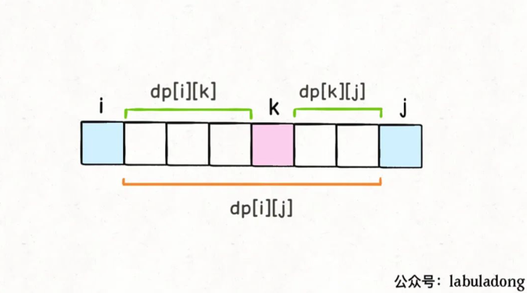

结合这个图，就能体会出dp数组定义的巧妙了。由于是开区间，dp[i][k]和dp[k][j]不会影响气球k；而戳破气球k时，旁边相邻的就是气球i和气球j了，最后还会剩下气球i和气球j，这也恰好满足了dp数组开区间的定义。

那么，对于一组给定的i和j，我们只要穷举i < k < j的所有气球k，选择得分最高的作为dp[i][j]的值即可，这也就是状态转移方程：

那么，对于一组给定的i和j，我们只要穷举i < k < j的所有气球k，选择得分最高的作为dp[i][j]的值即可，这也就是状态转移方程：

```c++
// 最后戳破的气球是哪个？
for (int k = i + 1; k < j; k++) {
    // 择优做选择，使得 dp[i][j] 最大
    dp[i][j] = Math.max(
        dp[i][j], 
        dp[i][k] + dp[k][j] + points[i]*points[j]*points[k]
    );
}
```

写出状态转移方程就完成这道题的一大半了，但是还有问题：对于k的穷举仅仅是在做「选择」，但是应该如何穷举「状态」i和j呢？

```c++
for (int i = ...; ; )
    for (int j = ...; ; )
        for (int k = i + 1; k < j; k++) {
            dp[i][j] = Math.max(
                dp[i][j], 
                dp[i][k] + dp[k][j] + points[i]*points[j]*points[k]
            );
return dp[0][n+1];
```

### 三、写出代码

关于「状态」的穷举，最重要的一点就是：状态转移所依赖的状态必须被提前计算出来。

拿这道题举例，dp[i][j]所依赖的状态是dp[i][k]和dp[k][j]，那么我们必须保证：在计算dp[i][j]时，dp[i][k]和dp[k][j]已经被计算出来了（其中i < k < j）。

那么应该如何安排i和j的遍历顺序，来提供上述的保证呢？我们前文 动态规划答疑篇 写过处理这种问题的一个鸡贼技巧：**根据 base case 和最终状态进行推导**。

PS：最终状态就是指题目要求的结果，对于这道题目也就是dp[0][n+1]。

我们先把 base case 和最终的状态在 DP table 上画出来：

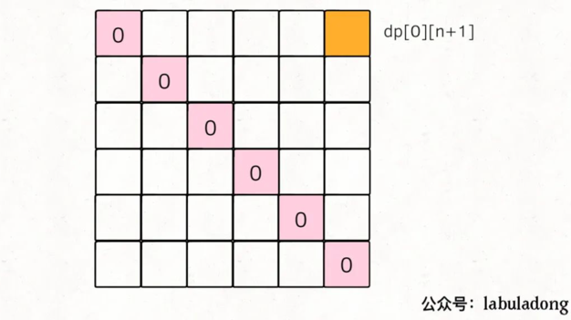

对于任一dp[i][j]，我们希望所有dp[i][k]和dp[k][j]已经被计算，画在图上就是这种情况：

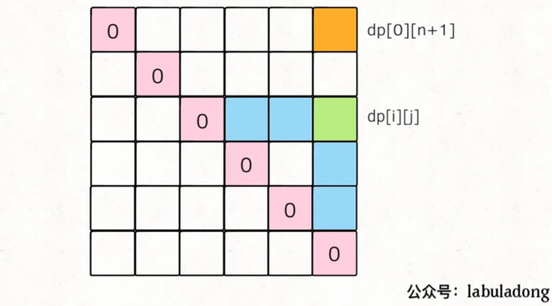

注意，i < k < j，对于dp[k][j]，因为k > i，所以(k, j) 在(i, j)下面。

那么，为了达到这个要求，可以有两种遍历方法，要么斜着遍历，要么从下到上从左到右遍历：

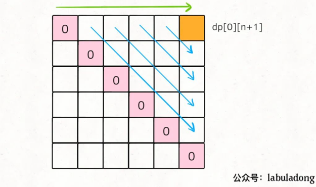

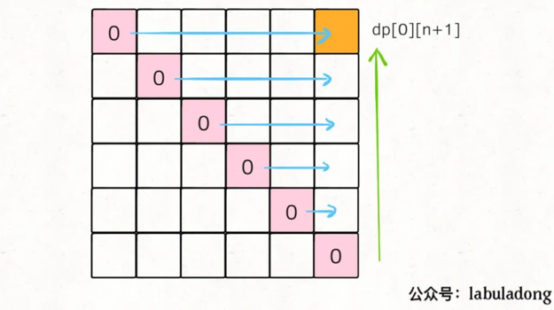

斜着遍历有一点难写，所以一般我们就从下往上遍历，下面看完整代码：

至此，这道题目就完全解决了，十分巧妙，但也不是那么难，对吧？

关键在于dp数组的定义，**需要避免子问题互相影响，所以我们反向思考，将dp[i][j]的定义设为开区间，考虑最后戳破的气球是哪一个，以此构建了状态转移方程**。

## 动态规划之博弈问题

LeetCode 877 石头游戏改编

博弈类问题的套路都差不多，其核心思路是在二维 dp 的基础上使用元组分别存储两个人的博弈结果。掌握了这个技巧以后，别人再问你什么俩海盗分宝石，俩人拿硬币的问题，你就告诉别人：我懒得想，直接给你写个算法算一下得了。

你和你的朋友面前有一排石头堆，用一个数组 piles 表示，piles[i] 表示第 i 堆石子有多少个。你们轮流拿石头，一次拿一堆，但是只能拿走最左边或者最右边的石头堆。所有石头被拿完后，谁拥有的石头多，谁获胜。

石头的堆数可以是任意正整数，石头的总数也可以是任意正整数，这样就能打破先手必胜的局面了。比如有三堆石头 piles = [1,100,3]，先手不管拿 1 还是 3，能够决定胜负的 100 都会被后手拿走，后手会获胜。

假设两人都很聪明，请你设计一个算法，返回先手和后手的最后得分（石头总数）之差。比如上面那个例子，先手能获得 4 分，后手会获得 100 分，你的算法应该返回 -96。

博弈问题的难点在于，两个人要轮流进行选择，而且都贼精明，应该如何编程表示这个过程呢？

### 一、定义 dp 数组的含义

定义 dp 数组的含义是很有技术含量的，同一问题可能有多种定义方法，不同的定义会引出不同的状态转移方程，不过只要逻辑没有问题，最终都能得到相同的答案。

我建议不要迷恋那些看起来很牛逼，代码很短小的奇技淫巧，最好是稳一点，采取可解释性最好，最容易推广的设计思路。本文就给出一种**博弈问题的通用设计框架**。

介绍 dp 数组的含义之前，我们先看一下 dp 数组最终的样子：

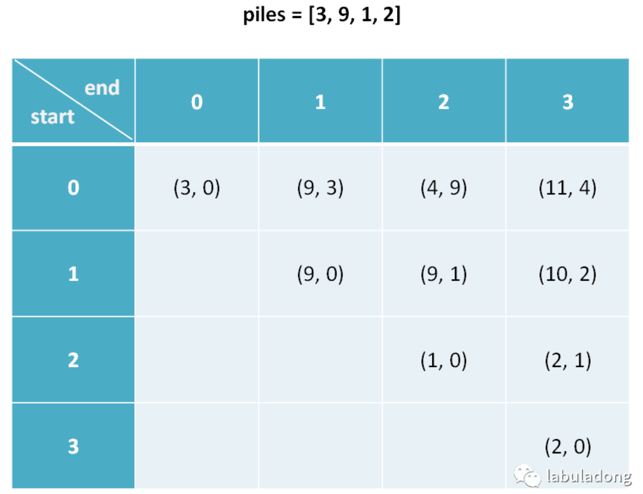

下文讲解时，认为元组是包含 first 和 second 属性的一个类，而且为了节省篇幅，将这两个属性简写为 fir 和 sec。比如按上图的数据，我们说 dp[1][3].fir = 10，dp[0][1].sec = 3。

先回答几个读者可能提出的问题：

这个二维 dp table 中存储的是元组，怎么编程表示呢？这个 dp table 有一半根本没用上，怎么优化？很简单，都不要管，先把解题的思路想明白了再谈也不迟。

以下是对 dp 数组含义的解释：

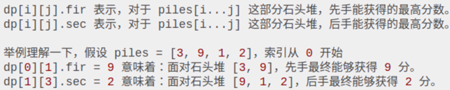

我们想求的答案是先手和后手最终分数之差，按照这个定义也就是 dp[0] [n-1].fir - dp[0][n-1].sec，即⾯对整个 piles，先⼿的最优得分和后⼿的 最优得分之差。

### ⼆、状态转移⽅程

写状态转移方程很简单，首先要找到所有「状态」和每个状态可以做的「选择」，然后择优。

根据前面对 dp 数组的定义，状态显然有三个：开始的索引 i，结束的索引 j，当前轮到的人。

```java
dp[i][j][fir or sec]
其中：
0 <= i < piles.length
i <= j < piles.length
```

对于这个问题的每个状态，可以做的选择有两个：选择最左边的那堆石头，或者选择最右边的那堆石头。 我们可以这样穷举所有状态：

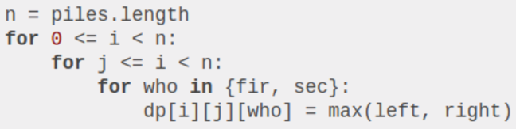

上面的伪码是动态规划的一个大致的框架，股票系列问题中也有类似的伪码。这道题的难点在于，两人是交替进行选择的，也就是说先手的选择会对后手有影响，这怎么表达出来呢？

根据我们对 dp 数组的定义，很容易解决这个难点，写出状态转移方程：

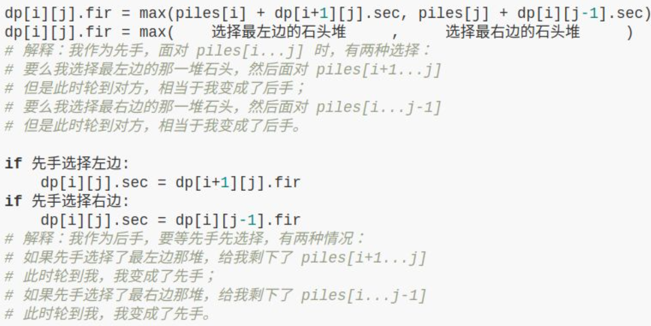

根据 dp 数组的定义，我们也可以找出 base case，也就是最简单的情况：

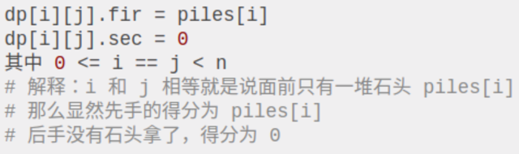

这里需要注意一点，我们发现 base case 是斜着的，而且我们推算 dp[i][j] 时需要用到 dp[i+1][j] 和 dp[i][j-1]：

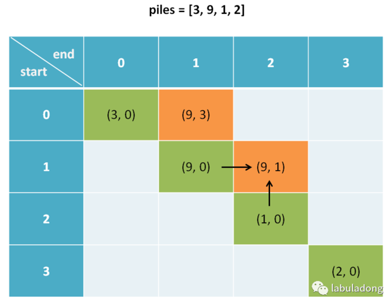

所以说算法不能简单的一行一行遍历 dp 数组，而要斜着遍历数组：

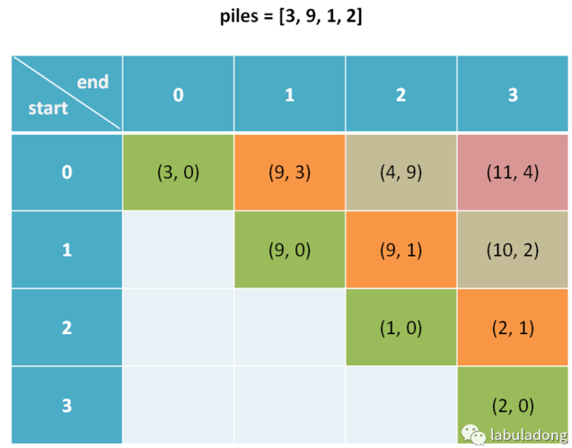

说实话，斜着遍历二维数组说起来容易，你还真不一定能想出来怎么实现，不信你思考一下？这么巧妙的状态转移方程都列出来了，要是不会写代码实现，那真的很尴尬了。

### 三、代码实现

见 LeetCode0877_StoneGame

动态规划解法，如果没有状态转移方程指导，绝对是一头雾水，但是根据前面的详细解释，读者应该可以清晰理解这一大段代码的含义。

而且，注意到计算 dp[i][j] 只依赖其左边和下边的元素，所以说肯定有优化空间，转换成一维 dp，想象一下把二维平面压扁，也就是投影到一维。但是，一维 dp 比较复杂，可解释性很差，大家就不必浪费这个时间去理解了。

### 四、最后总结

本文给出了解决博弈问题的动态规划解法。博弈问题的前提一般都是在两个聪明人之间进行，编程描述这种游戏的一般方法是二维 dp 数组，数组中通过元组分别表示两人的最优决策。

之所以这样设计，是因为先手在做出选择之后，就成了后手，后手在对方做完选择后，就变成了先手。**这种角色转换使得我们可以重用之前的结果，典型的动态规划标志**。

## 动态规划之正则表达

LeetCode 10

正则表达式匹配是⼀个很精妙的算法，⽽且难度也不⼩。本⽂主要写两个正则符号的算法实现：点号「.」和星号「*」，如果你⽤过正则表达式，应该明⽩他们的⽤法，不明⽩也没关系，等会会介绍。⽂章的最后，介绍了⼀种快速看出重叠⼦问题的技巧

本⽂还有⼀个重要⽬的，就是教会读者如何设计算法。我们平时看别⼈的解法，直接看到⼀个⾯⾯俱到的完整答案，总觉得⽆法理解，以⾄觉得问题太难，⾃⼰太菜。我⼒求向读者展⽰，算法的设计是⼀个螺旋上升、逐步求精的过程，绝不是⼀步到位就能写出正确算法。本⽂会带你解决这个较为复杂的问题，让你明⽩如何化繁为简，逐个击破，从最简单的框架搭建出最终的答案。

### ⼀、热⾝

第⼀步，我们暂时不管正则符号，如果是两个普通的字符串进⾏⽐较，如何 进⾏匹配？我想这个算法应该谁都会写：

```c++
bool isMatch(string text, string pattern) {
    if (text.size() != pattern.size()) {
        return false;
    }
    for (int j = 0; j < pattern.size(); j++){
        if(pattern[j]!=text[j]){
            return false;
        }
    }
    return true;
}
```

```c++
bool isMatch(string text, string pattern) {
    int i = 0; // text 的索引位置
    int j = 0; // pattern 的索引位置
    while (j < pattern.size()) {
        if (i >= text.size()) {
            return false;
        }
        if (pattern[j++] != text[i++]) {
            return false;
        }
    }
    // 相等则说明完成匹配 
    return j == text.size(); }
}
```

如上改写，是为了将这个算法改造成递归算法（伪码）：

```python
def isMatch(text, pattern) -> bool:
    if pattern is empty: return (text is empty?)
    first_match = (text not empty) and pattern[0] == text[0]
    return first_match and isMatch(text[1:], pattern[1:])
```

如果你能够理解这段代码，恭喜你，你的递归思想已经到位，正则表达式算法虽然有点复杂，其实是基于这段递归代码逐步改造⽽成的。

### ⼆、处理点号「.」通配符

点号可以匹配任意⼀个字符，万⾦油嘛，其实是最简单的，稍加改造即可：

```python
def isMatch(text, pattern) -> bool:
    if not pattern: return not text
    first_match = bool(text) and pattern[0] in {text[0], '.'}
    return first_match and isMatch(text[1:], pattern[1:])
```

### 三、处理「*」通配符

星号通配符可以让前⼀个字符重复任意次数，包括零次。那到底是重复⼏次呢？这似乎有点困难，不过不要着急，我们起码可以把框架的搭建再进⼀步：

```python
def isMatch(text, pattern) -> bool:
    if not pattern: return not text
    first_match = bool(text) and pattern[0] in {text[0], '.'}
    if len(pattern) >= 2 and pattern[1] == '*':
        # 发现 '*' 通配符
    else:
        return first_match and isMatch(text[1:], pattern[1:])
```

星号前⾯的那个字符到底要重复⼏次呢？这需要计算机暴⼒穷举来算，假设重复 N 次吧。前⽂多次强调过，写递归的技巧是管好当下，之后的事抛给递归。具体到这⾥，不管 N 是多少，当前的选择只有两个：匹配 0 次、匹配 1 次。所以可以这样处理：

```java
if len(pattern) >= 2 and pattern[1] == '*':
    return isMatch(text, pattern[2:]) or \ 
        first_match and isMatch(text[1:], pattern)
# 解释：如果发现有字符和 '*' 结合， 
    # 或者匹配该字符 0 次，然后跳过该字符和 '*' 
    # 或者当 pattern[0] 和 text[0] 匹配后，移动 text
```

可以看到，我们是通过保留 pattern 中的「*」，同时向后推移 text，来实现「」将字符重复匹配多次的功能。举个简单的例⼦就能理解这个逻辑了。假设 `pattern = a , text = aaa`，画个图看看匹配过程：

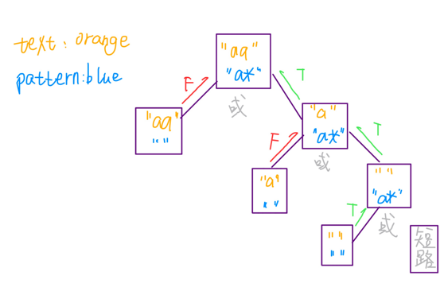

⾄此，正则表达式算法就基本完成了。

### 四、动态规划

我选择使⽤「备忘录」递归的⽅法来降低复杂度。有了暴⼒解法，优化的过程极其简单，就是使⽤两个变量 i, j 记录当前匹配到的位置，从⽽避免使⽤⼦字符串切⽚，并且将 i, j 存⼊备忘录，避免重复计算即可。

我将暴⼒解法和优化解法放在⼀起，⽅便你对⽐，你可以发现优化解法⽆⾮就是把暴⼒解法「翻译」了⼀遍，加了个 memo 作为备忘录，仅此⽽已。

```python
def isMatch(text, pattern) -> bool:
    memo = dict() // 备忘录
    def dp(i, j):
        if (i, j) in memo: return memo[(i, j)]
        if j == len(pattern): return i == len(text)
        
        first = i < len(text) and pattern[j] in {text[i], '.'}
        
        if j <= len(pattern) - 2 and pattern[j + 1] == '*':
            ans = dp(i, j + 2) or \
                first and dp(i + 1, j)
        else:
            ans = first and dp(i + 1, j + 1)
        memo[(i, j)] = ans
        return ans
    return dp(0, 0)

# 暴⼒递归 
def isMatch(text, pattern) -> bool: 
    if not pattern: return not text 
    first = bool(text) and pattern[0] in {text[0], '.'} 
    if len(pattern) >= 2 and pattern[1] == '*': 
        return isMatch(text, pattern[2:]) or \ 
            first and isMatch(text[1:], pattern) 
    else:
        return first and isMatch(text[1:], pattern[1:])
```

有的读者也许会问，你怎么知道这个问题是个动态规划问题呢，你怎么知道它就存在「重叠⼦问题」呢，这似乎不容易看出来呀？

解答这个问题，最直观的应该是随便假设⼀个输⼊，然后画递归树，肯定是 可以发现相同节点的。这属于定量分析，其实不⽤这么⿇烦，下⾯我来教你 定性分析，⼀眼就能看出「重叠⼦问题」性质。 先拿最简单的斐波那契数列举例，我们抽象出递归算法的框架：

```python
def fib(n): 
    fib(n - 1) #1 
    fib(n - 2) #2
```

看着这个框架，请问原问题 f(n) 如何触达⼦问题 f(n - 2) ？有两种路径，⼀是 f(n) -> #1 -> #1, ⼆是 f(n) -> #2。前者经过两次递归，后者进过⼀次递归⽽已。两条不同的计算路径都到达了同⼀个问题，这就是「重叠⼦问题」， ⽽且可以肯定的是，只要你发现⼀条重复路径，这样的重复路径⼀定存在千 万条，意味着巨量⼦问题重叠。

同理，对于本问题，我们依然先抽象出算法框架：

```java
def dp(i, j): 
    dp(i, j + 2) #1 
    dp(i + 1, j) #2 
    dp(i + 1, j + 1) #3
```

提出类似的问题，请问如何从原问题 dp(i, j) 触达⼦问题 dp(i + 2, j + 2) ？⾄ 少有两种路径，⼀是 dp(i, j) -> #3 -> #3，⼆是 dp(i, j) -> #1 -> #2 -> #2。因 此，本问题⼀定存在重叠⼦问题，⼀定需要动态规划的优化技巧来处理。

## 动态规划之四键键盘

最优按键序列⼀定只有两种情况：

要么⼀直按 A ：A,A,...A（当 N ⽐较⼩时）。

要么是这么⼀个形式：A,A,...C-A,C-C,C-V,C-V,...C-V（当 N ⽐较⼤时）。

因为字符数量少（N ⽐较⼩）时， C-A C-C C-V 这⼀套操作的代价相对⽐较⾼，可能不如⼀个个按 A ；⽽当 N ⽐较⼤时，后期 C-V 的收获肯定很⼤。这种情况下整个操作序列⼤致是：**开头连按⼏个 A ，然后 C-A C-C 组合再接若⼲ C-V ，然后再 C-A C-C 接着若⼲ C-V ，循环下去**。

```java
int[] dp = new int[N + 1];
// 定义：dp[i] 表⽰ i 次操作后最多能显⽰多少个 A
for (int i = 0; i <= N; i++) 
    dp[i] = max( 这次按 A 键， 这次按 C-V )

// 按 A 键，就⽐上次多⼀个 A ⽽已 
dp[i] = dp[i - 1] + 1;

```

刚才说了，最优的操作序列⼀定是 C-A C-C 接着若⼲ C-V ，所以我们⽤⼀个变量 j 作为若⼲ C-V 的起点。那么 j 之前的 2 个操作就应该是 C-A C-C 了：

```java
public int maxA(int N) {
    int[] dp = new int[N + 1];
    dp[0] = 0;
    for (int i = 1; i <= N; i++) {
        // 按 A 键
        dp[i] = dp[i - 1] + 1;
        // 按 CV 键
        for (int j = 2; j < i; j++) {
            // 全选 & 复制 dp[j-2]，连续粘贴 i - j 次
            // 屏幕上共 dp[j - 2] * (i - j + 1) 个 A
            dp[i] = Math.max(dp[i], dp[j - 2] * (i - j + 1));
        }
    }
    // N 次按键之后最多有⼏个 A？
    return dp[N];
}
```

其中 j 变量减 2 是给 C-A C-C 留下操作数，看个图就明⽩了：

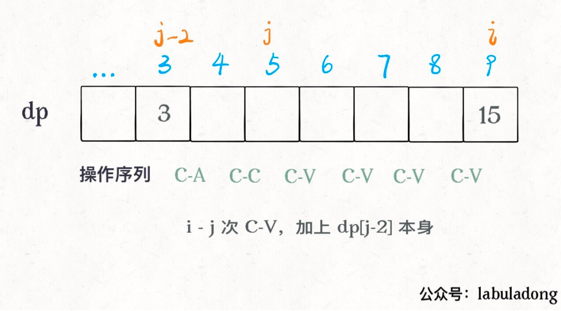

这样，此算法就完成了，时间复杂度 O(N^2)，空间复杂度 O(N)，这种解法 应该是⽐较⾼效的了。

## 动态规划之KMP字符匹配算法

先在开头约定，本⽂⽤ pat 表⽰模式串，⻓度为 M ， txt 表⽰⽂本串，⻓度为 N 。KMP 算法是在 txt 中查找⼦串 pat ，如果存在，返回这个⼦串的起始索引，否则返回 -1。

为什么我认为 KMP 算法就是个动态规划问题呢，等会再解释。对于动态规划，之前多次强调了要明确 dp 数组的含义，⽽且同⼀个问题可能有不⽌⼀种定义 dp 数组含义的⽅法，不同的定义会有不同的解法。 

读者⻅过的 KMP 算法应该是，⼀波诡异的操作处理 pat 后形成⼀个⼀维的数组 next ，然后根据这个数组经过⼜⼀波复杂操作去匹配 txt 。时间复杂度 O(N)，空间复杂度 O(M)。其实它这个 next 数组就相当于 dp 数组，其中元素的含义跟 pat 的前缀和后缀有关，判定规则⽐较复杂，不好理解。

**本⽂则⽤⼀个⼆维的 dp 数组（但空间复杂度还是 O(M)），重新定义其中元素的含义，使得代码⻓度⼤⼤减少，可解释性⼤⼤提⾼**。

PS：本⽂的代码参考《算法4》，原代码使⽤的数组名称是 dfa （确定有限状态机），因为我们的公众号之前有⼀系列动态规划的⽂章，就不说这么⾼⼤上的名词了，我对书中代码进⾏了⼀点修改，并沿⽤ dp 数组的名称。

### ⼀、KMP 算法概述

KMP 算法永不回退 txt 的指针 i ，不⾛回头路（不会重复扫描txt ），⽽是借助 dp 数组中储存的信息把 pat 移到正确的位置继续匹配，时间复杂度只需 O(N)，⽤空间换时间，所以我认为它是⼀种动态规划算法。

KMP 算法的难点在于，如何计算 dp 数组中的信息？如何根据这些信息正确地移动 pat 的指针？这个就需要确定有限状态⾃动机来辅助了，别怕这种⾼⼤上的⽂学词汇，其实和动态规划的 dp 数组如出⼀辙，等你学会了也可以拿这个词去吓唬别⼈。

还有⼀点需要明确的是：计算这个 dp 数组，只和 pat 串有关。意思是说，只要给我个 pat ，我就能通过这个模式串计算出 dp 数组，然后你可以给我不同的 txt ，我都不怕，利⽤这个 dp 数组我都能在 O(N) 时间完成字符串匹配。

### ⼆、状态机概述

为什么说 KMP 算法和状态机有关呢？是这样的，我们可以认为 pat 的匹配就是状态的转移。⽐如当 pat = "ABABC"：

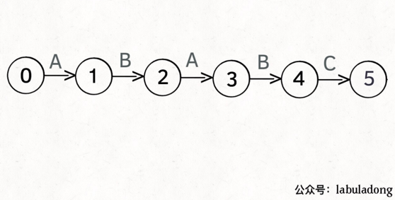

如上图，圆圈内的数字就是状态，状态 0 是起始状态，状态5（ pat.length ）是终⽌状态。开始匹配时 pat 处于起始状态，⼀旦转移到终⽌状态，就说明在 txt 中找到了 pat 。⽐如说当前处于状态 2，就说明字符 "AB" 被匹配：

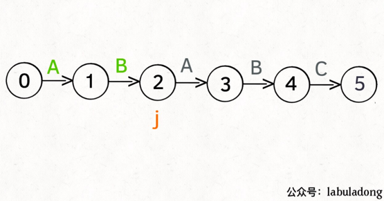

另外，处于不同状态时， pat 状态转移的⾏为也不同。⽐如说假设现在匹配到了状态 4，如果遇到字符 A 就应该转移到状态 3，遇到字符 C 就应该转移到状态 5，如果遇到字符 B 就应该转移到状态 0：

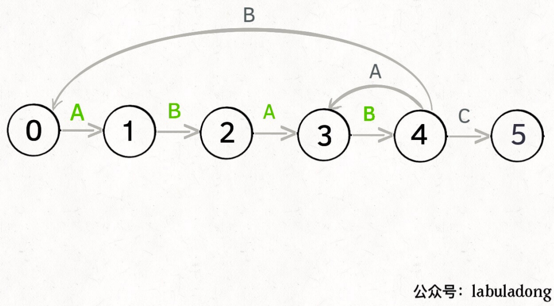

具体什么意思呢，我们来⼀个个举例看看。⽤变量 j 表⽰指向当前状态的指针，当前 pat 匹配到了状态 4：


如果遇到了字符 "A"，根据箭头指⽰，转移到状态 3 是最聪明的：

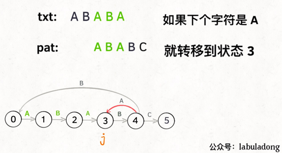

如果遇到了字符 "B"，根据箭头指⽰，只能转移到状态 0（⼀夜回到解放前）：

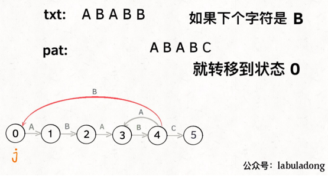

如果遇到了字符 "C"，根据箭头指⽰，应该转移到终⽌状态 5，这也就意味 着匹配完成：

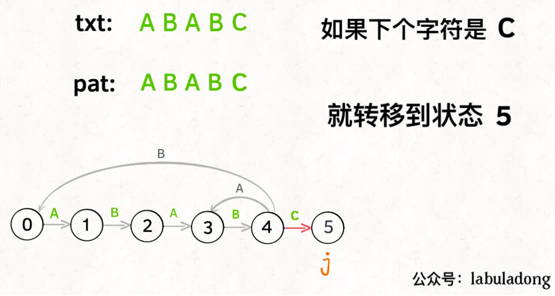

当然了，还可能遇到其他字符，⽐如 Z，但是显然应该转移到起始状态 0， 因为 pat 中根本都没有字符 Z。

这⾥为了清晰起⻅，我们画状态图时就把其他字符转移到状态 0 的箭头省略，只画 pat 中出现的字符的状态转移：

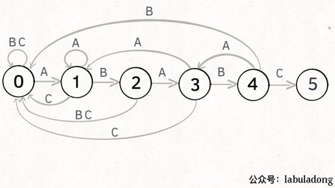

KMP 算法最关键的步骤就是构造这个状态转移图。要确定状态转移的⾏为，得明确两个变量，⼀个是当前的匹配状态，另⼀个是遇到的字符；确定了这两个变量后，就可以知道这个情况下应该转移到哪个状态。

余下见 labuladong 微信公众号 [动态规划之 KMP 算法详解](https://mp.weixin.qq.com/s/r9pbkMyFyMAvmkf4QnL-1g)

## 贪⼼算法之区间调度问题

贪心算法可以认为是动态规划算法的一个特例，相比动态规划，使用贪心算法需要满足更多的条件（贪心选择性质），但是效率比动态规划要高。

比如说一个算法问题使用暴力解法需要指数级时间，如果能使用动态规划消除重叠子问题，就可以降到多项式级别的时间，如果满足贪心选择性质，那么可以进一步降低时间复杂度，达到线性级别的。

什么是贪心选择性质呢，简单说就是：每一步都做出一个局部最优的选择，最终的结果就是全局最优。注意哦，这是一种特殊性质，其实只有一小部分问题拥有这个性质。

比如你面前放着 100 张人民币，你只能拿十张，怎么才能拿最多的面额？显然每次选择剩下钞票中面值最大的一张，最后你的选择一定是最优的。

然而，大部分问题都明显不具有贪心选择性质。比如打斗地主，对手出对儿三，按照贪心策略，你应该出尽可能小的牌刚好压制住对方，但现实情况我们甚至可能会出王炸。这种情况就不能用贪心算法，而得使用动态规划解决，参见前文 动态规划解决博弈问题。

### 一、问题概述

言归正传，本文解决一个很经典的贪心算法问题 Interval Scheduling（区间调度问题）。给你很多形如[start,end]的闭区间，请你设计一个算法，算出这些区间中最多有几个互不相交的区间。

```java
int intervalScheduling(int[][] ints) {}
```

举个例子，intvs=[[1,3],[2,4],[3,6]]，这些区间最多有两个区间互不相交，即[[1,3],[3,6]]，你的算法应该返回 2。注意边界相同并不算相交。

这个问题在生活中的应用广泛，比如你今天有好几个活动，每个活动都可以用区间[start,end]表示开始和结束的时间，请问你今天最多能参加几个活动呢？

### 二、贪心解法

* 从区间集合 intvs 中选择一个区间 x，这个 x 是在当前所有区间中**结束最早**的（end 最小）。

* 把所有与 x 区间相交的区间从区间集合 intvs 中删除。

* 重复步骤 1 和 2，直到 intvs 为空为止。之前选出的那些 x 就是最大不相交子集。

把这个思路实现成算法的话，可以按每个区间的end数值升序排序，因为这样处理之后实现步骤 1 和步骤 2 都方便很多。

现在来实现算法，对于步骤 1，由于我们预先按照end排了序，所以选择 x 是很容易的。关键在于，如何去除与 x 相交的区间，选择下一轮循环的 x 呢？

由于我们事先排了序，不难发现所有与 x 相交的区间必然会与 x 的end相交；如果一个区间不想与 x 的end相交，它的start必须要大于（或等于）x 的end：

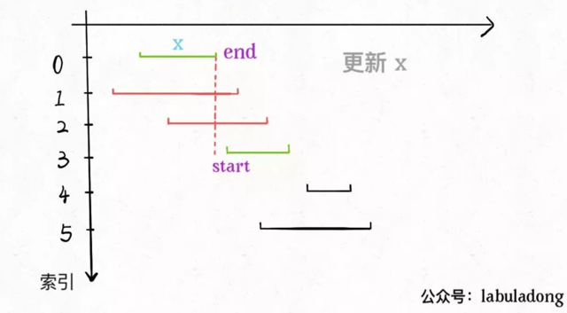


### 三、应用举例

LeetCode 435, 452

LeetCode 452 这个问题和区间调度算法一模一样！如果最多有n个不重叠的区间，那么就至少需要n个箭头穿透所有区间。

只是有一点不一样，在intervalSchedule算法中，如果两个区间的边界触碰，不算重叠；而按照这道题目的描述，箭头如果碰到气球的边界气球也会爆炸，所以说相当于区间的边界触碰也算重叠：


