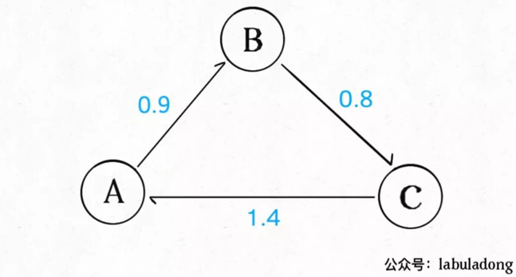
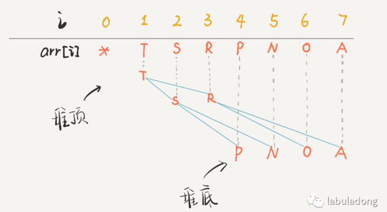
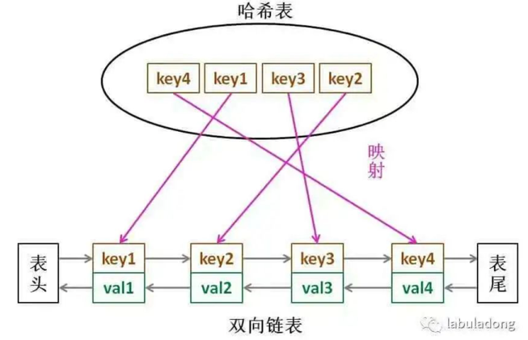
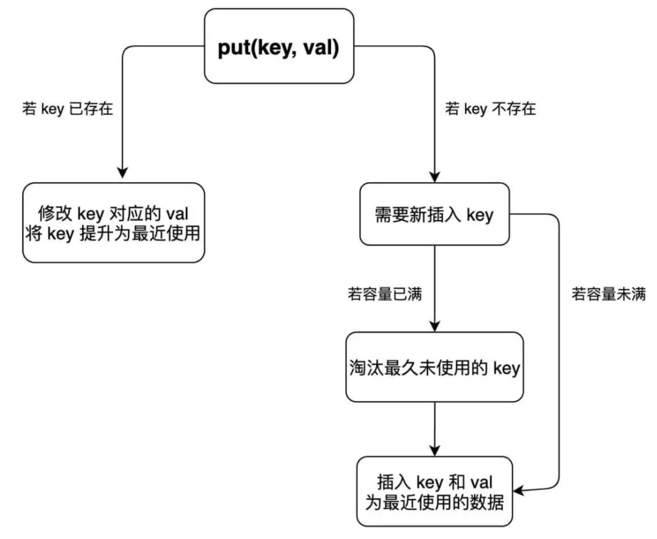
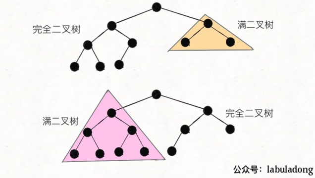
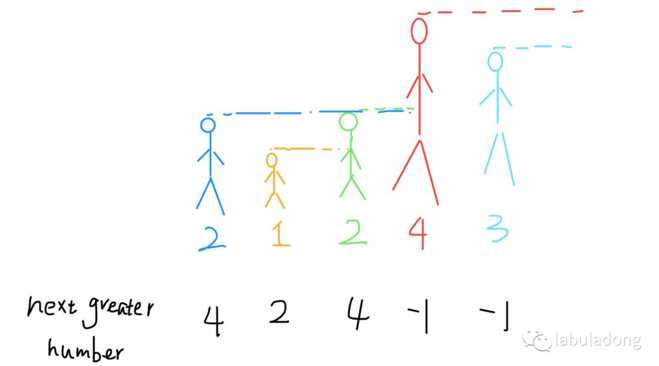
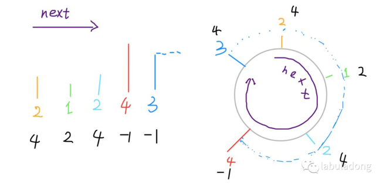
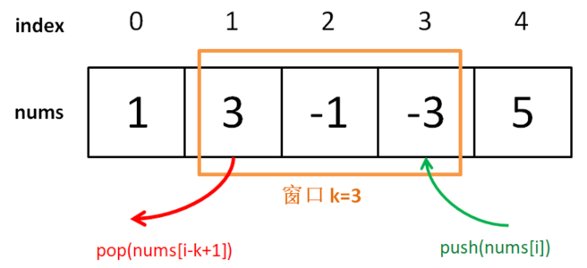
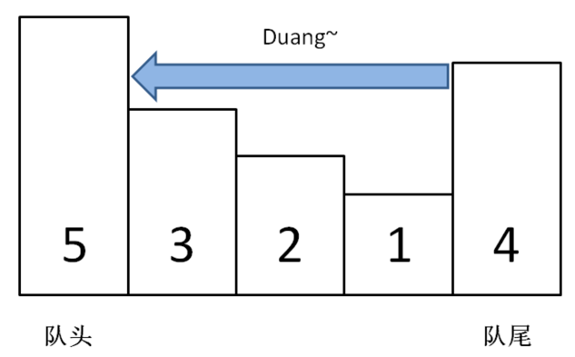
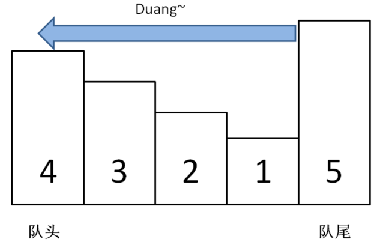

# 数据结构系列

## 为什么我推荐《算法4》

### 一、二分图的应用

二分图就是一幅拥有特殊性质的图：能够用两种颜色为所有顶点着色，使得任何一条边的两个顶点颜色不同。

能解决什么实际问题呢？

算法方面，常见的操作是如何判定一幅图是不是二分图。电影和演员的关系是具有二分图性质的，利用二分图可以避免建立两个hash表互为反向索引。

其他有趣的玩法，比如说社交网络中「间隔度数」的计算（六度空间理论应该听说过）等等，其实就是一个 BFS 广度优先搜索寻找最短路径的问题。


### 二、套汇的算法

如果我们说货币 A 到货币 B 的汇率是 10，意思就是 1 单位的货币 A 可以换 10 单位货币 B。如果我们把每种货币视为一幅图的顶点，货币之间的汇率视为加权有向边，那么整个汇率市场就是一幅「完全加权有向图」。

一旦把现实生活中的情景抽象成图，就有可能运用算法解决一些问题。比如说图中可能存在下面的情况：



图中的加权有向边代表汇率，我们可以发现如果把 100 单位的货币 A 换成 B，再换成 C，最后换回 A，就可以得到 100×0.9×0.8×1.4 = 100.8 单位的 A！如果交易的金额大一些的话，赚的钱是很可观的，这种空手套白狼的操作就是套汇。

现实中交易会有种种限制，而且市场瞬息万变，但是套汇的利润还是很高的，关键就在于如何快速找到这种套汇机会呢？

借助图的抽象，我们发现套汇机会其实就是一个环，且这个环上的权重之积大于 1，只要在顺着这个环交易一圈就能空手套白狼。

**图论中有一个经典算法叫做 Bellman-Ford 算法，可以用于寻找负权重环**。对于我们说的套汇问题，可以先把所有边的权重 w 替换成 -ln(w)，这样「寻找权重乘积大于 1 的环」就转化成了「寻找权重和小于 0 的环」，就可以使用 Bellman-Ford 算法在 O(EV) 的时间内寻找负权重环，也就是寻找套汇机会。

## ⼆叉堆详解实现优先级队列

二叉堆（Binary Heap）没什么神秘，性质比二叉搜索树 BST 还简单。其主要操作就两个，sink（下沉）和swim（上浮），用以维护二叉堆的性质。其主要应用有两个，首先是一种排序方法「堆排序」，第二是一种很有用的数据结构「优先级队列」。

本文就以实现优先级队列（Priority Queue）为例，通过图片和人类的语言来描述一下二叉堆怎么运作的。

### 一、二叉堆概览

首先，二叉堆和二叉树有啥关系呢，为什么人们总数把二叉堆画成一棵二叉树？

因为，二叉堆其实就是一种特殊的二叉树（完全二叉树），只不过存储在数组里。一般的链表二叉树，我们操作节点的指针，而在数组里，我们把数组索引作为指针：

```java
// 父节点的索引
int parent(int root) {
    return root / 2;
}
// 左孩子的索引
int left(int root) {
    return root * 2;
}
// 右孩子的索引
int right(int root) {
    return root * 2 + 1;
}
```

画个图你立即就能理解了，注意数组的第一个索引 0 空着不用：



PS：因为数组索引是数字，为了方便区分，将字符作为数组元素。

你看到了，把 arr[1] 作为整棵树的根的话，每个节点的父节点和左右孩子的索引都可以通过简单的运算得到，这就是二叉堆设计的一个巧妙之处。为了方便讲解，下面都会画的图都是二叉树结构，相信你能把树和数组对应起来。

二叉堆还分为最大堆和最小堆。最大堆的性质是：每个节点都大于等于它的两个子节点。类似的，最小堆的性质是：每个节点都小于等于它的子节点。

两种堆核心思路都是一样的，本文以最大堆为例讲解。

对于一个最大堆，根据其性质，显然堆顶，也就是 arr[1] 一定是所有元素中最大的元素。

### 二、优先级队列概览

优先级队列这种数据结构有一个很有用的功能，你插入或者删除元素的时候，元素会自动排序，这底层的原理就是二叉堆的操作。

数据结构的功能无非增删查该，优先级队列有两个主要 API，分别是insert插入一个元素和delMax删除最大元素（如果底层用最小堆，那么就是delMin）。


### 三、实现 swim 和 sink

为什么要有上浮 swim 和下沉 sink 的操作呢？为了维护堆结构。

我们要讲的是最大堆，每个节点都比它的两个子节点大，但是在插入元素和删除元素时，难免破坏堆的性质，这就需要通过这两个操作来恢复堆的性质了。

对于最大堆，会破坏堆性质的有有两种情况：

如果某个节点 A 比它的子节点（中的一个）小，那么 A 就不配做父节点，应该下去，下面那个更大的节点上来做父节点，这就是对 A 进行下沉。

如果某个节点 A 比它的父节点大，那么 A 不应该做子节点，应该把父节点换下来，自己去做父节点，这就是对 A 的上浮。

当然，错位的节点 A 可能要上浮（或下沉）很多次，才能到达正确的位置，恢复堆的性质。所以代码中肯定有一个while循环。

**上浮的代码实现**：

```java
private void swim(int k) {
    // 如果浮到堆顶，就不能再上浮了
    while (k > 1 && less(parent(k), k)) {
        // 如果第 k 个元素⽐上层⼤
        // 将 k 换上去
        swap(parent(k), k);
        k = parent(k);
    }
}
```

**下沉的代码实现**：

下沉比上浮略微复杂一点，因为上浮某个节点 A，只需要 A 和其父节点比较大小即可；但是下沉某个节点 A，需要 A 和其两个子节点比较大小，如果 A 不是最大的就需要调整位置，要把较大的那个子节点和 A 交换。

```java
private void sink(int k) {
    // 如果沉到堆底，就沉不下去了
    while (left(k) <= N) {
        // 先假设左边节点较⼤
        int older = left(k);
        // 如果右边节点存在，⽐⼀下⼤⼩
        if (right(k) <= N && less(older, right(k))) {
            older = right(k);
        }
        // 结点 k ⽐俩孩⼦都⼤，就不必下沉了
        if (less(older, k)) {
            break;
        }
        // 否则，不符合最⼤堆的结构，下沉 k 结点
        swap(k, older);
        k = older;
    }
}
```

至此，二叉堆的主要操作就讲完了，一点都不难吧，代码加起来也就十行。明白了sink和swim的行为，下面就可以实现优先级队列了。

### 四、实现 delMax 和 insert

这两个方法就是建立在swim和sink上的。

insert方法先把要插入的元素添加到堆底的最后，然后让其上浮到正确位置

delMax方法先把堆顶元素 A 和堆底最后的元素 B 对调，然后删除 A，最后让 B 下沉到正确位置。

至此，一个优先级队列就实现了，插入和删除元素的时间复杂度为 O(logK)，K为当前二叉堆（优先级队列）中的元素总数。因为我们时间复杂度主要花费在sink或者swim上，而不管上浮还是下沉，最多也就树（堆）的高度，也就是 log 级别。


## LRU算法详解

LeetCode 146

计算机的缓存容量有限，如果缓存满了就要删除一些内容，给新内容腾位置。但问题是，删除哪些内容呢？我们肯定希望删掉哪些没什么用的缓存，而把有用的数据继续留在缓存里，方便之后继续使用。那么，什么样的数据，我们判定为「有用的」的数据呢？

LRU 的全称是 Least Recently Used，也就是说我们认为最近使用过的数据应该是是「有用的」，很久都没用过的数据应该是无用的，内存满了就优先删那些很久没用过的数据。

### 一、LRU 算法描述

首先要接收一个 capacity 参数作为缓存的最大容量，然后实现两个 API，一个是 put(key, val) 方法存入键值对，另一个是 get(key) 方法获取 key 对应的 val，如果 key 不存在则返回 -1。

注意哦，get 和 put 方法必须都是 O(1) 的时间复杂度，我们举个具体例子来看看 LRU 算法怎么工作。

```java
/* 缓存容量为 2 */
LRUCache cache = new LRUCache(2);
// 你可以把 cache 理解成一个队列
// 假设左边是队头，右边是队尾
// 最近使用的排在队头，久未使用的排在队尾
// 圆括号表示键值对 (key, val)

cache.put(1, 1);
// cache = [(1, 1)]

cache.put(2, 2);
// cache = [(2, 2), (1, 1)]

cache.get(1);       // 返回 1
// cache = [(1, 1), (2, 2)]
// 解释：因为最近访问了键 1，所以提前至队头
// 返回键 1 对应的值 1

cache.put(3, 3);
// cache = [(3, 3), (1, 1)]
// 解释：缓存容量已满，需要删除内容空出位置
// 优先删除久未使用的数据，也就是队尾的数据
// 然后把新的数据插入队头

cache.get(2);       // 返回 -1 (未找到)
// cache = [(3, 3), (1, 1)]
// 解释：cache 中不存在键为 2 的数据

cache.put(1, 4);    
// cache = [(1, 4), (3, 3)]
// 解释：键 1 已存在，把原始值 1 覆盖为 4
// 不要忘了也要将键值对提前到队头
```

### 二、LRU 算法设计

分析上面的操作过程，要让 put 和 get 方法的时间复杂度为 O(1)，我们可以总结出 cache 这个数据结构必要的条件：

1、显然 cache 中的元素必须有时序，以区分最近使用的和久未使用的数据，当容量满了之后要删除最久未使用的那个元素腾位置。

2、我们要在 cache 中快速找某个 key 是否已存在并得到对应的 val；

3、每次访问 cache 中的某个 key，需要将这个元素变为最近使用的，也就是说 cache 要支持在任意位置快速插入和删除元素。

那么，什么数据结构同时符合上述条件呢？哈希表查找快，但是数据无固定顺序；链表有顺序之分，插入删除快，但是查找慢。所以结合一下，形成一种新的数据结构：**哈希链表 LinkedHashMap**。

LRU 缓存算法的核心数据结构就是哈希链表，双向链表和哈希表的结合体。这个数据结构长这样：



借助这个结构，我们来逐一分析上面的 3 个条件：

1、如果我们每次默认从链表尾部添加元素，那么显然越靠尾部的元素就是最近使用的，越靠头部的元素就是最久未使用的。

2、对于某一个 key，我们可以通过哈希表快速定位到链表中的节点，从而取得对应 val。

3、链表显然是支持在任意位置快速插入和删除的，改改指针就行。只不过传统的链表无法按照索引快速访问某一个位置的元素，而这里借助哈希表，可以通过 key 快速映射到任意一个链表节点，然后进行插入和删除。

也许读者会问，为什么要是双向链表，单链表行不行？另外，既然哈希表中已经存了 key，为什么链表中还要存 key 和 val 呢，只存 val 不就行了？

想的时候都是问题，只有做的时候才有答案。这样设计的原因，必须等我们亲自实现 LRU 算法之后才能理解，所以我们开始看代码吧～

### 三、代码实现

> 见 LRU.java


到这里就能回答刚才「为什么必须要用双向链表」的问题了，因为我们需要删除操作。删除一个节点不光要得到该节点本身的指针，也需要操作其前驱节点的指针，而双向链表才能支持直接查找前驱，保证操作的时间复杂度 O(1)。

注意我们实现的双链表 API 只能从尾部插入，也就是说靠尾部的数据是最近使用的，靠头部的数据是最久为使用的。

先不慌去实现 LRU 算法的 get 和 put 方法。由于我们要同时维护一个双链表 cache 和一个哈希表 map，很容易漏掉一些操作，比如说删除某个 key 时，在 cache 中删除了对应的 Node，但是却忘记在 map 中删除 key。

解决这种问题的有效方法是：**在这两种数据结构之上提供一层抽象 API**。

说的有点玄幻，实际上很简单，就是尽量让 LRU 的主方法 get 和 put 避免直接操作 map 和 cache 的细节。

「为什么要在链表中同时存储 key 和 val，而不是只存储 val」，注意 removeLeastRecently 函数中，我们需要用 deletedNode 得到 deletedKey。 也就是说，当缓存容量已满，我们不仅仅要删除最后一个 Node 节点，还要把 map 中映射到该节点的 key 同时删除，而这个 key 只能由 Node 得到。如果 Node 结构中只存储 val，那么我们就无法得知 key 是什么，就无法删除 map 中的键，造成错误。

上述方法就是简单的操作封装，调用这些函数可以避免直接操作 cache 链表和 map 哈希表，下面我先来实现 LRU 算法的 get 方法：

```java
public int get(int key) {
    if (!map.containsKey(key)) {
        return -1;
    }
    // 将该数据提升为最近使用的
    makeRecently(key);
    return map.get(key).val;
}
```

put 方法稍微复杂一些，我们先来画个图搞清楚它的逻辑：



至此，你应该已经完全掌握 LRU 算法的原理和实现了，我们最后用 Java 的内置类型 LinkedHashMap 来实现 LRU 算法，逻辑和之前完全一致，我就不过多解释了，见LeetCode 146。


## ⼆叉搜索树操作集锦

二叉树算法的设计的总路线：**明确一个节点要做的事情，然后剩下的事抛给框架**。

```java
void traverse(TreeNode root) {
    // root 需要做什么？在这做。
    // 其他的不用 root 操心，抛给框架
    traverse(root.left);
    traverse(root.right);
}
```

举例：如何把二叉树所有的节点中的值加一？

```java
void plusOne(TreeNode root) {
    if (root == null) return;
    root.val += 1;

    plusOne(root.left);
    plusOne(root.right);
}
```

如果可以理解，那么所有二叉树算法你都能解决。

下面实现 BST 的基础操作：判断 BST 的合法性、增、删、查。其中「删」和「判断合法性」略微复杂。

二叉搜索树（Binary Search Tree，简称 BST）是一种很常用的的二叉树。它的定义是：一个二叉树中，任意节点的值要大于左子树所有节点的值，且要小于右边子树的所有节点的值。

参考文档：[二叉搜索树](https://mp.weixin.qq.com/s/CQHRu1RwdBVSTLV5vQSEqw)


## 完全二叉树的节点数

### 一、思路分析

#### 普通二叉树 O(N)

```java
public int countNodes(TreeNode root) {
    if (root == null) return 0;
    return 1 + countNodes(root.left) + countNodes(root.right);
}
```

#### 满二叉树 O(logN)

```java
public int countNodes(TreeNode root) {
    int h = 0;
    // 计算树的高度
    while (root != null) {
        root = root.left;
        h++;
    }
    // 节点总数就是 2^h - 1
    return (int)Math.pow(2, h) - 1;
}
```

#### 完全二叉树  O(logN*logN)

```java
public int countNodes(TreeNode root) {
    TreeNode l = root, r = root;
    // 记录左、右子树的高度
    int hl = 0, hr = 0;
    while (l != null) {
        l = l.left;
        hl++;
    }
    while (r != null) {
        r = r.right;
        hr++;
    }
    // 如果左右子树的高度相同，则是一棵满二叉树
    if (hl == hr) {
        return (int)Math.pow(2, hl) - 1;
    }
    // 如果左右高度不同，则按照普通二叉树的逻辑计算
    return 1 + countNodes(root.left) + countNodes(root.right);
}
```

结合刚才针对满二叉树和普通二叉树的算法，**上面这段代码应该不难理解，就是一个结合版，但是其中降低时间复杂度的技巧是非常微妙的**。


### 二、复杂度分析

开头说了，这个算法的时间复杂度是 O(logN*logN)，这是怎么算出来的呢？

直觉感觉好像最坏情况下是 O(N*logN) 吧，因为之前的 while 需要 logN 的时间，最后要 O(N) 的时间向左右子树递归：

```java
return 1 + countNodes(root.left) + countNodes(root.right);
```

**关键点在于，这两个递归只有一个会真的递归下去，另一个一定会触发hl == hr而立即返回，不会递归下去。**

为什么呢？原因如下：

**一棵完全二叉树的两棵子树，至少有一棵是满二叉树**：



看图就明显了吧，由于完全二叉树的性质，其子树一定有一棵是满的，所以一定会触发hl == hr，只消耗 O(logN) 的复杂度而不会继续递归。

综上，算法的递归深度就是树的高度 O(logN)，每次递归所花费的时间就是 while 循环，需要 O(logN)，所以总体的时间复杂度是 O(logN*logN)。

所以说，「完全二叉树」这个概念还是有它存在的原因的，不仅适用于数组实现二叉堆，而且连计算节点总数这种看起来简单的操作都有高效的算法实现。

## 单调栈 Monotonic Stack 的使用

LeetCode 496， 503

单调栈实际上就是栈，只是利用了一些巧妙的逻辑，**使得每次新元素入栈后，栈内的元素都保持有序（单调递增或单调递减）**。

听起来有点像堆（heap）？不是的，单调栈用途不太广泛，只处理一种典型的问题，叫做 Next Greater Element。本文用讲解单调队列的算法模版解决这类问题，并且探讨处理「循环数组」的策略。

首先，讲解 Next Greater Number 的原始问题：给你一个数组，返回一个等长的数组，对应索引存储着下一个更大元素，如果没有更大的元素，就存 -1。不好用语言解释清楚，直接上一个例子：

给你一个数组 [2,1,2,4,3]，你返回数组 [4,2,4,-1,-1]。

解释：第一个 2 后面比 2 大的数是 4; 1 后面比 1 大的数是 2；第二个 2 后面比 2 大的数是 4; 4 后面没有比 4 大的数，填 -1；3 后面没有比 3 大的数，填 -1。

这道题的暴力解法很好想到，就是对每个元素后面都进行扫描，找到第一个更大的元素就行了。但是暴力解法的时间复杂度是 O(n^2)。

这个问题可以这样抽象思考：把数组的元素想象成并列站立的人，元素大小想象成人的身高。这些人面对你站成一列，如何求元素「2」的 Next Greater Number 呢？很简单，如果能够看到元素「2」，那么他后面可见的第一个人就是「2」的 Next Greater Number，因为比「2」小的元素身高不够，都被「2」挡住了，第一个露出来的就是答案。



这个情景很好理解吧？带着这个抽象的情景，先来看下代码。

```java
public int[] nextGreaterElement(int[] nums){
    int[] ans = new int[nums.length];
    Stack<Integer> s = new Stack<>();
    // 倒着往栈里放
    for (int i = nums.length - 1; i >= 0; i--) {
        // 判定个子高矮
        while (!s.empty() && s.peek() <= nums[i]) {
            // 矮个起开，反正也被挡着了。。。
            s.pop();
        }
        // 这个元素身后的第一个高个
        ans[i] = s.empty() ? -1 : s.peek();
        // 进队，接受之后的身高判定吧！
        s.push(nums[i]);
    }
    return ans;
}
```

这就是单调队列解决问题的模板。**for 循环要从后往前扫描元素，因为我们借助的是栈的结构，倒着入栈，其实是正着出栈**。while 循环是把**两个“高个”元素之间的元素**排除，因为他们的存在没有意义，前面挡着个“更高”的元素，所以他们不可能被作为后续进来的元素的 Next Great Number 了。

这个算法的时间复杂度不是那么直观，如果你看到 for 循环嵌套 while 循环，可能认为这个算法的复杂度也是 O(n^2)，但是实际上这个算法的复杂度只有 O(n)。

分析它的时间复杂度，要从整体来看：总共有 n 个元素，每个元素都被 push 入栈了一次，而最多会被 pop 一次，没有任何冗余操作。所以总的计算规模是和元素规模 n 成正比的，也就是 O(n) 的复杂度。

单调栈讲解完毕。下面开始另一个重点：**如何处理「循环数组」**。

同样是 Next Greater Number，现在假设给你的数组是个环形的，如何处理？

给你一个数组 [2,1,2,4,3]，你返回数组 [4,2,4,-1,4]。拥有了环形属性，最后一个元素 3 绕了一圈后找到了比自己大的元素 4 。



首先，计算机的内存都是线性的，没有真正意义上的环形数组，但是我们可以**模拟出环形数组的效果，一般是通过 % 运算符求模（余数），获得环形特效**

回到 Next Greater Number 的问题，增加了环形属性后，问题的难点在于：这个 Next 的意义不仅仅是当前元素的右边了，有可能出现在当前元素的左边（如上例）。

明确问题，问题就已经解决了一半了。我们可以考虑这样的思路：将原始数组“翻倍”，就是在后面再接一个原始数组，这样的话，按照之前“比身高”的流程，每个元素不仅可以比较自己右边的元素，而且也可以和左边的元素比较了。


怎么实现呢？你当然可以把这个双倍长度的数组构造出来，然后套用算法模板。但是，我们可以不用构造新数组，而是利用循环数组的技巧来模拟。直接看代码吧：

```java
public int[] nextGreaterElement(int[] nums){
    int n = nums.length;
    int[] ans = new int[n];
    Stack<Integer> s = new Stack<>();
    // 倒着往栈里放
    for (int i = 2 * n - 1; i >= 0; i--) {
        // 判定个子高矮
        while (!s.empty() && s.peek() <= nums[i % n]) {
            // 矮个起开，反正也被挡着了。。。
            s.pop();
        }
        // 这个元素身后的第一个高个
        ans[i % n] = s.empty() ? -1 : s.peek();
        // 进队，接受之后的身高判定吧！
        s.push(nums[i % n]);
    }
    return ans;
}
```

至此，你已经完全掌握了单调栈的设计方法，学会解决 Next Greater Number 这类问题，并且能够应付循环数组了。

## 「单调队列」数据结构解决滑动窗口问题

LeetCode 239

其实没啥难的，就是一个「队列」，只是使用了一点巧妙的方法，使得队列中的元素全都是单调递增（或递减）的。

「单调栈」主要解决 Next Great Number 一类算法问题，而「单调队列」这个数据结构可以解决滑动窗口问题。我们之前的爆文 滑动窗口解题套路框架 讲的滑动窗口算法是双指针技巧的一种，是解决子串、子数组的通用技巧；而本文说的滑动窗口是比较具体的问题。

### 一、搭建解题框架

这道题不复杂，难点在于如何在O(1)时间算出每个「窗口」中的最大值，使得整个算法在线性时间完成。这种问题的一个特殊点在于，「窗口」是不断滑动的，也就是你得动态地计算窗口中的最大值。

对于这种动态的场景，很容易得到一个结论：

**在一堆数字中，已知最值为A，如果给这堆数添加一个数B，那么比较一下A和B就可以立即算出新的最值；但如果减少一个数，就不能直接得到最值了，因为如果减少的这个数恰好是A，就需要遍历所有数重新找新的最值。**

回到这道题的场景，每个窗口前进的时候，要添加一个数同时减少一个数，所以想在 O(1) 的时间得出新的最值，不是那么容易的，需要「单调队列」这种特殊的数据结构来辅助。

一个普通的队列一定有这两个操作：

```java
class Queue {
    // enqueue 操作，在队尾加入元素 n
    void push(int n);
    // dequeue 操作，删除队头元素
    void pop();
}
```

一个「单调队列」的操作也差不多：

```java
class MonotonicQueue {
    // 在队尾添加元素 n
    void push(int n);
    // 返回当前队列中的最大值
    int max();
    // 队头元素如果是 n，删除它
    void pop(int n);
}
```

当然，这几个 API 的实现方法肯定跟一般的 Queue 不一样，不过我们暂且不管，而且认为这几个操作的时间复杂度都是 O(1)，先把这道「滑动窗口」问题的解答框架搭出来：

```java
int[] maxSlidingWindow(int[] nums, int k) {
    MonotonicQueue window = new MonotonicQueue();
    List<Integer> res = new ArrayList<>();

    for (int i = 0; i < nums.length; i++) {
        if (i < k - 1) {
            //先把窗口的前 k - 1 填满
            window.push(nums[i]);
        } else {
            // 窗口开始向前滑动
            // 移入新元素
            window.push(nums[i]);
            // 将当前窗口中的最大元素记入结果
            res.add(window.max());
            // 移出最后的元素
            window.pop(nums[i - k + 1]);
        }
    }
    // 将 List 类型转化成 int[] 数组作为返回值
    int[] arr = new int[res.size()];
    for (int i = 0; i < res.size(); i++) {
        arr[i] = res.get(i);
    }
    return arr;
}
```



### 二、实现单调队列数据结构

观察滑动窗口的过程就能发现，实现「单调队列」必须使用一种数据结构支持在头部和尾部进行插入和删除，很明显双链表是满足这个条件的。

「单调队列」的核心思路和「单调栈」类似，push方法依然在队尾添加元素，但是要把前面比自己小的元素都删掉：

```java
class MonotonicQueue {
    // 双链表，支持头部和尾部增删元素
    private LinkedList<Integer> q = new LinkedList<>();

    public void push(int n) {
    // 将前面小于自己的元素都删除
        while (!q.isEmpty() && q.getLast() < n) {
            q.pollLast();
        }
        q.addLast(n);
    }
}
```



如果每个元素被加入时都这样操作，最终单调队列中的元素大小就会保持一个单调递减的顺序，因此我们的max方法可以可以这样写：

```java
public int max() {
    // 队头的元素肯定是最大的
    return q.getFirst();
}
```

pop方法在队头删除元素n，也很好写

```java
public void pop(int n) {
    if (n == q.getFirst()) {
        q.pollFirst();
    }
}
```

之所以要判断data.front() == n，是因为我们想删除的队头元素n可能已经被「压扁」了，可能已经不存在了，所以这时候就不用删除了：



有一点细节问题不要忽略，在实现MonotonicQueue时，我们使用了 Java 的LinkedList，因为链表结构支持在头部和尾部快速增删元素；而在解法代码中的res则使用的ArrayList结构，因为后续会按照索引取元素，所以数组结构更合适。

### 三、算法复杂度分析

读者可能疑惑，push操作中含有 while 循环，时间复杂度应该不是O(1)呀，那么本算法的时间复杂度应该不是线性时间吧？

单独看push操作的复杂度确实不是O(1)，但是算法整体的复杂度依然是O(N)线性时间。要这样想，nums中的每个元素最多被push_back和pop_back一次，没有任何多余操作，所以整体的复杂度还是O(N)。

空间复杂度就很简单了，就是窗口的大小O(k)。

## 设计推特

[设计Twitter](https://mp.weixin.qq.com/s/Bv_nZpPQFoyk10OEijN20A)

LeetCode 355

### 一、题目及应用场景简介

题目中的几个 API 中大部分都很好实现，最核心的功能难点应该是 getNewsFeed，因为返回的结果必须在时间上有序，但问题是用户的关注是动态变化的，怎么办？

这里就涉及到算法了：如果我们把每个用户各自的推文存储在链表里，每个链表节点存储文章 id 和一个时间戳 time（记录发帖时间以便比较），而且这个链表是按 time 有序的，那么如果某个用户关注了 k 个用户，我们就可以用合并 k 个有序链表的算法合并出有序的推文列表，正确地 getNewsFeed 了！

### 二、面向对象设计

根据刚才的分析，我们需要一个 User 类，储存 user 信息，还需要一个 Tweet 类，储存推文信息，并且要作为链表的节点。所以我们先搭建一下整体的框架：

```java
class Twitter {
    
    private static int timestamp = 0;

    private static class Tweet{}

    private static class User{}
    
    private 

    public Twitter() {

    }
    
    public void postTweet(int userId, int tweetId) {

    }
    
    public List<Integer> getNewsFeed(int userId) {

    }
    
    public void follow(int followerId, int followeeId) {

    }
    
    public void unfollow(int followerId, int followeeId) {

    }
}
```

之所以要把 Tweet 和 User 类放到 Twitter 类里面，是因为 Tweet 类必须要用到一个全局时间戳 timestamp，而 User 类又需要用到 Tweet 类记录用户发送的推文，所以它们都作为内部类。不过为了清晰和简洁，下文会把每个内部类和 API 方法单独拿出来实现。

#### 1、Tweet 类的实现

根据前面的分析，Tweet 类很容易实现：每个 Tweet 实例需要记录自己的 tweetId 和发表时间 time，而且作为链表节点，要有一个指向下一个节点的 next 指针。

```java
class Tweet {
    private int id;
    private int time;
    private Tweet next;

    // 需要传入推文内容（id）和发文时间
    public Tweet(int id, int time) {
        this.id = id;
        this.time = time;
        this.next = null;
    }
}
```

#### 2、User 类的实现

我们根据实际场景想一想，一个用户需要存储的信息有 userId，关注列表，以及该用户发过的推文列表。其中关注列表应该用集合（Hash Set）这种数据结构来存，因为不能重复，而且需要快速查找；推文列表应该由链表这种数据结构储存，以便于进行有序合并的操作。


除此之外，根据面向对象的设计原则，「关注」「取关」和「发文」应该是 User 的行为，况且关注列表和推文列表也存储在 User 类中，所以我们也应该给 User 添加 follow，unfollow 和 post 这几个方法。

#### 3、几个 API 方法的实现

### 三、算法设计

实现合并 k 个有序链表的算法需要用到优先级队列（Priority Queue），这种数据结构是「二叉堆」最重要的应用。

如果你对优先级队列不太了解，可以理解为它可以对插入的元素自动排序。乱序的元素插入其中就被放到了正确的位置，可以按照从小到大（或从大到小）有序地取出元素。

```java
PriorityQueue pq
# 乱序插入
for i in {2,4,1,9,6}:
    pq.add(i)
while pq not empty:
    # 每次取出第一个（最小）元素
    print(pq.pop())

# 输出有序：1,2,4,6,9
```

借助这种牛逼的数据结构支持，我们就很容易实现这个核心功能了。注意我们把优先级队列设为按 time 属性从大到小降序排列，因为 time 越大意味着时间越近，应该排在前面。


